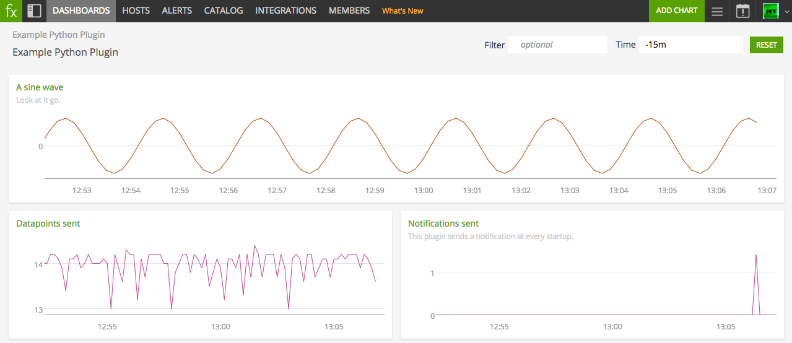
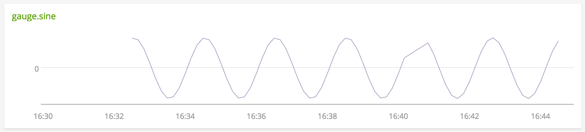

# Example Python Plugin

Metadata associated with the **Example Integration** can be found [here](https://github.com/signalfx/integrations/tree/release/Example). The relevant code for the integration can be found [here](https://github.com/signalfx/collectd-example).

>This file contains information about our example Python plugin. It also contains instructions for producing similar README files for other plugins.
>
> In this document, sections in block quotes (like this one) contain instructions for plugin authors. Follow the instructions to format your README file, then remove them before submitting your contribution.

- [Description](#description)
- [Requirements and Dependencies](#requirements-and-dependencies)
- [Installation](#installation)
- [Configuration](#configuration)
- [Usage](#usage)
- [Metrics](#metrics)
- [License](#license)

### DESCRIPTION

> In this section, give a general description of what your plugin is, what it does, and what the user can expect.

This is the SignalFx Example Python plugin for collectd. Use it to send a sine wave metric using collectd.

This plugin emits 3 metrics:
- one gauge in the form of a sine wave
- two counters for number of datapoints and events seen

The plugin also emits a notification every time it starts up.

### REQUIREMENTS AND DEPENDENCIES

>In this section, list:
>- collectd version requirements
>- Version and configuration requirements for the application being monitored
>- Other plugins that this plugin depends on (like the Python or Java plugins for collectd)
>- Any other dependencies that this plugin requires in order to run successfully

This plugin requires:

| Software          | Version        |
|-------------------|----------------|
| collectd          |     4.9+       |
| Python plugin for collectd | (included with SignalFx collectd) |
| Python            |     2.6+       |

### INSTALLATION

>In this section, provide step-by-step instructions that a user can follow to install this plugin. Each step should allow the user to verify that it has been completed successfully.
>
>This section should also contain instructions for any steps that the user must take to modify or reconfigure the software to be monitored. For instance, the plugin might collect data from an API endpoint that must be enabled by the user.

Follow these steps to install this plugin:

1. Download this repository to your local machine.
2. Modify the sample configuration file [10-example.conf](https://github.com/signalfx/integrations/tree/master/collectd-example/10-example.conf) to contain values that make sense for your environment, as described [below](#configuration).
3. Add the following line to `collectd.conf`, replacing the path with the path to the sample configuration file you modified in step 2:

        include '/path/to/10-example.conf'

4. Restart collectd.

### CONFIGURATION

>Provide in this section instructions on how to configure the plugin, before and after installation. If this plugin has a configuration file with properties, list each property, define its purpose and give an example or list the default value.

Using the example configuration file [10-example.conf](https://github.com/signalfx/integrations/tree/master/collectd-example/10-example.conf) as a guide, provide values for the configuration options listed below that make sense for your environment.

| configuration option | definition | example value |
| ---------------------|------------|---------------|
| ModulePath | Path on disk where collectd can find this module. | "/opt/example" |
| Frequency  | Cycles of the sine wave per minute. | 0.5 |

### USAGE

>This section contains information about how best to monitor the software in question, using the data from this plugin. In this section, the plugin author shares experience and expertise with the software to be monitored, for the benefit of users of the plugin. This section includes:
>
>- Important conditions to watch out for in the software
>- Common failure modes, and the values of metrics that will allow the user to spot them
>- Chart images demonstrating each important condition or failure mode

This plugin is an example that emits values on its own, and does not connect to software. It emits a repeating sine wave in the metric `gauge.sine`, and counts of datapoints and notifications emitted in the metrics `counter.datapoints` and `counter.notifications` respectively.

Below is a screen capture of an example SignalFx dashboard, illustrating the metrics emitted by this plugin. The dashboard is included in this repository, and can be imported into SignalFx or other monitoring product. [Click here to download](././Page_Example Python Plugin.json).

#### Important conditions to watch out for

*`gauge.sine` looks like a straight line instead of a curve.*

This may indicate a period of missing data points. In the example chart shown above, some data points are missing between 16:40 and 16:41, and SignalFx is interpolating a straight line through the gap.

*`counter.notifications` shows a suddenly high value.*

This plugin emits a notification at every startup. If your collectd configuration and plugins do not ordinarily emit notifications, a suddenly high value for `counter.notifications` may indicate that collectd has been restarted. In the example charts shown above, `counter.notifications` shows a spike at about the same time as data resumes in `gauge.sine`.

### METRICS

>This section refers to the metrics documentation found in the `/docs` subdirectory. See [/docs/README.md](./docs/readme.md) for formatting instructions.

For documentation of the metrics and dimensions emitted by this plugin, [click here](./docs).

### LICENSE

> Include licensing information for this integration metadata, not the integration itself, in this section.

This integration is released under the Apache 2.0 license. See [LICENSE](https://github.com/signalfx/collectd-example/blob/master/LICENSE) for more details.
