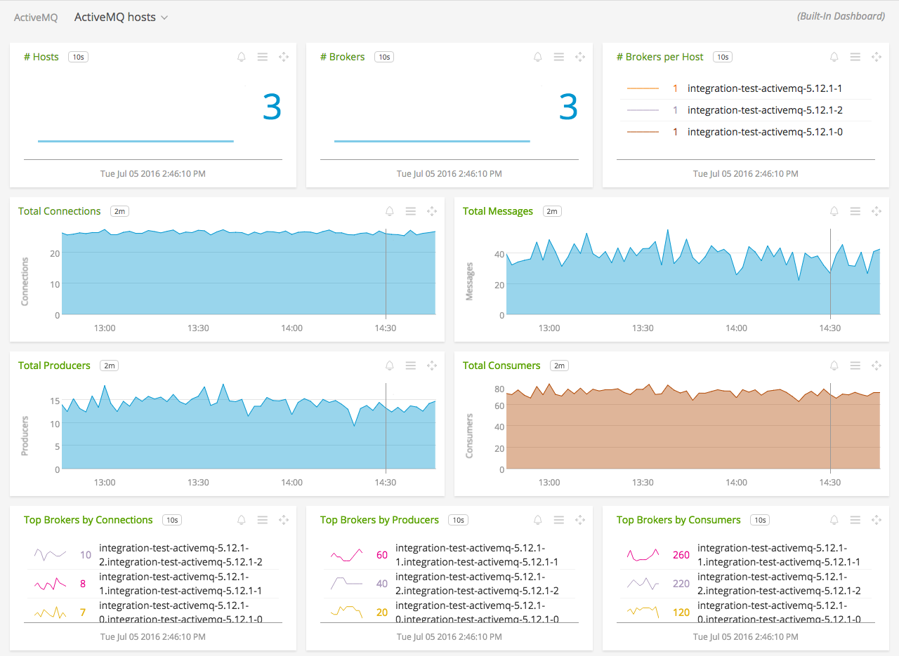
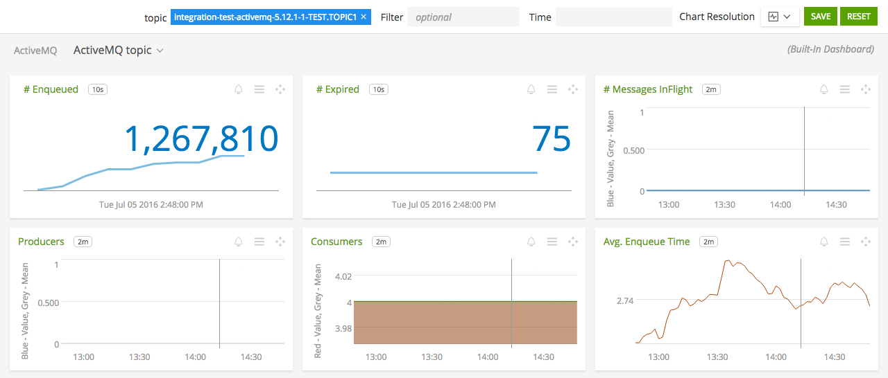
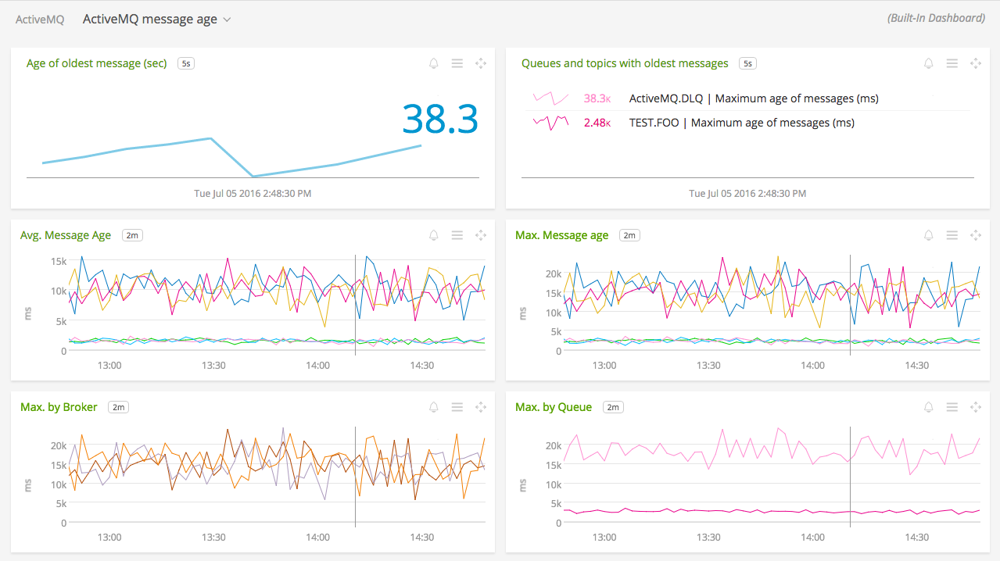

#  ActiveMQ

Metadata associated with SignalFx's integration with ActiveMQ can be found <a target="_blank" href="https://github.com/signalfx/integrations/tree/release/activemq">here</a>. The relevant code for the plugin can be found <a target="_blank" href="https://github.com/signalfx/activemq-integration">here</a>.

- [Description](#description)
- [Requirements and Dependencies](#requirements-and-dependencies)
- [Configuration](#configuration)
- [Usage](#usage)
- [Metrics](#metrics)
- [License](#license)

#### FEATURES

##### Built-in dashboards

- **ActiveMQ Hosts**: Overview of all data from ActiveMQ hosts.

  

- **ActiveMQ Host**: Focus on a single ActiveMQ host.

  

- **ActiveMQ Queue**: Focus on a single ActiveMQ queue.

  

- **ActiveMQ Topic**: Focus on a single ActiveMQ topic.

  

- **ActiveMQ Message Age**: (if enabled) Shows the average age of messages in ActiveMQ queues. See [ActiveMQ message age listener](https://github.com/signalfx/integrations/tree/master/amq-message-age).

  

### REQUIREMENTS AND DEPENDENCIES

| Software    | Version        |
|-------------|----------------|
| Smart Agent |       *        |
| ActiveMQ    | 5.8.0 or later |

### USAGE

Sample of built-in dashboard in SignalFx:

### LICENSE

This integration is released under the Apache 2.0 license. See [LICENSE](./LICENSE) for more details.
