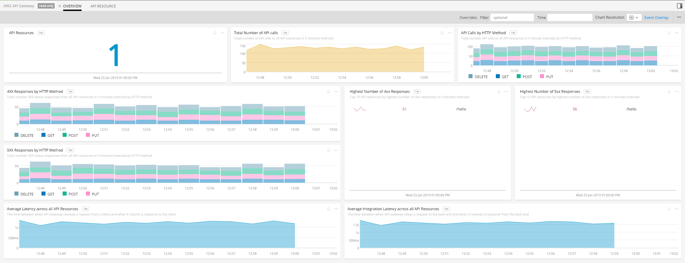
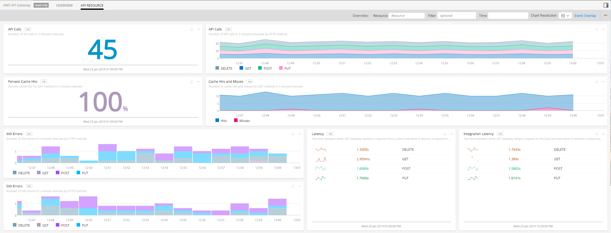

#  Amazon API Gateway

- [Description](#description)
- [Installation](#installation)
- [Usage](#usage)
- [Metrics](#metrics)
- [License](#license)

### DESCRIPTION

Use SignalFx to monitor Amazon API Gateway via [Amazon Web Services](https://github.com/signalfx/integrations/tree/master/aws).

#### FEATURES

##### Built-in dashboards

- **Overview**: Overview of CloudWatch data of the number of API calls, average latency and error responses for all API resources.
  

- **API Resource**: CloudWatch data of the number of API calls, average latency, error responses and cache hit/miss filtered for individual API resources.
  

### INSTALLATION

To access this integration, [connect to CloudWatch](https://github.com/signalfx/integrations/tree/master/aws).

Note that detailed CloudWatch metrics must be enabled for your API `stage` in AWS. To do this, go to the Amazon API Gateway console,
click the name of your API, and then click `Stages`. Click on your stage. Click `Logs/Tracing`, specify `Enable Detailed CloudWatch Metrics`, and then click `Save Changes`.

Also, if not already added, add an ARN of an IAM role that has write access to CloudWatch logs in the `Settings` section of the Amazon API Gateway console.

### USAGE

SignalFx provides built-in dashboards for this service. Examples are shown below.

### METRICS

For more information about the metrics emitted by Amazon API Gateway, visit the service's homepage at <a target="_blank" href="https://aws.amazon.com/api-gateway/">https://aws.amazon.com/api-gateway/</a>.

### LICENSE

This integration is released under the Apache 2.0 license. See [LICENSE](./LICENSE) for more details.
