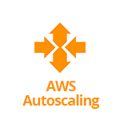

#   AWS Auto Scaling

- [Description](#description)
- [Installation](#installation)
- [Usage](#usage)
- [Metrics](#metrics)
- [License](#license)

### DESCRIPTION

Use SignalFx to monitor AWS Auto Scaling via [Amazon Web Services](https://github.com/signalfx/integrations/tree/master/aws).

#### FEATURES

##### Built-in dashboards

- AutoScaling - Multi Group
- AutoScaling - Single Group

### INSTALLATION

To access this integration, [connect to CloudWatch](https://github.com/signalfx/integrations/tree/master/aws) on the SignalFx Integrations page.

By default, SignalFx will import all CloudWatch metrics that are available in your account. To retrieve metrics for a subset of available services or regions, modify the connection on the Integrations page.

### USAGE

SignalFx provides built-in dashboards for this service. Find them on the Dashboards page in SignalFx.

### METRICS

For more information about the metrics emitted by AWS Auto Scaling, visit the service's homepage at <a target="_blank" href="https://aws.amazon.com/autoscaling/">https://aws.amazon.com/autoscaling/</a>.

### LICENSE

This integration is released under the Apache 2.0 license. See [LICENSE](./LICENSE) for more details.
