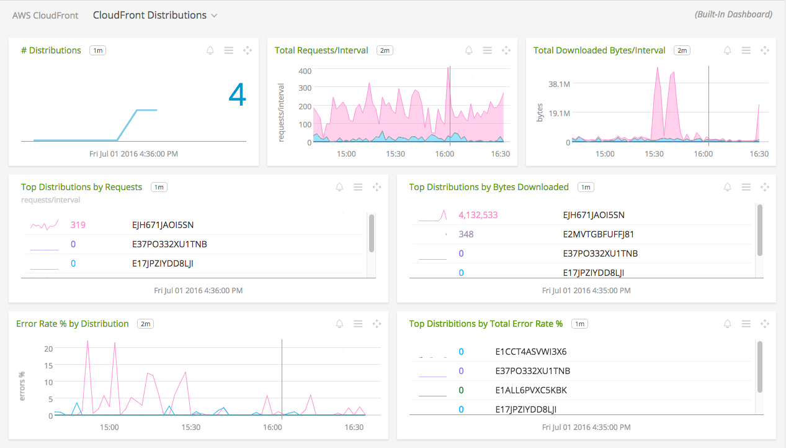
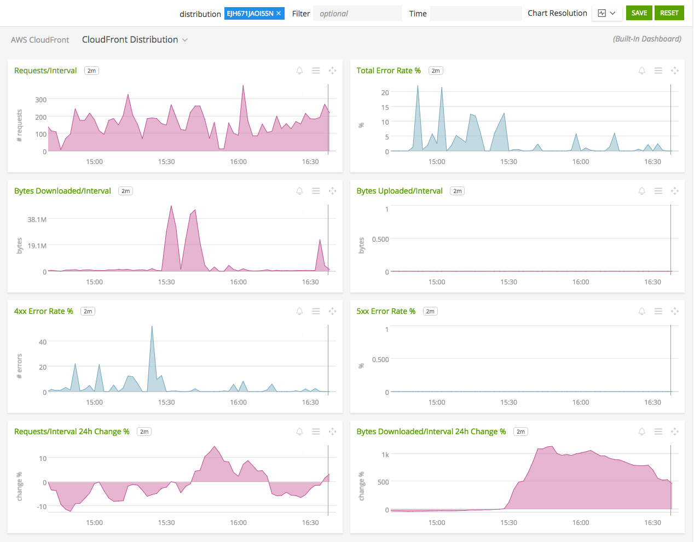

#  Amazon CloudFront

- [Description](#description)
- [Installation](#installation)
- [Usage](#usage)
- [Metrics](#metrics)
- [License](#license)

### DESCRIPTION

Use SignalFx to monitor Amazon CloudFront via [Amazon Web Services](https://github.com/signalfx/integrations/tree/master/aws).

#### FEATURES

##### Built-in dashboards

- **CloudFront Distributions**: Overview of all data from CloudFront.

  
- **CloudFront Distribution**: Focus on a single CloudFront distribution.

  

### INSTALLATION

To access this integration, [connect to CloudWatch](https://github.com/signalfx/integrations/tree/master/aws). 

Note that CloudWatch metrics for CloudFront are reported only from region `us-east-1` (US East/N. Virginia). To import metrics for CloudFront, ensure that your CloudWatch configuration includes metrics from `us-east-1`.

### USAGE

SignalFx provides built-in dashboards for this service. Examples are shown below.

### METRICS

For more information about the metrics emitted by Amazon CloudFront, visit the service's homepage at <a target="_blank" href="https://aws.amazon.com/cloudfront/">https://aws.amazon.com/cloudfront/</a>.

### LICENSE

This integration is released under the Apache 2.0 license. See [LICENSE](./LICENSE) for more details.
