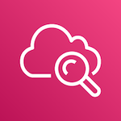

#  CloudWatch Events

- [Description](#description)
- [Installation](#installation)

### DESCRIPTION

You can use the SignalFx CloudWatch Lambda function to send CloudWatch Events to SignalFx as Custom Events.

To learn more about Events at SignalFx, see [View Additional Data with Events](https://docs.signalfx.com/en/latest/detect-alert/events-intro.html).

### INSTALLATION

There are two ways to deploy SignalFx Lambda for CloudWatch Events:

* AWS Serverless Application Repository
    * For details, in [AWS Serverless Repository](https://console.aws.amazon.com/serverlessrepo/home#/available-applications), the application in the Serverless Repository is called “signalfx-cloudwatch-event-forwarder”.
* SignalFx’s GitHub repository
    * For details, see the repository’s [README](https://github.com/signalfx/cloudwatch-event-forwarder/blob/master/README.md).
