# 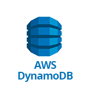 Amazon DynamoDB

- [Description](#description)
- [Installation](#installation)
- [Usage](#usage)
- [Metrics](#metrics)
- [License](#license)

### DESCRIPTION

Use SignalFx to monitor Amazon DynamoDB via [Amazon Web Services](https://github.com/signalfx/integrations/tree/master/aws).

#### FEATURES

##### Built-in dashboards

- **AWS DynamoDB**: Overview of all data from DynamoDB.

  [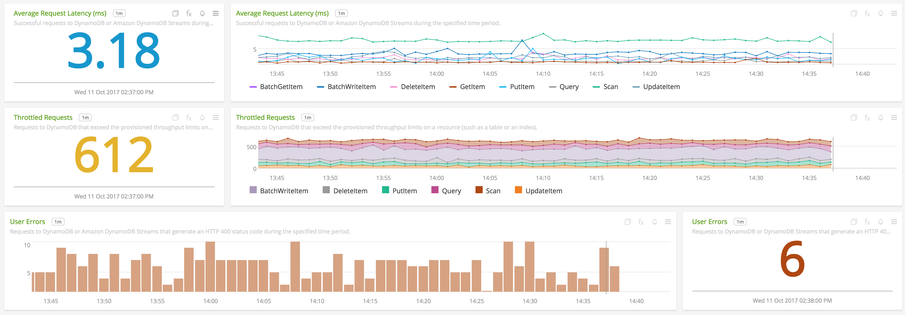](./img/dashboard-dynamodb1.png)
  [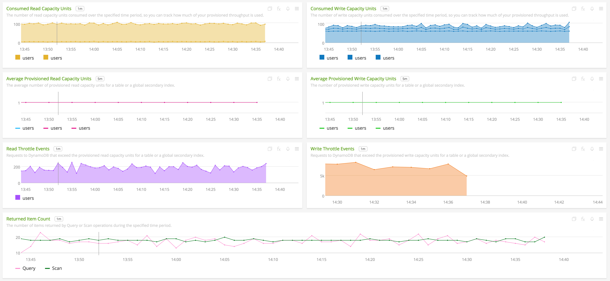](./img/dashboard-dynamodb2.png)

### INSTALLATION

To access this integration, [connect to CloudWatch](https://github.com/signalfx/integrations/tree/master/aws).

By default, SignalFx will import all CloudWatch metrics that are available in your account. To retrieve metrics for a subset of available services or regions, modify the connection on the Integrations page.

### USAGE

SignalFx provides built-in dashboards for this service. Examples are shown below.

- Average Latency (latest)
    - Successful requests to DynamoDB or Amazon DynamoDB Streams during the specified time period.
    - [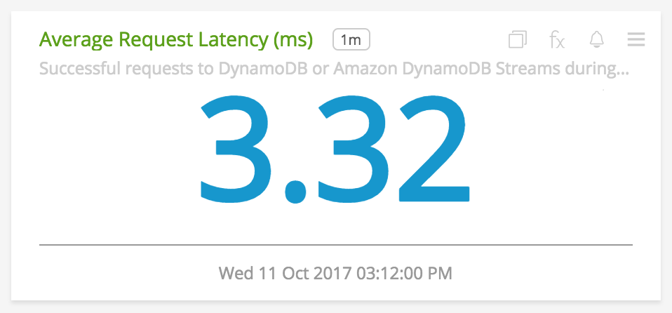](./img/avg_latency.png)
- Average Latency (by request type)
    - Successful requests to DynamoDB or Amazon DynamoDB Streams during the specified time period.
    - [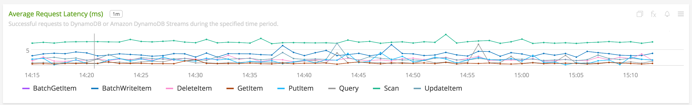](./img/avg_latency_by_type.png)
- Throttled Requests (latest)
    - Requests to DynamoDB that exceed the provisioned throughput limits on a resource (such as a table or an index).
    - [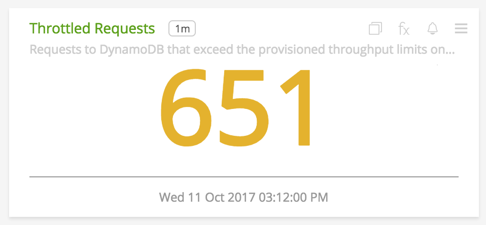](./img/throttled_requests.png)
- Throttled Requests by Request Type
    - Requests to DynamoDB that exceed the provisioned throughput limits on a resource (such as a table or an index).
    - [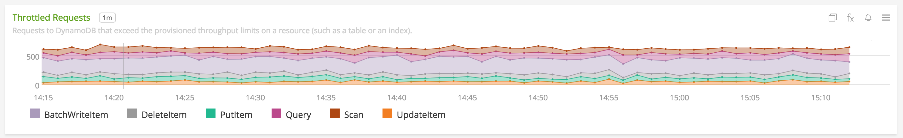](./img/throttled_requests_by_type.png)
- User Errors (trend)
    - Requests to DynamoDB or Amazon DynamoDB Streams that generate an HTTP 400 status code during the specified time period.
    - [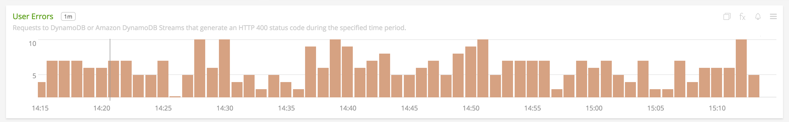](./img/user_errors_trend.png)
- User Errors (latest)
    - Requests to DynamoDB or Amazon DynamoDB Streams that generate an HTTP 400 status code during the specified time period.
    - [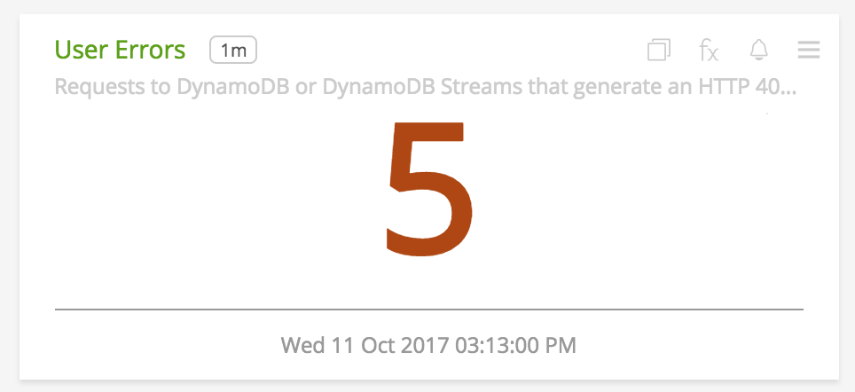](./img/user_errors.png)
- System Errors (trend)
    - Requests to DynamoDB or Amazon DynamoDB Streams that generate an HTTP 500 status code during the specified time period.
- System Errors (latest)
    - Requests to DynamoDB or Amazon DynamoDB Streams that generate an HTTP 500 status code during the specified time period.
- Consumed Read Capacity Units
    - The number of read capacity units consumed over the specified time period, so you can track how much of your provisioned throughput is used.
    - [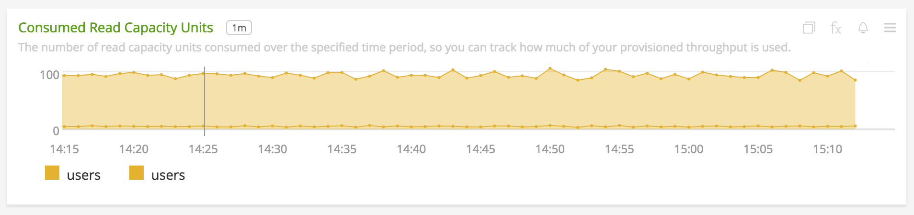](./img/consumed_read_capacity.png)
- Consumed Read Capacity Units
    - The number of write capacity units consumed over the specified time period, so you can track how much of your provisioned throughput is used.
    - [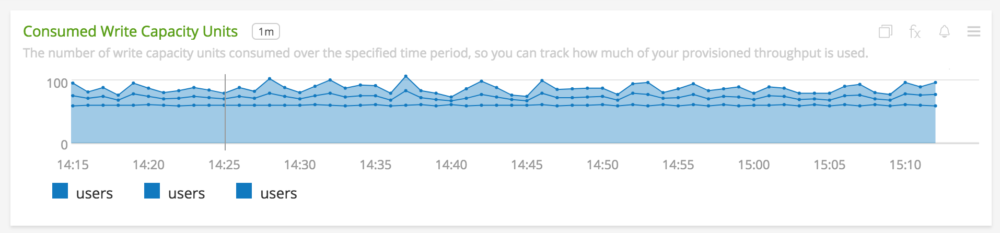](./img/consumed_write_capacity.png)
- Average Provisioned Read Capacity Units
    - The average number of provisioned read capacity units for a table or a global secondary index.
    - [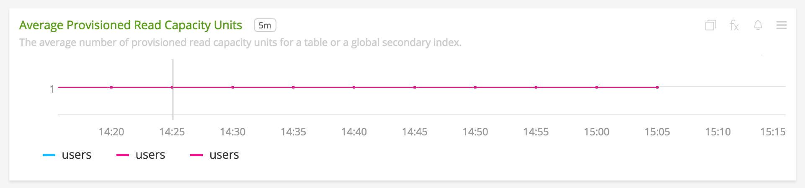](./img/avg_provisioned_read_capacity.png)
- Average Provisioned Write Capacity Units
    - The number of provisioned write capacity units for a table or a global secondary index.
    - [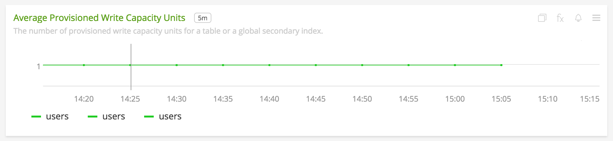](./img/avg_provisioned_write_capacity.png)
- Read Throttle Events
    - Requests to DynamoDB that exceed the provisioned read capacity units for a table or a global secondary index.
    - [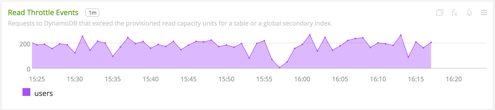](./img/read_throttle_events.png)
- Write Throttle Events
    - Requests to DynamoDB that exceed the provisioned write capacity units for a table or a global secondary index.
    - [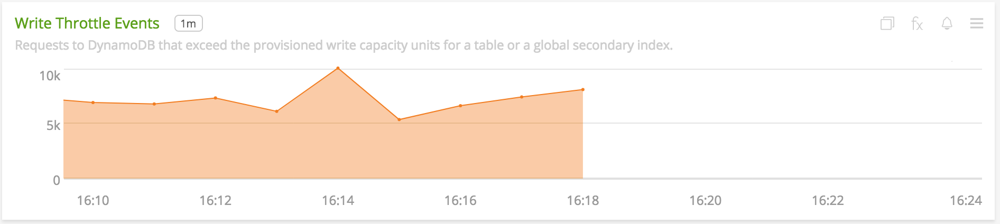](./img/write_throttle_events.png)
- Returned Item Count
    - Requests to DynamoDB that exceed the provisioned write capacity units for a table or a global secondary index.
    - [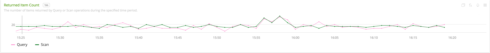](./img/returned_item_count.png)

### METRICS

For more information about the metrics emitted by Amazon DynamoDB, visit the service's homepage at <a target="_blank" href="https://aws.amazon.com/dynamodb/">https://aws.amazon.com/dynamodb/</a>.

### LICENSE

This integration is released under the Apache 2.0 license. See [LICENSE](./LICENSE) for more details.
