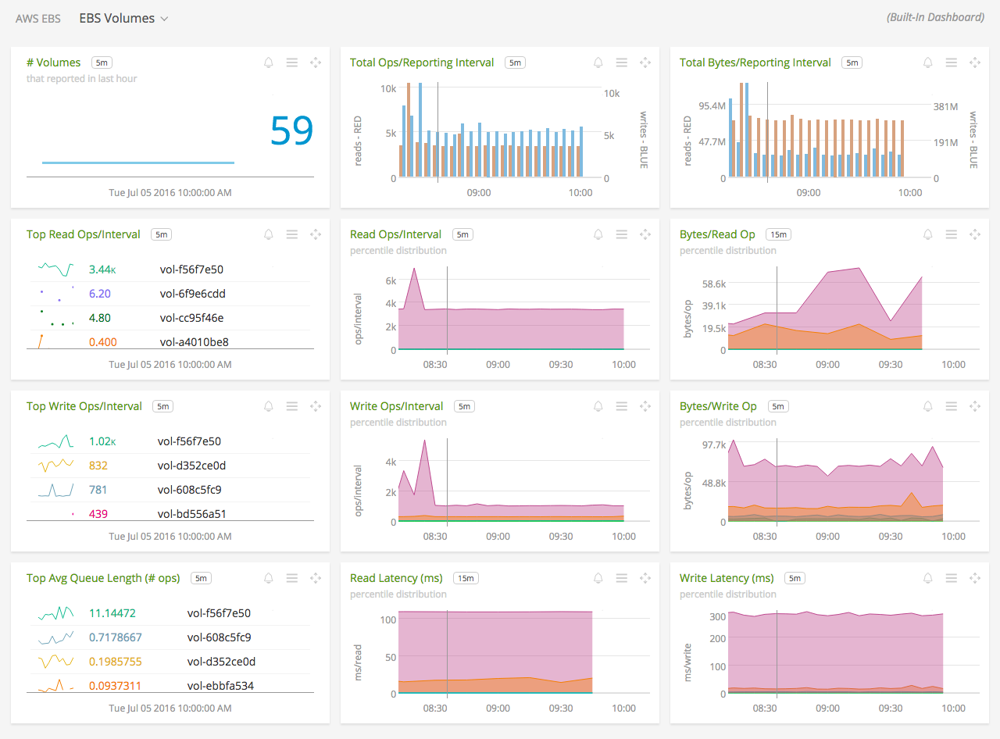
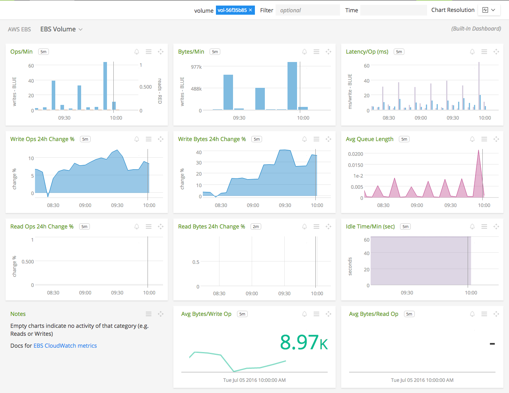

#  Amazon Elastic Block Store (EBS)

- [Description](#description)
- [Installation](#installation)
- [Usage](#usage)
- [Metrics](#metrics)
- [License](#license)

### DESCRIPTION

Use SignalFx to monitor Amazon Elastic Block Store (EBS) via [Amazon Web Services](https://github.com/signalfx/integrations/tree/master/aws).

#### FEATURES

##### Built-in dashboards

- **EBS Volumes**: Overview of all data from EBS.

  

- **EBS Volume**: Focus on a single EBS volume.

  

### INSTALLATION

To access this integration, [connect to CloudWatch](https://github.com/signalfx/integrations/tree/master/aws).

By default, SignalFx will import all CloudWatch metrics that are available in your account. To retrieve metrics for a subset of available services or regions, modify the connection on the Integrations page.

### USAGE

#### Uniquely identifying EBS Volumes

SignalFx synthesizes a unique ID for each EBS volume in the dimension `AWSUniqueId`.

#### EBS metadata

For EBS, SignalFx will scan every volume ID from your AWS account and pull out properties of the volume and any tags set on the volume.

| EBS Filter Name	| Custom Property	| Description |
|-----------------|-----------------|-------------|
| availability-zone	| aws\_availability\_zone |	The Availability Zone in which the volume was created |
| create-time	| aws\_create\_time |	The time stamp when the volume was created |
| encrypted	| aws\_encrypted |	The encryption status of the volume |
| iops	| aws\_iops | The number of I/O operations per second (IOPS) that the volume supports |
| kms\_key\_id	| aws\_kms\_key\_id | The full ARN of the AWS customer master key used to protect the volume encryption key for the volume |
| size	| aws\_size | The size of the volume, in GiB |
| snapshot\_id	| aws\_snapshot\_id |	The snapshot from which the volume was created |
| state	| aws\_state |	The status of the volume |
| volume\_id	| aws\_volume\_id |	The volume ID |
| volume\_type	| aws\_volume\_type |	The Amazon EBS volume type |

### METRICS

For more information about the metrics emitted by Amazon Elastic Block Store, visit the service's homepage at <a target="_blank" href="https://aws.amazon.com/ebs/">https://aws.amazon.com/ebs/</a>.

### LICENSE

This integration is released under the Apache 2.0 license. See [LICENSE](./LICENSE) for more details.
