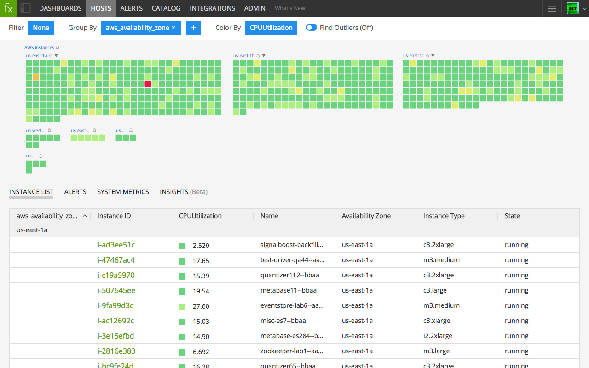
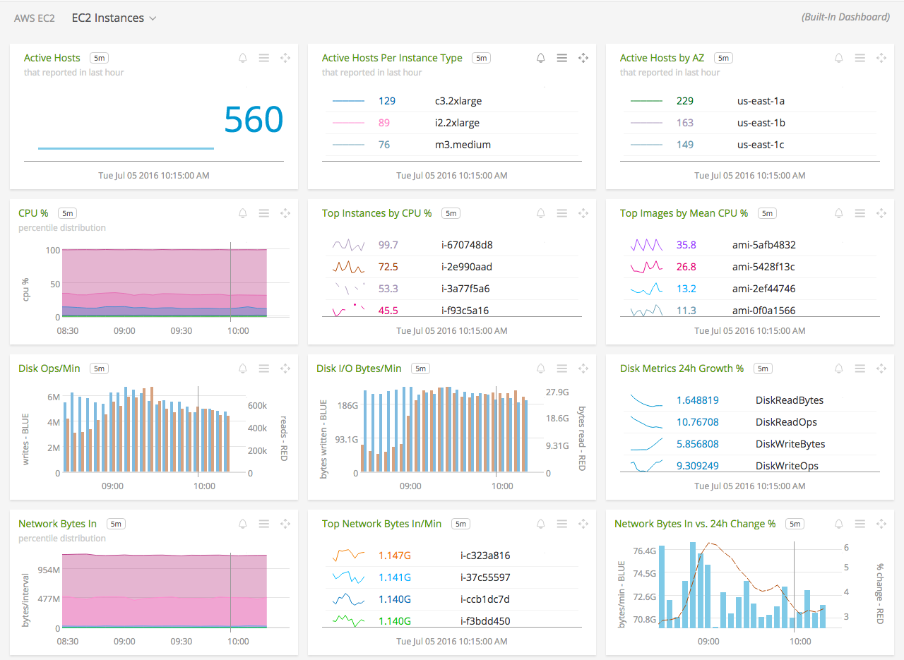
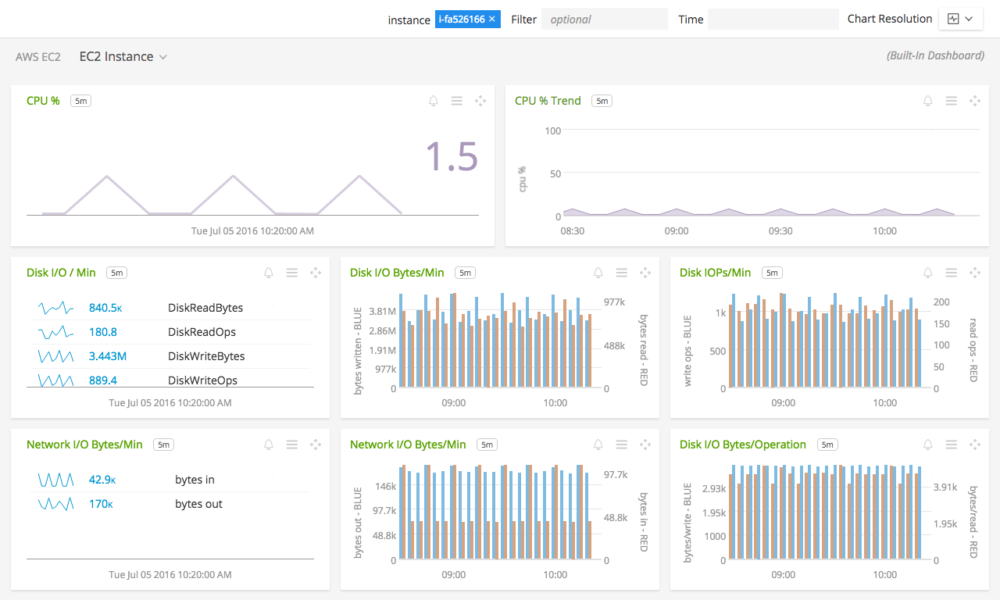

#  Amazon Elastic Compute Cloud (EC2)

- [Description](#description)
- [Installation](#installation)
- [Usage](#usage)
- [Metrics](#metrics)
- [License](#license)

### DESCRIPTION

Use SignalFx to monitor Amazon Elastic Compute Cloud (EC2) via [Amazon Web Services](https://github.com/signalfx/integrations/tree/master/aws)[](sfx_link:aws).

#### FEATURES

##### Infrastructure Page

- **Infrastructure Navigator**: On the Infrastructure page in SignalFx, the Infrastructure Navigator visualizes EC2 instances as squares, colored by CloudWatch metrics including CPU, disk, and network. Group and filter instances by AWS metadata like availability zone or service tag in order to discover trends and correlations. <a target="_blank" href="http://docs.signalfx.com/en/latest/built-in-content/infra-nav.html">Click here to read more about the Infrastructure Page</a>.

  [](./img/hosts_aws_instances.png)

##### Built-in dashboards

- **EC2 Instances**: Overview of all data from EC2.

  [](./img/dashboard_ec2_instances.png)

- **EC2 Instance**: Focus on a single EC2 instance.

  [](./img/dashboard_ec2_instance.png)

### INSTALLATION

To access this integration, [connect to CloudWatch](https://github.com/signalfx/integrations/tree/master/aws)[](sfx_link:aws).

By default, SignalFx will import all CloudWatch metrics that are available in your account. To retrieve metrics for a subset of available services or regions, modify the connection on the Integrations page.

### USAGE

#### Uniquely identifying EC2 instances

EC2 instance IDs are not guaranteed to be unique. To uniquely identify an EC2 instance, SignalFx concatenates instanceId, AWS region, and AWS account ID separated by underscores in the dimension `AWSUniqueId`, as follows:
```
    instanceId_region_accountID
```

#### EC2 metadata

For EC2, SignalFx will scan every instance ID from your AWS account and pull out properties of the instance and any tags set on the instance.  Any dimension called “Host” or “InstanceId” in SignalFx that matches the instance ID’s value, private DNS name, or private IP address will now have the same tags and properties of the instance ID.  Each instance property is prefixed with “aws_”.

| EC2 Filter Name	| Custom Property	| Description |
|-----------------|-----------------|-------------|
| architecture	| aws\_architecture	| Instance architecture (i386 or x86\_64) |
| availability-zone	| aws\_availability\_zone	| The availability zone of the instance |
| dns-name	| aws\_public\_dns\_name	| Public DNS name of the instance |
| hypervisor	| aws\_hypervisor	| Hypervisor type of the instance (ovm or xen)  |
| image-id	| aws\_image\_id	| ID of the image used to launch the instance |
| instance-id	| aws\_instance\_id	| ID of the instance |
| instance-state-name	| aws\_state	| An object defining the state code and name of the instance |
| instance-type	| aws\_instance\_type	| Type of the instance |
| ip-address	| aws\_public\_ip\_address	| The address of the Elastic IP address bound to the network interface |
| kernel-id	| aws\_kernel\_id	| Kernel ID |
| launch-time	| aws\_launch\_time	| The time when the instance was launched |
| private-dns-name	| aws\_private\_dns\_name	| Private DNS name of the instance |
| reason	| aws\_state\_reason	| The state reason for the instance (if provided) |
| region	| aws\_region	| The region which the instance is running in |
| reservation-id	| aws\_reservation\_id	| ID of the instance’s reservation |
| root-device-type	| aws\_root\_device\_type	| Type of root device that the instance uses |

For more information about the filters, see <a target="_blank" href="http://docs.aws.amazon.com/AWSEC2/latest/CommandLineReference/ApiReference-cmd-DescribeInstances.html">http://docs.aws.amazon.com/AWSEC2/latest/CommandLineReference/ApiReference-cmd-DescribeInstances.html</a>.

### METRICS

For more information about the metrics emitted by Amazon EC2, visit the service's homepage at <a target="_blank" href="https://aws.amazon.com/ec2/">https://aws.amazon.com/ec2/</a>.

### LICENSE

This integration is released under the Apache 2.0 license. See [LICENSE](./LICENSE) for more details.
