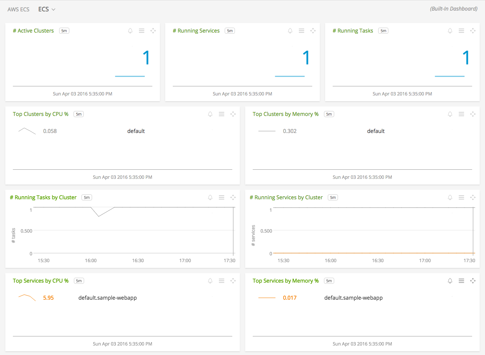
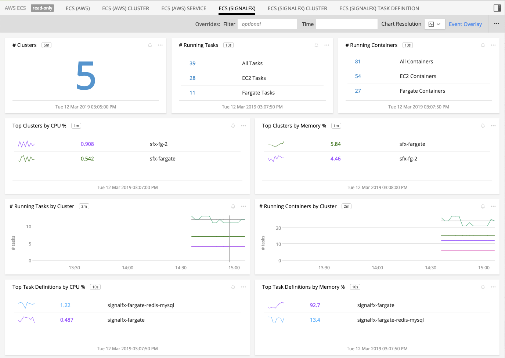
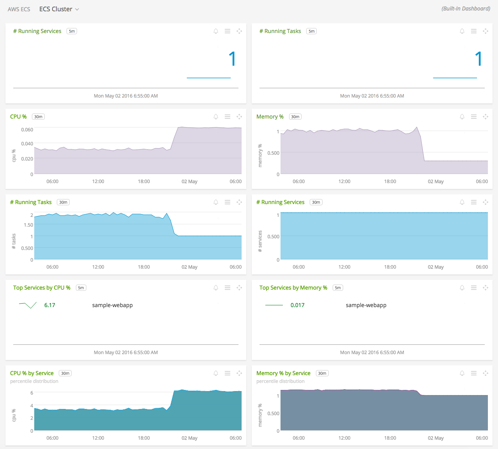
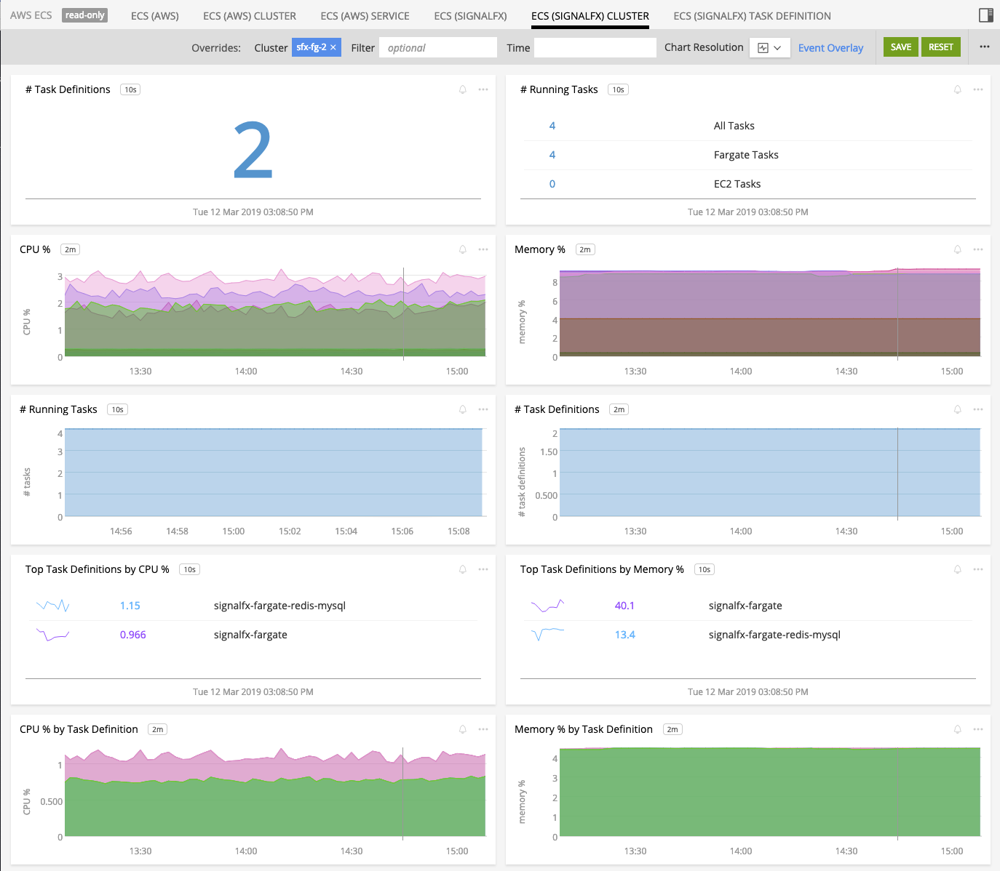
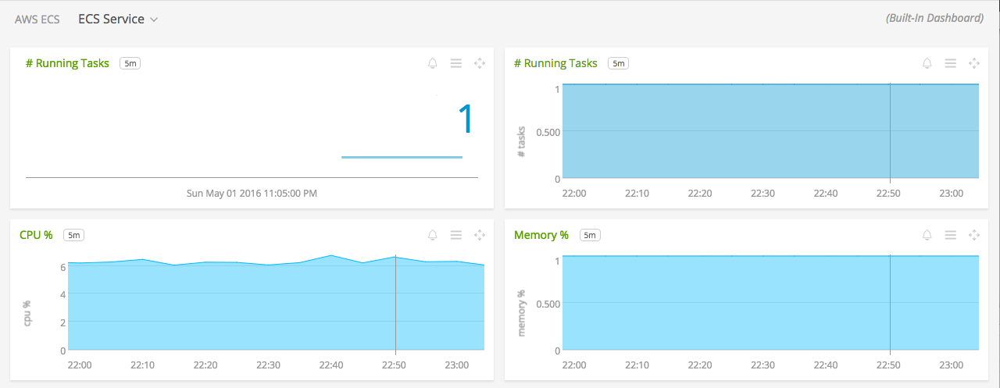
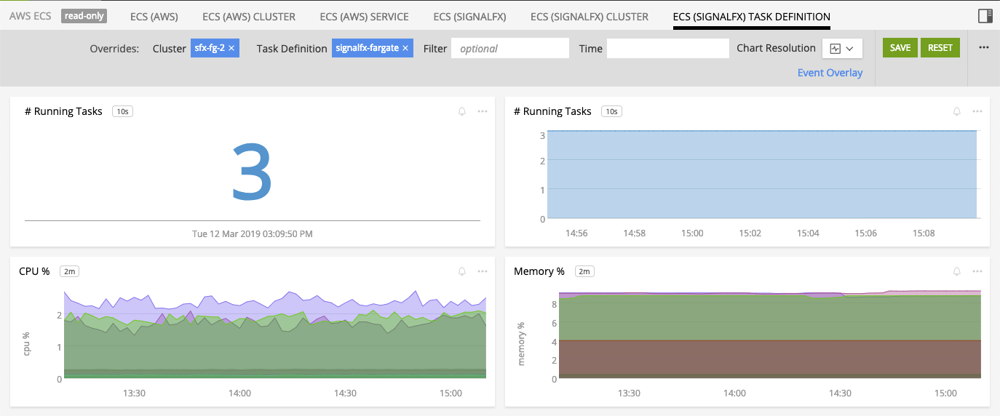

#  Amazon EC2 Container Service (ECS)

- [Description](#description)
- [Installation](#installation)
- [Usage](#usage)
- [Metrics](#metrics)
- [License](#license)

### DESCRIPTION

Use SignalFx to monitor Amazon EC2 Container Service (ECS) via [Amazon Web Services](https://github.com/signalfx/integrations/tree/master/aws).

For greater insight into your ECS environment, SignalFx's Smart Agent can auto-discover services and provide more in-depth metrics about your containers that are running in ECS.  See the <a target="_blank" href="https://github.com/signalfx/signalfx-agent/tree/master/deployments/ecs">Smart Agent ECS Deployment Guide</a> for instructions on how to deploy the Smart Agent in ECS. Also, Smart Agent can be deployed in ECS task to monitor AWS Fargate containers. See the <a target="_blank" href="https://github.com/signalfx/signalfx-agent/tree/master/deployments/fargate">Smart Agent Fargate Deployment Guide</a> for more detailed deployment instructions.

#### FEATURES

##### Built-in dashboards

- **ECS (AWS)**: Overview of all data from ECS via CloudWatch.

  

- **ECS (SignalFx)**: Overview of all data from ECS via SignalFx SmartAgent.

  

- **ECS (AWS) Cluster**: Focus on a single ECS cluster via CloudWatch.

  

- **ECS (SignalFx) Cluster**: Focus on a single ECS cluster via SignalFx SmartAgent.

  

- **ECS (AWS) Service**: Focus on a single ECS service via CloudWatch.

  

- **ECS (SignalFx) Task Definition**: Focus on a single ECS Task Defiinition via SignalFx SmartAgent.

  

### INSTALLATION

#### CloudWatch

To access this integration, [connect to CloudWatch](https://github.com/signalfx/integrations/tree/master/aws). 

By default, SignalFx will import all CloudWatch metrics that are available in your account. To retrieve metrics for a subset of available services or regions, modify the connection on the Integrations page.

#### SmartAgent

To auto-discover services and collect more detailed metrics, SignalFx SmartAgent can be deployed in two different ways depend on the type of containers to be monitor. To monitor EC2 containers, see the <a target="_blank" href="https://github.com/signalfx/signalfx-agent/tree/master/deployments/ecs">Smart Agent ECS Deployment Guide</a> and to monitor Fargate containers, see the <a target="_blank" href="https://github.com/signalfx/signalfx-agent/tree/master/deployments/fargate">Smart Agent Fargate Deployment Guide</a> for more detailed instructions.

### USAGE

SignalFx provides built-in dashboards for this service. Examples are shown below.

### METRICS

For more information about the metrics emitted by Amazon EC2 Container Service, visit the service's homepage at <a target="_blank" href="https://aws.amazon.com/ecs/">https://aws.amazon.com/ecs/</a>.

### LICENSE

This integration is released under the Apache 2.0 license. See [LICENSE](./LICENSE) for more details.
