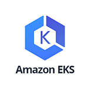
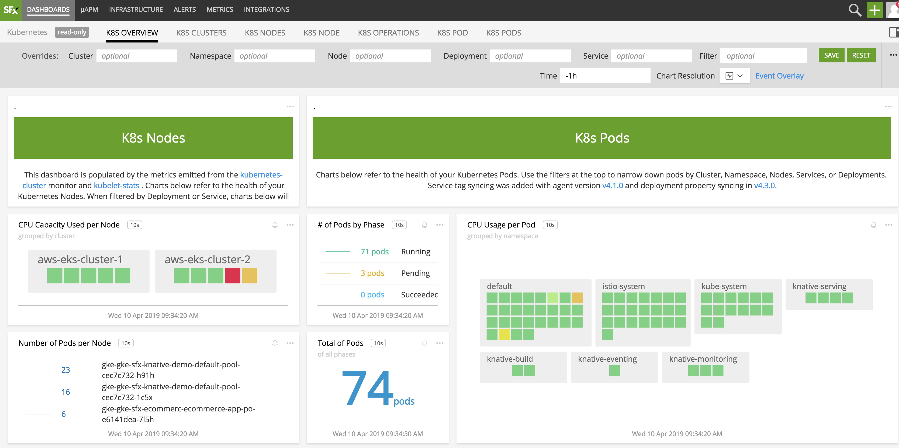

#  Amazon Elastic Container Service for Kubernetes (EKS)

- [Description](#description)
- [Recommended Statistics](#recommended-statistics)
- [License](#license)

### DESCRIPTION

Use SignalFx to monitor Elastic Container Service for Kubernetes (EKS) via the [SignalFx Smart Agent](https://docs.signalfx.com/en/latest/integrations/agent/kubernetes-setup.html).
For more information, see our documentation on installing the Smart Agent in your cluster [here](https://docs.signalfx.com/en/latest/integrations/kubernetes-quickstart.html).

#### FEATURES

##### Built-in dashboards

- **Kubernetes**: Overview of all data from EKS.

  

<!--- METRICS --->
### RECOMMENDED STATISTICS

No recommended CloudWatch metrics for this integration.

### LICENSE

This integration is released under the Apache 2.0 license. See [LICENSE](./LICENSE) for more details.
