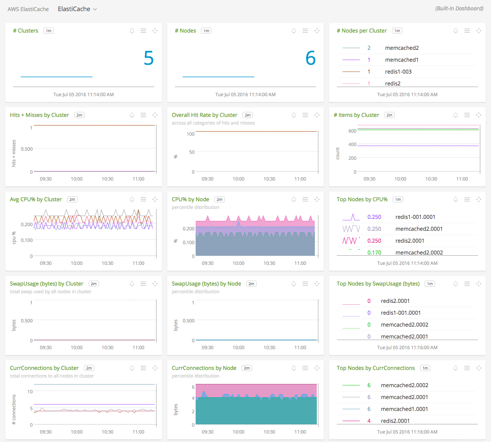
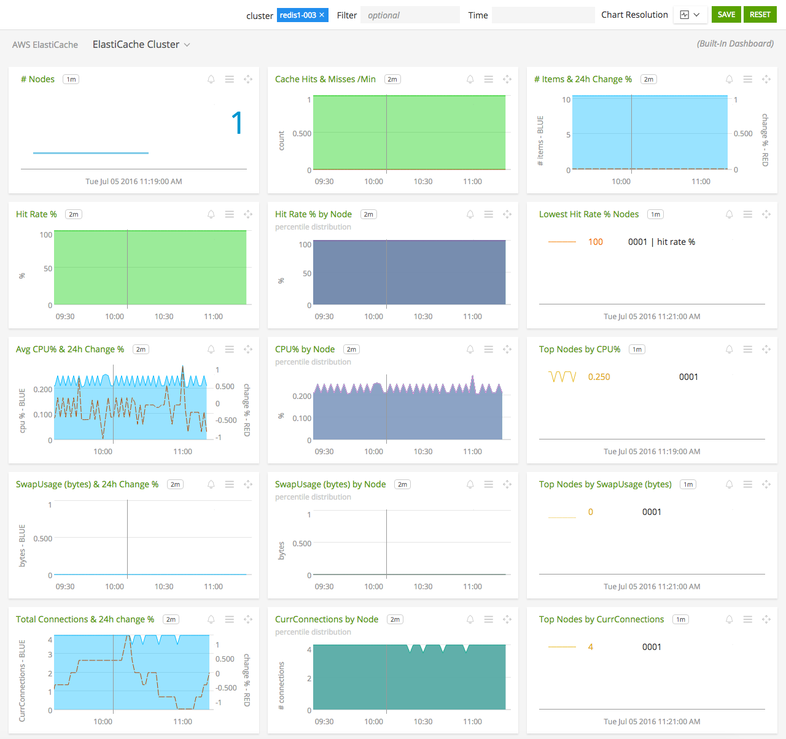
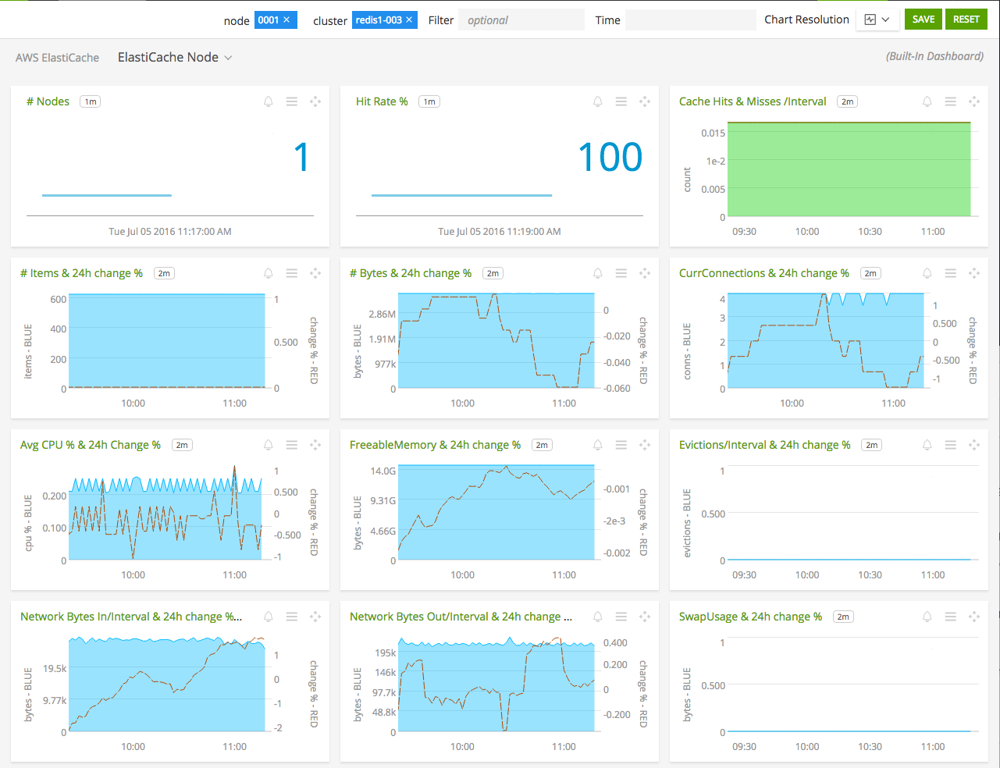

#  Amazon ElastiCache

- [Description](#description)
- [Installation](#installation)
- [Usage](#usage)
- [Metrics](#metrics)
- [License](#license)

### DESCRIPTION

Use SignalFx to monitor Amazon ElastiCache via [Amazon CloudWatch](../aws)<!-- sfx_link:aws -->. 

#### FEATURES

##### Built-in dashboards

- **ElastiCache**: Overview of all data from ElastiCache.
  
  

- **ElastiCache Cluster**: Focus on a single ElastiCache cluster.
  
  
  
- **ElastiCache Node**: Focus on a single ElastiCache node.
  
  

### INSTALLATION

To access this integration, [connect to CloudWatch](../aws)<!-- sfx_link:aws --> on the SignalFx Integrations page. 

By default, SignalFx will import all CloudWatch metrics that are available in your account. To retrieve metrics for a subset of available services or regions, modify the connection on the Integrations page. 

### USAGE

SignalFx provides built-in dashboards for this service. Examples are shown below. 

### METRICS

For more information about the metrics emitted by Amazon ElastiCache, click here or visit the service's homepage at https://aws.amazon.com/elasticache/.

### LICENSE

This integration is released under the Apache 2.0 license. See [LICENSE](./LICENSE) for more details.
