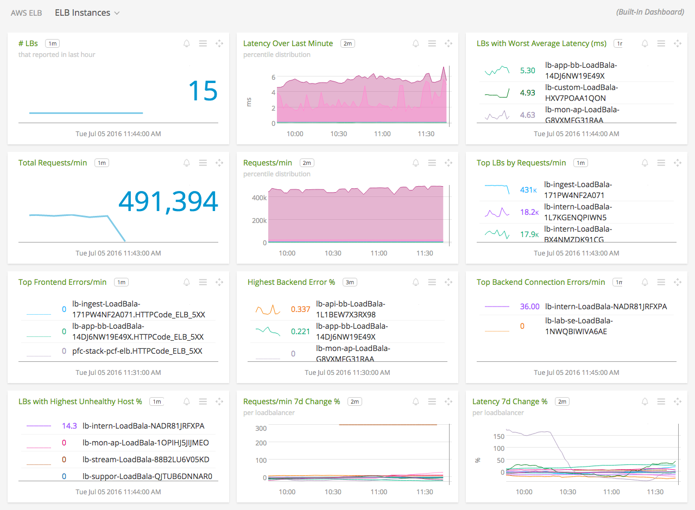
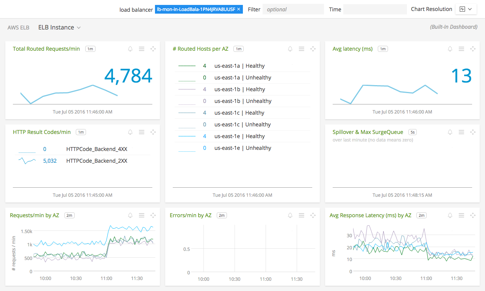

#  Amazon Elastic Load Balancing (ELB)

- [Description](#description)
- [Installation](#installation)
- [Usage](#usage)
- [Metrics](#metrics)
- [License](#license)

### DESCRIPTION

Use SignalFx to monitor Elastic Load Balancing (ELB) via [Amazon Web Services](https://github.com/signalfx/integrations/tree/master/aws).

#### FEATURES

##### Built-in dashboards

- **ELB Instances**: Overview of all data from ELB.

  

- **ELB Instance**: Focus on a single ELB load balancer.

  

### INSTALLATION

To access this integration, [connect to CloudWatch](https://github.com/signalfx/integrations/tree/master/aws).

By default, SignalFx will import all CloudWatch metrics that are available in your account. To retrieve metrics for a subset of available services or regions, modify the connection on the Integrations page.

### USAGE

#### Uniquely identifying ELBs

SignalFx synthesizes a unique ID for each ELB in the dimension `AWSUniqueId`.

#### ELB metadata

For ELB, SignalFx will scan every load balancer name from your AWS account and pull out properties of the load balancer and any tags set on the load balancer.

| ELB Filter Name |	Custom Property |	Description |
|-----------------|-----------------|-------------|
| create-time | aws\_create\_time | The time stamp when the load balancer was created |

### METRICS

For more information about the metrics emitted by Elastic Load Balancing, visit the service's homepage at <a target="_blank" href="https://aws.amazon.com/elasticloadbalancing/">https://aws.amazon.com/elasticloadbalancing/</a>.

### LICENSE

This integration is released under the Apache 2.0 license. See [LICENSE](./LICENSE) for more details.
