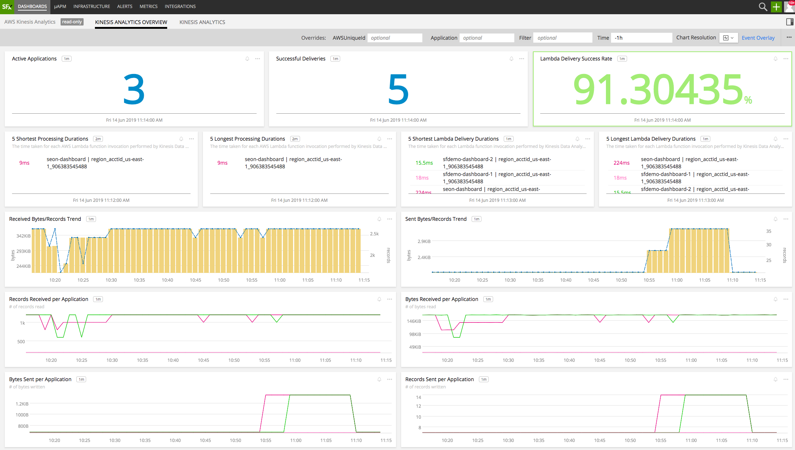

#  AWS Kinesis Analytics

- [Description](#description)
- [Installation](#installation)
- [Usage](#usage)
- [Metrics](#metrics)
- [License](#license)

### DESCRIPTION

Use SignalFx to monitor AWS Kinesis Analytics via [Amazon Web Services](https://github.com/signalfx/integrations/tree/master/aws).

### FEATURES

##### Built-in dashboards

- **Kinesis Analytics Overview**: Overview of all applications and data from Kinesis Analytics.

  

- **Kinesis Analytics**: Focus on a single Kinesis Analytics application.

  

### INSTALLATION

To access this integration, [connect to CloudWatch](https://github.com/signalfx/integrations/tree/master/aws).

By default, SignalFx will import all CloudWatch metrics that are available in your account. To retrieve metrics for a subset of available services or regions, modify the connection on the Integrations page.

### USAGE

SignalFx provides built-in dashboards for this service. Examples are shown below.

#### METRICS

For more information about the metrics emitted by AWS Kinesis Analytics, visit the service's monitoring page at <a target="_blank" href="https://docs.aws.amazon.com/kinesisanalytics/latest/dev/monitoring-metrics.html">https://docs.aws.amazon.com/kinesisanalytics/latest/dev/monitoring-metrics.html</a>.

#### LICENSE

This integration is released under the Apache 2.0 license. See [LICENSE](./LICENSE) for more details.
