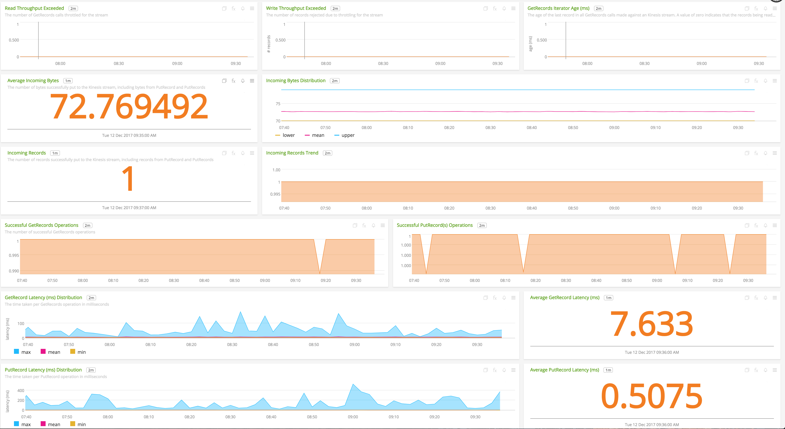

#  AWS Kinesis Streams

- [Description](#description)
- [Installation](#installation)
- [Usage](#usage)
- [Metrics](#metrics)
- [Recommended Statistics](#recommended-statistics)
- [License](#license)

### DESCRIPTION

Use SignalFx to monitor AWS Kinesis Streams via [Amazon Web Services](https://github.com/signalfx/integrations/tree/master/aws).

### FEATURES

##### Built-in dashboards

- **Kinesis Streams Overview**: Overview of all streams and data from Kinesis Streams.

  

- **Kinesis Stream**: Focus on a single Kinesis Stream.

  

### INSTALLATION

To access this integration, [connect to CloudWatch](https://github.com/signalfx/integrations/tree/master/aws).

By default, SignalFx will import all CloudWatch metrics that are available in your account. To retrieve metrics for a subset of available services or regions, modify the connection on the Integrations page.

### USAGE

SignalFx provides built-in dashboards for this service. Examples are shown below.

#### METRICS

For more information about the metrics emitted by AWS Kinesis Streams, visit the service homepage at <a target="_blank" href="https://aws.amazon.com/kinesis/">https://aws.amazon.com/kinesis/</a>.

<!--- METRICS --->
### RECOMMENDED STATISTICS

The following are a subset of available metrics; these statistics are recommended by Amazon for collection.

_Stream level metrics_

| Metric                                   | Recommended Statistics                |
| ---------------------------------------- | ------------------------------------- |
| GetRecords.Bytes                         | Average, Count, Minimum, Maximum, Sum |
| GetRecords.IteratorAgeMilliseconds       | Maximum                               |
| GetRecords.Latency                       | Average, Minimum, Maximum             |
| GetRecords.Records                       | Average, Count, Minimum, Maximum, Sum |
| GetRecords.Success                       | Average, Count, Sum                   |
| IncomingBytes                            | Average, Count, Minimum, Maximum, Sum |
| IncomingRecords                          | Average, Count, Minimum, Maximum, Sum |
| PutRecord.Bytes                          | Average, Count, Minimum, Maximum, Sum |
| PutRecord.Latency                        | Average, Minimum, Maximum             |
| PutRecord.Success                        | Average, Count, Sum                   |
| PutRecords.Bytes                         | Average, Count, Minimum, Maximum, Sum |
| PutRecords.Latency                       | Average, Minimum, Maximum             |
| PutRecords.Records                       | Average, Count, Minimum, Maximum, Sum |
| PutRecords.Success                       | Average, Count, Sum                   |
| ReadProvisionedThroughputExceeded        | Average                               |
| SubscribeToShard.RateExceeded            | Average, Count, Minimum, Maximum, Sum |
| SubscribeToShard.Success                 | Average, Count, Minimum, Maximum, Sum |
| SubscribeToShardEvent.Bytes              | Average, Count, Minimum, Maximum, Sum |
| SubscribeToShardEvent.MillisBehindLatest | Average, Count, Minimum, Maximum      |
| SubscribeToShardEvent.Records            | Average, Count, Minimum, Maximum, Sum |
| SubscribeToShardEvent.Success            | Average, Count, Minimum, Maximum, Sum |
| WriteProvisionedThroughputExceeded       | Average                               |

_Enhanced shard level metrics_

| Metrics                            | Recommended Statistics                |
| ---------------------------------- | ------------------------------------- |
| IncomingBytes                      | Average, Count, Minimum, Maximum, Sum |
| IncomingRecords                    | Average, Count, Minimum, Maximum, Sum |
| IteratorAgeMilliseconds            | Average, Count, Minimum, Maximum, Sum |
| OutgoingBytes                      | Average, Count, Minimum, Maximum      |
| ReadProvisionedThroughputExceeded  | Average, Count, Minimum, Maximum, Sum |
| WriteProvisionedThroughputExceeded | Average, Count, Minimum, Maximum, Sum |

#### LICENSE

This integration is released under the Apache 2.0 license. See [LICENSE](./LICENSE) for more details.
