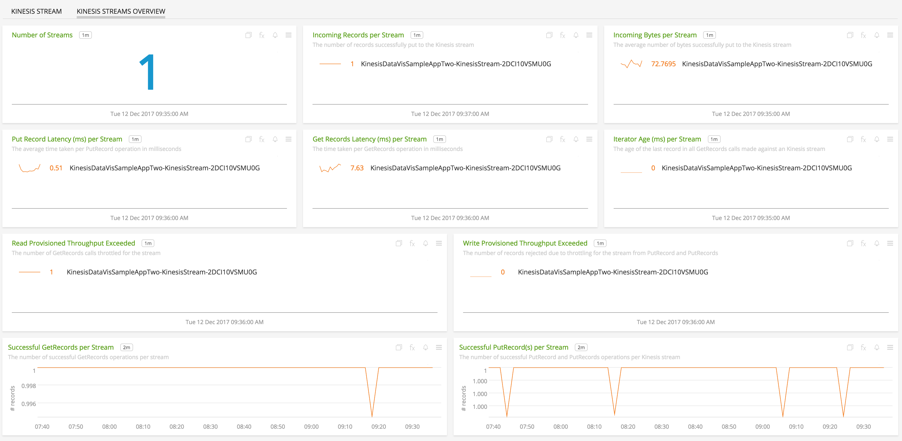

#  AWS Kinesis

- [Description](#description)
- [Installation](#installation)
- [Usage](#usage)
- [Metrics](#metrics)
- [License](#license)

### DESCRIPTION

Use SignalFx to monitor AWS Kinesis via [Amazon Web Services](https://github.com/signalfx/integrations/tree/master/aws).

#### FEATURES

##### Built-in dashboards

- **Kinesis Streams Overview**: Overview of all streams and data from Kinesis.

  

- **Kinesis Stream**: Focus on a single Kinesis Stream.

  

### INSTALLATION

To access this integration, [connect to CloudWatch](https://github.com/signalfx/integrations/tree/master/aws).

By default, SignalFx will import all CloudWatch metrics that are available in your account. To retrieve metrics for a subset of available services or regions, modify the connection on the Integrations page.

### USAGE

SignalFx provides built-in dashboards for this service. Examples are shown below.

### METRICS

For more information about the metrics emitted by AWS Kinesis, visit the service's homepage at <a target="_blank" href="https://aws.amazon.com/kinesis/">https://aws.amazon.com/kinesis/</a>.

### LICENSE

This integration is released under the Apache 2.0 license. See [LICENSE](./LICENSE) for more details.
