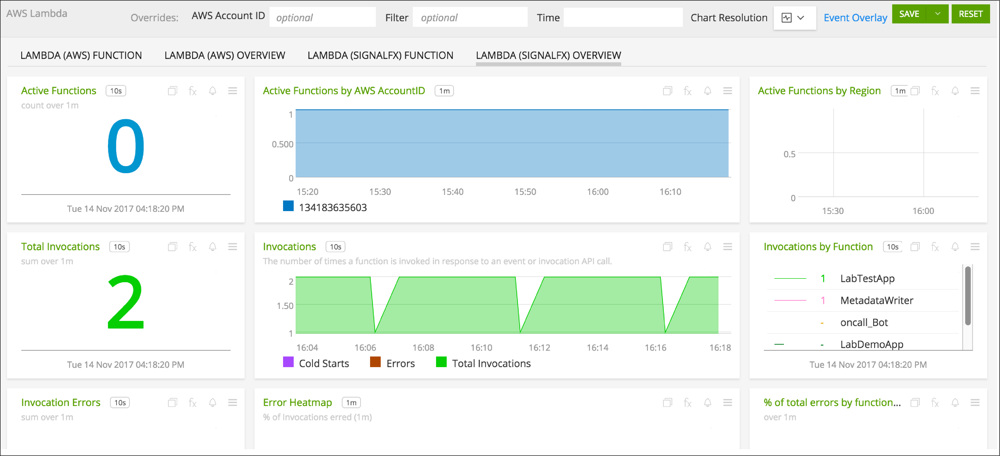
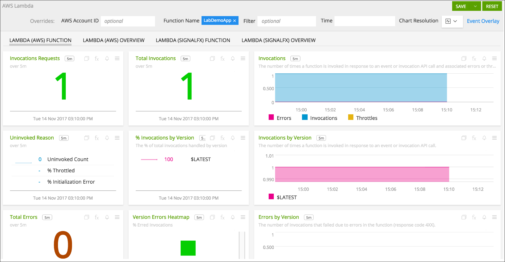
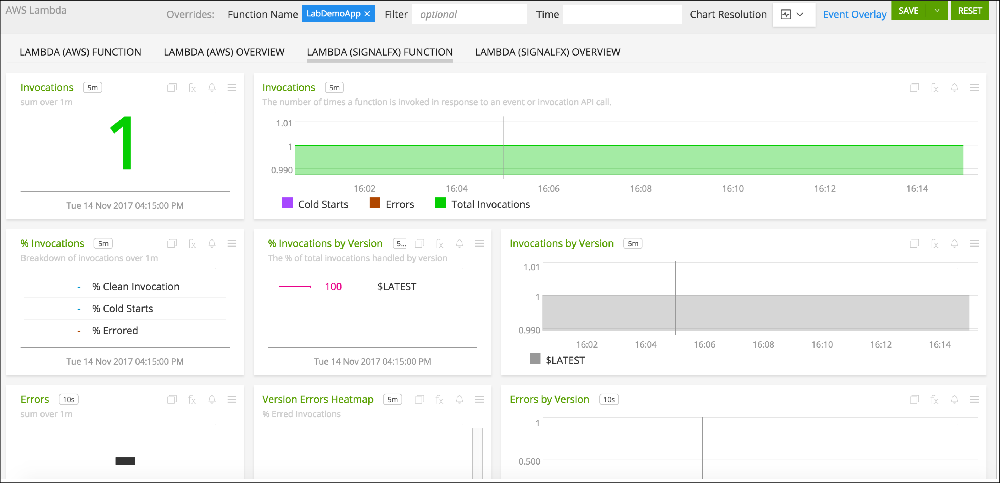

#  Amazon Lambda

- [Description](#description)
- [Installation](#installation)
- [Usage](#usage)
- [Metrics](#metrics)
- [Recommended Statistics](#recommended-statistics)
- [License](#license)

### DESCRIPTION

SignalFx enables you to monitor the health and performance of your Lambda functions through metrics on total invocations, errors, durations, and more. In addition, you can easily send custom application or business metrics from within your Lambda functions.

- If you have enabled the SignalFx Amazon Web Services integration and are syncing Cloudwatch metrics, <a target="_blank" href="http://docs.aws.amazon.com/lambda/latest/dg/monitoring-functions-metrics.html">those metrics</a> will automatically be available to view.

-  You can use one of our language-specific wrappers to monitor your functions. Using a wrapper lets you see invocations, errors and durations for your functions in real time, and also provides insight into whether a given function is being impacted by cold starts.

-  The wrapper is also a way for you to send in custom application or business metrics from within a Lambda function, analogous to what you can do with our client libraries for code running in non-Lambda environments.

### FEATURES

##### Built-in dashboards

- **Lambda (AWS) Overview**: Overview of all data from Lambda via CloudWatch.

  

- **Lambda (SignalFx) Overview**: Overview of all data from Lambda via SignalFx Wrapper.

  

- **Lambda (AWS) Function**: Instance view for specific Lambda function via CloudWatch.

  

- **Lambda (SignalFx) Function**: Instance view for specific Lambda function via SignalFx Wrapper.

  

### INSTALLATION

#### SignalFx Wrapper vs Cloudwatch monitoring

##### Step 1: Review and Select a Deployment Method

While you can use both the SignalFx Wrapper and Cloudwatch methods to monitor Lambda functions at the same time, you also have the option to use only one method.

Before you select a single method (or both), consider the following statements:

- Each method sends different metrics and uses different properties to uniquely identify a Lambda function.

- Cloudwatch data is reported with a delay; the delay can range from 1 to 10 minutes. The SignalFx Wrapper sends data immediately when it becomes available.

- Cloudwatch data is sent automatically for all Lambda functions, whereas the SignalFx Wrapper needs to be added to each function.

- SignalFx Wrapper is the only method to send custom application or business metrics from within a Lambda function.

##### Step 2: Review Setup Documentation

*Option 1: Use the SignalFx Wrapper*

The SignalFx Wrapper provides real-time monitoring of Lambda functions, as well as the ability to send custom metrics from your applications to SignalFx.

To use the SignalFx Wrapper, you can do either of the following:
  - Include the SignalFx Lambda Wrapper in your Lambda function
  - Add the Lambda Layer containing the Wrapper to the Lambda function.

To support different deployment models, SignalFx provides Lambda Wrappers as libraries, hosted [Lambda Layers](https://docs.aws.amazon.com/lambda/latest/dg/configuration-layers.html)
and as [Serverless Applications](https://aws.amazon.com/serverless/sam/) available through [Serverless Application Repository](https://aws.amazon.com/serverless/serverlessrepo/) (with language-specific exceptions).

To view the three installation methods for each Lambda wrapper, review the following readme files:

- <a target="_blank" href="https://github.com/signalfx/lambda-java">Java</a>
- <a target="_blank" href="https://github.com/signalfx/lambda-nodejs">NodeJs</a>
- <a target="_blank" href="https://github.com/signalfx/lambda-python">Python</a>
- <a target="_blank" href="https://github.com/signalfx/lambda-ruby">Ruby</a>
- <a target="_blank" href="https://github.com/signalfx/lambda-csharp">C#</a>
    - SAM application is not supported.
- <a target="_blank" href="https://github.com/signalfx/lambda-go">Go</a>
    - Lambda Layers are not supported.

*Option 2: Use CloudWatch*

By default, SignalFx imports all CloudWatch metrics that are available in your account. To retrieve metrics for a subset of available services or regions, you need to modify the connection on the Integrations page in the SignalFx UI.

To access this integration, see [connect to CloudWatch](https://github.com/signalfx/integrations/tree/master/aws).

### USAGE

#### Uniquely identifying Lambda

##### SignalFx Wrapper

SignalFx uses a unique ARN (Amazon Resource Names) of the function instance in the dimension `lambda_arn`.

##### CloudWatch

SignalFx synthesizes a unique ID for each Lambda function instance in the dimension `AWSUniqueId`.

### METRICS

#### SignalFx Wrapper

The SignalFx Lambda wrapper sends the following metrics to SignalFx:

| Metric Name  | Type | Description |
| ------------- | ------------- | ---|
| function.invocations  | Counter  | Count of Lambda invocations|
| function.cold_starts  | Counter  | Count of cold starts|
| function.errors  | Counter  | Count of errors from underlying Lambda handler|
| function.duration  | Gauge  | Milliseconds in execution time of underlying Lambda handler|

The Lambda wrappers add several dimensions to data points sent to SignalFx. These dimensions can be used for filtering and aggregation.

| Dimension | Description |
| ------------- | ---|
| lambda_arn  | Amazon Resource Name (ARN) of the Lambda function instance |
| aws_region  | AWS region where the Lambda function is executed  |
| aws_account_id | AWS Account ID associated with the Lambda function  |
| aws_function_name  | Name of the Lambda function |
| aws_function_version  | Version of the Lambda function |
| aws_function_qualifier  | AWS function version qualifier (version or version alias if it is not an event source mapping Lambda invocation) |
| event_source_mappings  | AWS function name (if it is an event source mapping Lambda invocation) |
| aws_execution_env  | AWS execution environment (e.g. AWS_Lambda_nodejs6.10) |
| function_wrapper_version  | SignalFx function wrapper qualifier (e.g. signalfx-lambda-0.0.9) |
| metric_source | The literal value of 'lambda_wrapper' |

#### CloudWatch

For more information about the metrics emitted by Lambda, see the documentation at <a target="_blank" href="https://docs.signalfx.com/en/latest/integrations/aws-info.html#lambda-metadata">https://docs.signalfx.com/en/latest/integrations/aws-info.html#lambda-metadata</a>.

<!--- METRICS --->
### RECOMMENDED STATISTICS

No CloudWatch recommended statistics for this integration.

### LICENSE

This integration is released under the Apache 2.0 license. See [LICENSE](./LICENSE) for more details.
