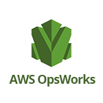
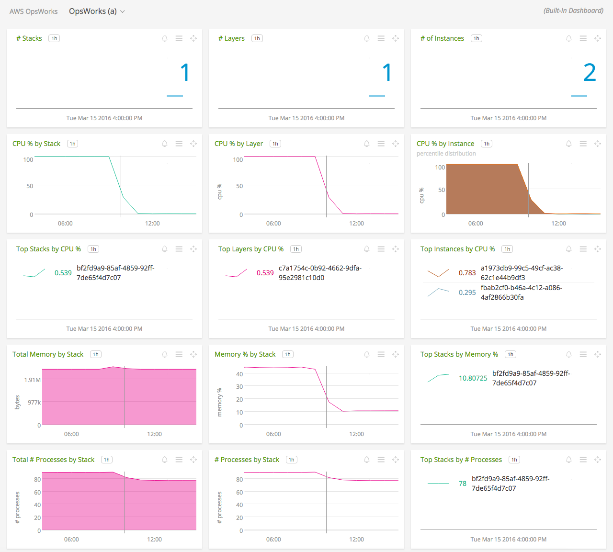
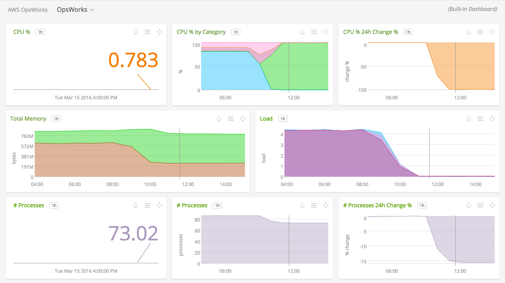

#  AWS OpsWorks

- [Description](#description)
- [Installation](#installation)
- [Usage](#usage)
- [Metrics](#metrics)
- [License](#license)

### DESCRIPTION

Use SignalFx to monitor AWS OpsWorks via [Amazon CloudWatch](https://docs.signalfx.com/en/latest/integrations/integrations-reference/integrations.amazon.cloudwatch.html).

#### FEATURES

##### Built-in dashboards

- **OpsWorks (a)**: Overview of all data from OpsWorks.

  

- **OpsWorks**: Focus on a single OpsWorks instance, layer or stack.

  

### INSTALLATION

To access this integration, [connect to CloudWatch](https://docs.signalfx.com/en/latest/integrations/integrations-reference/integrations.amazon.cloudwatch.html).

By default, SignalFx will import all CloudWatch metrics that are available in your account. To retrieve metrics for a subset of available services or regions, modify the connection on the Integrations page.

### USAGE

SignalFx provides built-in dashboards for this service. Examples are shown below.

### METRICS

For more information about the metrics emitted by AWS OpsWorks, visit the service's homepage at https://aws.amazon.com/opsworks/.

### LICENSE

This integration is released under the Apache 2.0 license. See [LICENSE](./LICENSE) for more details.
