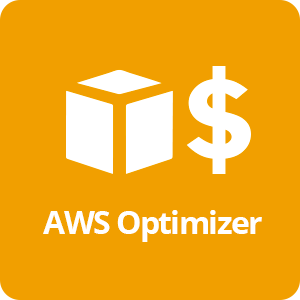
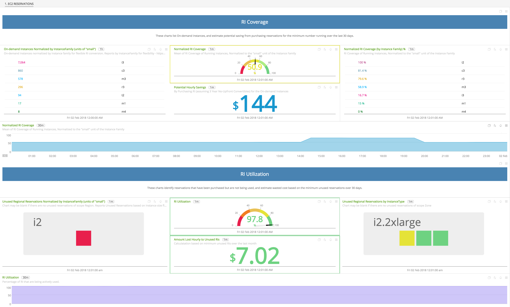
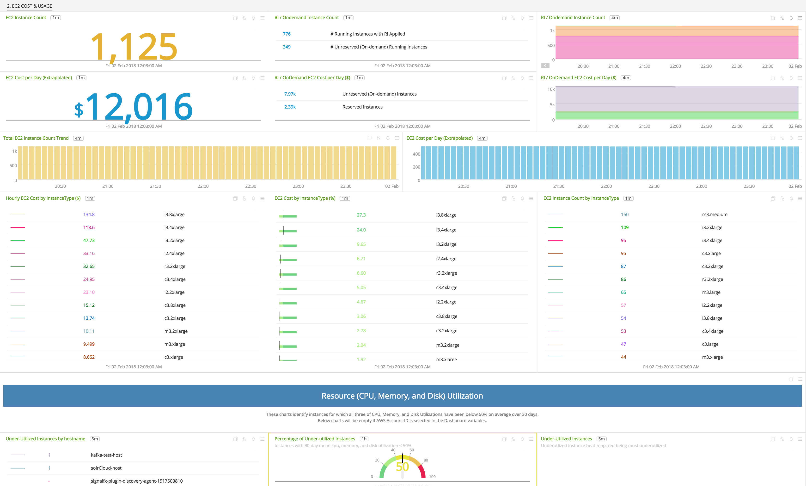
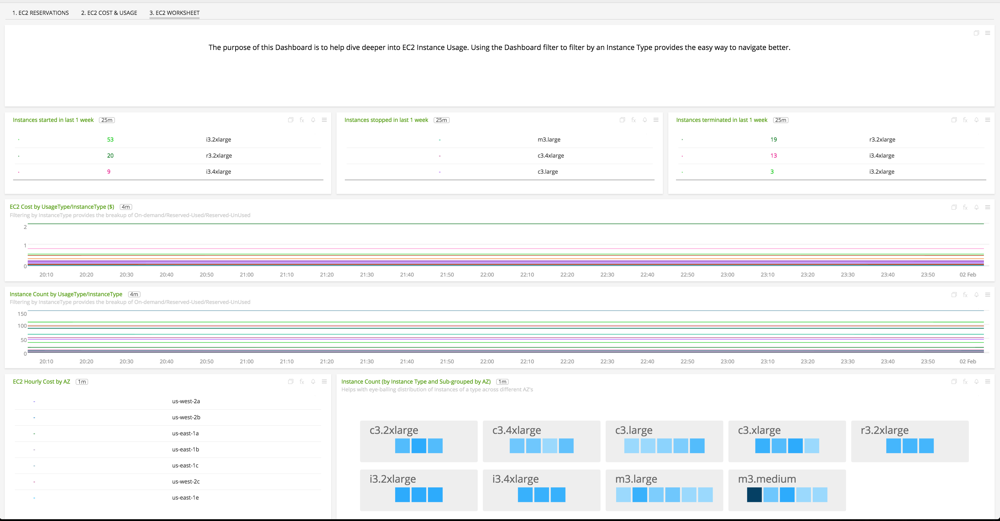

#  AWS Optimizer

- [Description](#description)
- [Installation](#installation)
- [Usage](#usage)
- [Metrics](#metrics)
- [License](#license)

### DESCRIPTION

SignalFx AWS Optimizer gives you actionable insight into cost-saving opportunities, underutilized investments, usage patterns, and cost attribution. You can view data by InstanceType, AWS Region, AWS availability Zone and categories specific to your setup, such as Service, Team, or any other dimensions that are sourced from EC2 instance tags. SignalFx makes calls to the AWS API to retrieve cost and usage data and derives metrics with which you can visualize EC2 usage and approximated costs. You can also create detectors based on this data, so you can get alerted in real-time on unexpected changes in cost or usage patterns.

Notes on using AWS Optimizer:
- The imported data does not include AWS Billing data.
- Data is not imported for EC2 Spot Instances.
- If you have multiple AWS Accounts, they must all be included in the SignalFx AWS integration and have “Import data for SignalFx AWS Optimizer” selected. If this is not the case, the generated metrics will not reflect accurate values.

#### FEATURES

AWS Optimizer generates usage & cost metrics and makes these available for visualization, analytics and alerting.

##### Built-in dashboards

- **EC2 Reservations**: Suggestions to optimize EC2 Reservations.

  [](./img/dashboard_optimizer_ec2_reservations.png)

- **EC2 Cost and Usage**: Details of EC2 Cost and Usage information.

  [](./img/dashboard_optimizer_ec2_cost_usage.png)

- **EC2 Worksheet**: Charts to help dive deeper into and troubleshoot EC2 Usage.

  [](./img/dashboard_optimizer_ec2_worksheet.png)

### INSTALLATION

To access this integration, [connect to Amazon Web Services](https://github.com/signalfx/integrations/tree/master/aws)[](sfx_link:aws).

For the usage data to be imported, make sure the following lines are in your AWS Policy Document:

```
"ec2:DescribeInstances",
"ec2:DescribeInstanceStatus",
"ec2:DescribeTags",
"ec2:DescribeReservedInstances",
"ec2:DescribeReservedInstancesModifications",
"organizations:DescribeOrganization",
```

### USAGE

SignalFx provides built-in dashboards for this service. Examples are shown below.

- **EC2 Reservations**: Suggestions to optimize EC2 Reservations.


- **EC2 Cost and Usage**: Details of EC2 Cost and Usage information.


- **EC2 Worksheet**: Charts to help dive deeper into and troubleshoot EC2 Usage.


### METRICS

For documentation of the metrics and dimensions emitted by this plugin, [click here](./docs).

### LICENSE

This integration is released under the Apache 2.0 license. See [LICENSE](./LICENSE) for more details.
