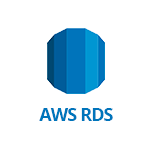
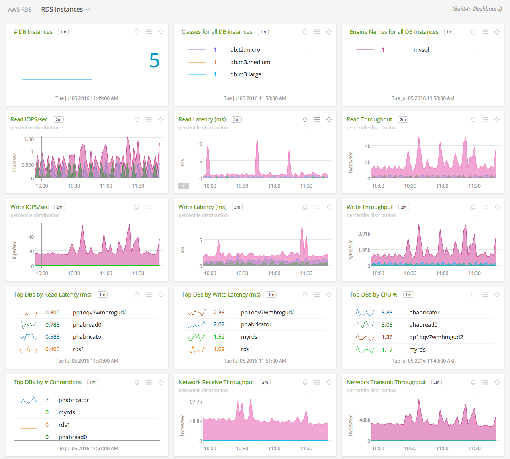
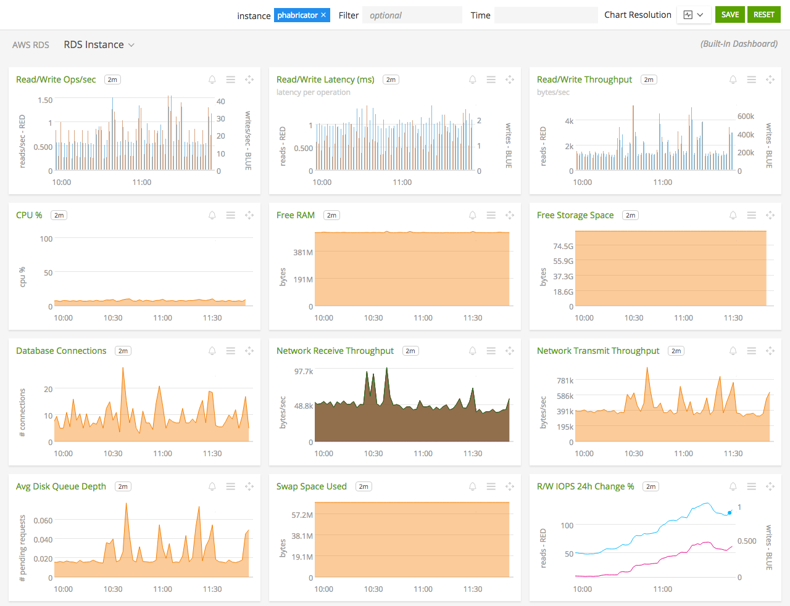

#  Amazon Relational Database Service (RDS)

- [Description](#description)
- [Installation](#installation)
- [Usage](#usage)
- [Metrics](#metrics)
- [License](#license)

### DESCRIPTION

Use SignalFx to monitor Amazon Relational Database Service (RDS) via [Amazon Web Services](https://github.com/signalfx/integrations/tree/master/aws)[](sfx_link:aws).

#### FEATURES

##### Built-in dashboards

- **RDS Instances**: Overview of all data from RDS.

  [](./img/dashboard_rds_instances.png)

- **RDS Instance**: Focus on a single RDS instance.

  [](./img/dashboard_rds_instance.png)

### INSTALLATION

To access this integration, [connect to CloudWatch](https://github.com/signalfx/integrations/tree/master/aws)[](sfx_link:aws).

By default, SignalFx will import all CloudWatch metrics that are available in your account. To retrieve metrics for a subset of available services or regions, modify the connection on the Integrations page.

#### RDS ENHANCED MONITORING

SignalFx supports an integration with <a target="_blank" href="http://docs.aws.amazon.com/AmazonRDS/latest/UserGuide/USER_Monitoring.OS.html">RDS Enhanced Monitoring</a> using an AWS Lambda function, described below. This integration also includes built-in dashboards designed specifically for the metrics from Enhanced Monitoring. This Enhanced Monitoring integration complements the CloudWatch-based integration described above.  

You can choose to deploy the function either from the Serverless Application Repository (recommended) or from source. Choose a deployment method and follow the steps below to encrypt your SignalFx access token, customize the metrics that will be sent to SignalFx, and create and deploy the new function. 

Before you begin, you must enable the Enhanced Monitoring option for the RDS instances you want to monitor using this integration. <a target="_blank" href="http://docs.aws.amazon.com/AmazonRDS/latest/UserGuide/USER_Monitoring.OS.html">Click here for instructions on enabling Enhanced Monitoring</a>.

##### Note: Encryption of your SignalFx access token
This Lambda function uses your SignalFx access token to send metrics to SignalFx, as an environment variable to the function. While Lambda encrypts all environment variables at rest and decrypts them upon invocation, AWS recommends that all sensitive information such as access tokens be encrypted using a KMS key before function deployment, and decrypted at runtime within the code. 

Both procedures below include instructions for using either an encrypted or non-encrypted access token. 

- [Deploying through the Serverless Application Repository](#deploying-through-the-serverless-application-repository)
- [Building from source](#building-from-source)
- [Metrics collected by this integration](#metric-groups-collected-by-this-integration)

#### Deploying through the Serverless Application Repository

##### 1. Set up an encryption key and encrypt your access token (if desired)
Only follow this step if you chose to manually encrypt your access token. Either create a new KMS encryption key or select a preexisting one. **The key must be in the same availability zone as the RDS instances you are monitoring.** You can create and manage encryption keys from IAM in the AWS management console. Documentation on KMS encryption from the CLI can be found <a target="_blank" href="http://docs.aws.amazon.com/cli/latest/reference/kms/encrypt.html">here</a>. Make sure you have access to the cipher text output by the encryption as well as the key id of the encryption key you used.

##### 2. Create the Lambda function
Click `Create Function` from the list of Lambda functions in your AWS console. Make sure you are in the intended availability zone. Select the `Serverless Application Repository` option in the upper right hand corner. Search for `signalfx rds` and choose the appropriate entry based on whether you encrypted your access token.

To access the templates directly, find the template for encrypted access tokens <a target="_blank" href="https://serverlessrepo.aws.amazon.com/applications/arn:aws:serverlessrepo:us-east-1:134183635603:applications~signalfx-enhanced-rds-metrics-encrypted">here</a>. The template for non-encrypted access tokens is <a target="_blank" href="https://serverlessrepo.aws.amazon.com/applications/arn:aws:serverlessrepo:us-east-1:134183635603:applications~signalfx-enhanced-rds-metrics">here</a>.

##### 3. Fill out application parameters
Under `Configure application parameters`, choose a name for your function, and fill out the fields accordingly.

**Parameters for template using encrypted access tokens**
- `EncryptedSignalFxAuthToken`: The Ciphertext blob output from your encryption of your SignalFx organization's access token
- `KeyId`: The key id of your KMS encryption key; it is the last section of the key's ARN.
- `SelectedMetricGroups`: The metric groups you wish to send. Enter `All` if you want all available metrics. Otherwise, list the names of desired metric groups, spelled exactly as they are in [Metrics collected by this integration](#metric-groups-collected-by-this-integration), separated by single spaces.

**Parameters for template using non-encrypted access tokens**
- `SignalFxAuthToken`: Your SignalFx organization's access token (YOUR_SIGNALFX_API_TOKEN)
- `SelectedMetricGroups`: The metric groups you wish to send. Enter `All` if you want all available metrics. Otherwise, list the names of desired metric groups, spelled exactly as they are in [Metrics collected by this integration](#metric-groups-collected-by-this-integration), separated by single spaces.

 
##### 4. Deploy function and configure trigger
Click `Deploy`. Once the function has finished deploying, navigate to the function's main page. 

Under the `Configuration` tab, scroll through the list on the left and select CloudWatch Logs as the source of the trigger. Below there will be specific configurations for the trigger. 

- Select `RDSOSMetrics` as the log group. 
- Choose an appropriate name for the filter, and leave the filter pattern blank. 
- Make sure the `Enabled` switch is activated. 

Click `Add`, then click `Save` in the upper right corner.

That's it! Your metrics are on the way to SignalFx ingest!

#### Building from source

##### 1. Set up the execution role
The execution role just needs basic Lambda execution permissions and KMS decrypt permissions (if you wish to encrypt your SignalFx access token). If you don't want to create one, you can select from a list of templates when you create the lambda function.

##### 2. Set up an encryption key and encrypt access token
Only follow this step if you chose to encrypt your access token. Either create a new KMS encryption key or select a preexisting one. **The key must be in the same availability zone as the RDS instances you are monitoring.** You can create and manage encryption keys from IAM in the AWS management console. Documentation on KMS encryption from the CLI can be found <a target="_blank" href="http://docs.aws.amazon.com/cli/latest/reference/kms/encrypt.html">here</a>. Make sure you have access to the cipher text output by the encryption as well as the key id of the encryption key you used.

##### 3. Clone the source repo and build the deployment package
You can find the repo <a target="_blank" href="https://github.com/signalfx/enhanced-rds-monitoring">here</a>.
Once you have cloned the repo:
```
$ cd enhanced-rds-monitoring
$ ./build.sh
```
The package will be named `enhanced_rds.zip`. This will be the file to upload for the Lambda.

##### 4. Create and configure the Lambda function
From the Lambda creation screen, make sure you have selected `Build from scratch`. Select a name for your function. For `Runtime` select `Python2.7`. For the execution role, either select the role you wish to use or select `Create from Template` and add KMS decrypt permissions if need be. You will also need to choose a name for the role.

###### Designer
The only thing to be done here is set up the trigger from CloudWatch Logs. Select CloudWatch Logs from the list on the left. Below, a section labelled `Configure triggers` will appear. For the `Log group` field, select `RDSOSMetrics`. You must also choose a filter name, but leave the filter pattern blank. You can disable the trigger to start if you wish (though you will need to manually enable it later to start sending metrics), then click Add.

###### Function code
Once the function is created you can change the configurations. Upload the ZIP file containing the deployment package. Change the text in `Handler` to be `lambda_script.lambda_handler`.

###### Environment variables
First create an environment variable called `groups`. This will store the list of metric groups to be reported. To report all available metrics, enter `All`. Otherwise, list the names of desired metric groups, spelled exactly as listed under [Metrics collected by this integration](#metric-groups-collected-by-this-integration), separated by single spaces. 

Next create a variable to store your SignalFx access token. Create a field called `encrypted_access_token` to store an encrypted SignalFx access token, or simply `access_token` to store an unencrypted token. Paste your access token into the value field. 

If you use `encrypted_access_token`, follow the steps below to encrypt it:
- Under `Encryption configuration`, check the box to `Enable helpers for encryption in transit`. A new field will appear labelled `KMS key to encrypt in transit`. 
- Select the encryption key you wish to use from the dropdown. A button labelled `Encrypt` will appear next to your environment variables. 
- Click the `Encrypt` button next to `encrypted_access_token` once. The value will be replaced by a Ciphertext blob.

###### Basic settings
Under basic settings, set `Timeout` to `0 min 5 sec`.

Click `Save`, and once the trigger is enabled, your function will start sending your metrics to SignalFx!

#### Metric groups collected by this integration

The following metric groups are collected by this integration. To collect all of them, use `All` at configuration time. To select a subset, choose metric groups by name. You can find documentation on the available metrics <a target="_blank" href="http://docs.aws.amazon.com/AmazonRDS/latest/UserGuide/USER_Monitoring.OS.html">here</a>.

**Metric Groups (except for SQLServer)**
- cpuUtilization
- diskIO
- fileSys
- loadAverageMinute
- memory
- network
- swap
- tasks
- OSprocesses*
- RDSprocesses*

**SQLServer Metric Groups**
- cpuUtilization
- disks
- memory
- network
- system
- OSprocesses*
- RDSprocesses*

\* Process-based metric group added by SignalFx, does not appear in AWS documentation.

### USAGE

SignalFx provides built-in dashboards for this service. Examples are shown below.


### METRICS

For more information about the metrics emitted by Amazon Relational Database Service, visit the service's homepage at <a target="_blank" href="https://aws.amazon.com/rds/">https://aws.amazon.com/rds/<a>.

### LICENSE

This integration is released under the Apache 2.0 license. See [LICENSE](./LICENSE) for more details.
