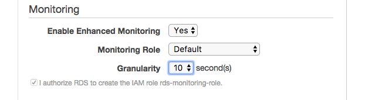
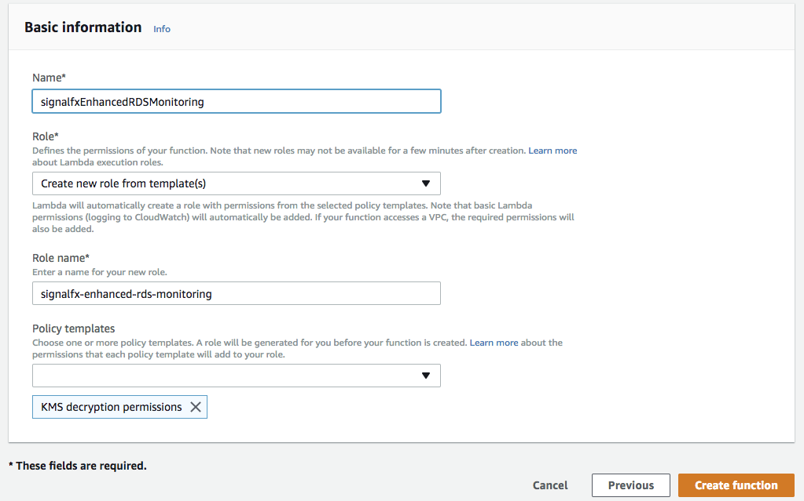
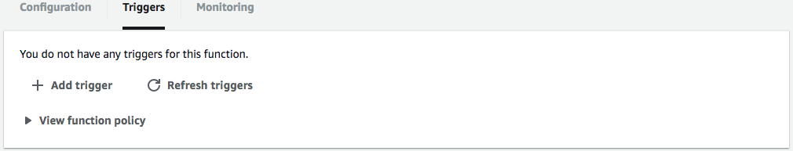
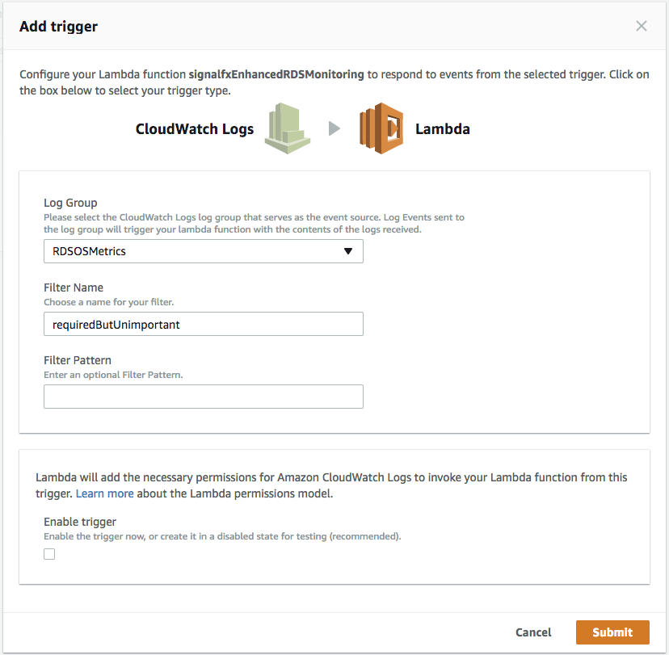

#  Amazon Relational Database Service (RDS)

- [Description](#description)
- [Installation](#installation)
- [Usage](#usage)
- [Metrics](#metrics)
- [License](#license)

### DESCRIPTION

Use SignalFx to monitor Amazon Relational Database Service (RDS) via [Amazon CloudWatch](https://github.com/signalfx/integrations/tree/master/aws)[](sfx_link:aws). 

#### FEATURES

##### Built-in dashboards

- **RDS Instances**: Overview of all data from RDS.
  
  [](./img/dashboard_rds_instances.png)

- **RDS Instance**: Focus on a single RDS instance.
  
  [](./img/dashboard_rds_instance.png)

### INSTALLATION

To access this integration, [connect to CloudWatch](https://github.com/signalfx/integrations/tree/master/aws)[](sfx_link:aws) on the SignalFx Integrations page. 

By default, SignalFx will import all CloudWatch metrics that are available in your account. To retrieve metrics for a subset of available services or regions, modify the connection on the Integrations page. 

### USAGE

SignalFx provides built-in dashboards for this service. Examples are shown below. 


### METRICS

For more information about the metrics emitted by Amazon Relational Database Service, visit the service's homepage at https://aws.amazon.com/rds/.

### ENHANCED MONITORING

SignalFx now offers a Lambda-based integration of enhanced monitoring from RDS. This integration can be used regardless of whether the standard RDS integration is in use. Setup only requires a bit of configuration on AWS to start sending enhanced metrics to SignalFx at the desired granularity.

#### Download and build the archive

First things first, you need to get the code into a zip archive. In a bash shell:

```sh
$ git clone https://github.com/signalfx/enhanced-rds-monitoring.git
$ cd enhanced-rds-monitoring
$ ./build.sh
$ tox # Optional: verify the build.
```

After running this sequence of commands, you will have a copy of `enhanced_rds.zip`. This will be the zip archive you upload to the Lambda function later.

#### Enable Enhanced Monitoring

You must enable enhanced monitoring on each instance for which you wish to report metrics. To do so, go to the list of instances on the RDS dashboard, select the instance, display the `Instance Actions` dropdown, and select Modify. The Enable Enhanced Monitoring section is towards the bottom. After selecting Yes, you will have options for which monitoring role to use, as well as the resolution of your data points. If there is no role available on the dropdown you can allow one to be created for you by selecting a checkbox, or reuse a preexisting one.

[](./img/enable-enhanced-mon.png)

Each instance will take a few minutes to change its configuration, after which the metrics will be sent to a CloudWatch Logs stream.

#### Create an Encryption Key

Creating an Encryption Key allows you to keep your SignalFx access token encrypted in the configuration of the Lambda function. To create a new one, go to the Encryption Keys tab on the IAM Management Console. Make sure to add the users who will need to have access to the Lambda function, as well as appropriate admins.

#### Create the Lambda function

##### Basic information

You can create a new Lambda from the Functions page of the Lambda Management Console. The name of the function itself will be how it appears on the list in the Management Console, so choose one accordingly. For the function permissions, the only requirement is KMS decryption permissions. You can either use a preexisting role that already has those permissions, or create a new role from the templates that AWS provides. If you choose this route, select `Create new role from template(s)` from the Role dropdown, create a descriptive name for the role, and under Policy templates, select `KMS decryption permissions`.

[](./img/function-name-and-role.png)

##### Configuration tab

[<img src='./img/lambda-configuration.png' width=200px](./img/lambda-configuration.png)

###### Function code

Under 'Code entry type' select `Upload a .ZIP file`. Set the runtime to `Python 2.7`. Set 'Handler' to be `lambda_script.lambda_handler`. Click 'Upload', and find the `enhanced_rds.zip` file you built earlier. The file should be about 2.9 MB; if it isn't, the archive may not be built correctly, so you should try going through the process described above again.

###### Environment variables

You will want to create 1 or 2 environment variables. The access token for your SignalFx organization is required so that we can attach the metrics to your account. The key must be `access_token`, and the value should be that access token. Expand the 'Encryption configuration' section and check the box under 'Enable helpers for encryption in transit'. From 'KMS key to encrypt in transit' and 'KMS key to encrypt at rest', select the encryption key you created earlier. An 'Encrypt' button will appear next to your environment variables; click it to activate the encryption.

Another environment variable is necessary only if you are certain that you want a subset of the available metrics. The full list can be found [here](http://docs.aws.amazon.com/AmazonRDS/latest/UserGuide/USER_Monitoring.OS.html). You can provide the names of the metric groups that you want either included or excluded. The key for this environment variable is `groups` for the inclusive group or `groups_out` for the exclusive group. The list should simply be the names of the groups, spelled exactly as they are in the documentation (including capitals), separated by a single space. If you create both lists, only the `groups` list will be used.

E.g.
`cpuUtilization diskIO memory`

###### Execution role

You can just select `Choose an existing role` and select the role we created earlier.

###### Basic settings

Change the default 3 seconds timeout to 5 seconds.

##### Triggers tab

[](./img/trigger-before.png)

Click on the perforated box and select CloudWatch Logs from the list. A number of additional options will appear. Select `RDSOSMetrics` under 'Log Group', and select an appropriate 'Filter Name'. Leave 'Filter Pattern' empty. We recommend that you deselect the 'Enable trigger' option so that you can review your settings before activating your Lambda. You can enable the trigger from the Triggers tab at any time.

[](./img/trigger-after.png)

When you are satisfied with your configuration settings, enable the trigger, and you're good to go! Your metrics will shortly be on their way to SignalFx ingest.
  
### LICENSE

This integration is released under the Apache 2.0 license. See [LICENSE](./LICENSE) for more details.
