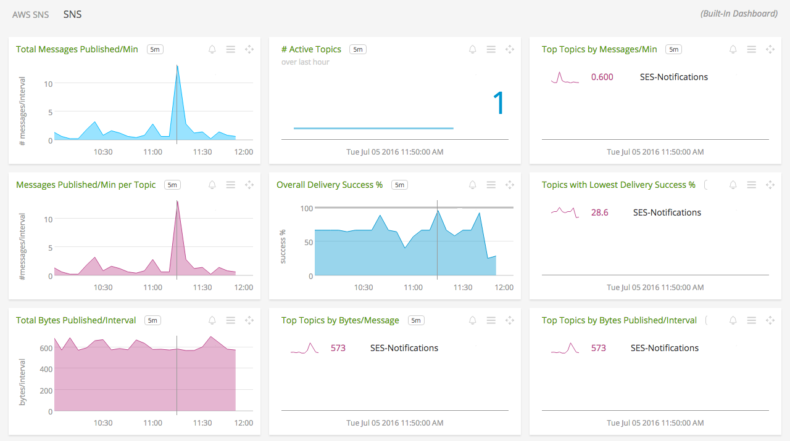

#  Amazon Simple Notification Service (SNS)

- [Description](#description)
- [Installation](#installation)
- [Usage](#usage)
- [Metrics](#metrics)
- [License](#license)

### DESCRIPTION

Use SignalFx to monitor Amazon Simple Notification Service (SNS) via [Amazon Web Services](https://github.com/signalfx/integrations/tree/master/aws).

#### FEATURES

##### Built-in dashboards

- **SNS**: Overview of all data from SNS.

  

### INSTALLATION

To access this integration, [connect to CloudWatch](https://github.com/signalfx/integrations/tree/master/aws). 

By default, SignalFx will import all CloudWatch metrics that are available in your account. To retrieve metrics for a subset of available services or regions, modify the connection on the Integrations page.

### USAGE

SignalFx provides a built-in dashboard for this service, as shown below.

### METRICS

For more information about the metrics emitted by Amazon Simple Notification Service, visit the service's homepage at <a target="_blank" href="https://aws.amazon.com/sns/">https://aws.amazon.com/sns/</a>.

### LICENSE

This integration is released under the Apache 2.0 license. See [LICENSE](./LICENSE) for more details.
