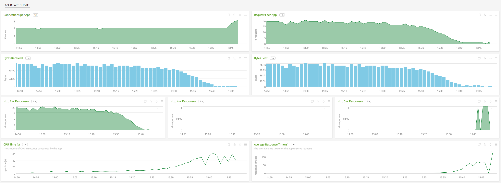
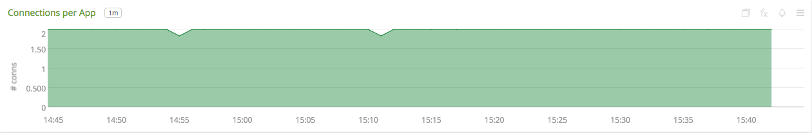
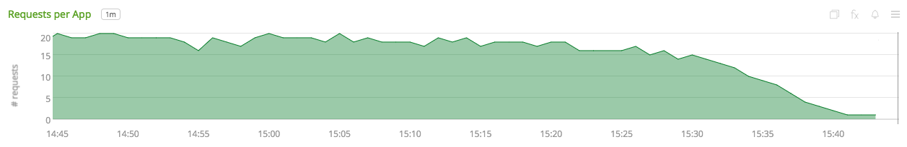
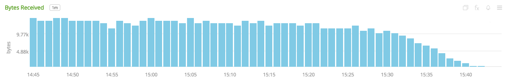
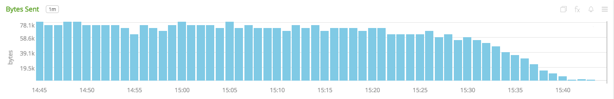
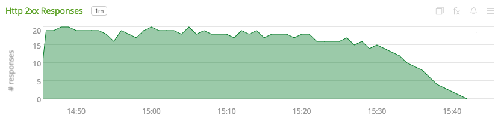
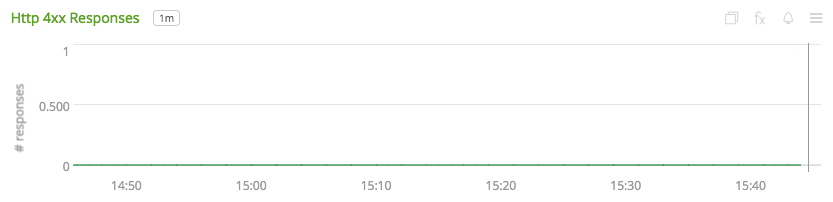
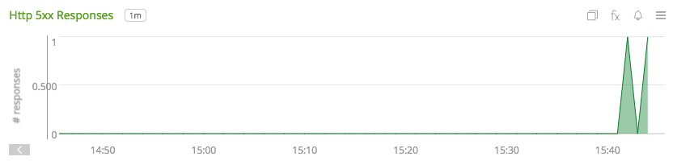
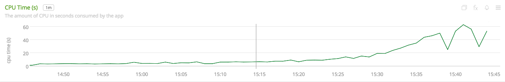
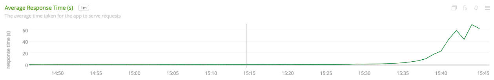

#  Microsoft Azure App Service

- [Description](#description)
- [Installation](#installation)
- [Usage](#usage)
- [Metrics](#metrics)
- [License](#license)

### DESCRIPTION

Use SignalFx to monitor Azure App Service via [Microsoft Azure](https://github.com/signalfx/integrations/tree/master/azure).

#### FEATURES

##### Built-in dashboards

- **Azure App Service**: An overview of all the Azure apps being monitored by SignalFx. Users can also specify an app's name to view metrics from a single app.

  

### INSTALLATION

To access this integration, [connect to Microsoft Azure](https://github.com/signalfx/integrations/tree/master/azure).

### USAGE

#### Interpreting Built-in dashboards

**Azure App Service**

- **Connections per App** - A stacked chart of number of connections aggregated by app.

  

- **Requests per App** - A stacked chart of number of requests aggregated by app.

  

- **Bytes Received** - Total bytes received by all the apps being monitored.

  

- **Bytes Sent** - Total bytes sent by all the apps being monitored.

  

- **Http 2xx Responses** - Number of 2xx responses returned by apps aggregated by app.

  

- **Http 4xx Responses** - Number of 4xx responses returned by apps aggregated by app.

  

- **Http 5xx Responses** - Number of 5xx responses returned by apps aggregated by app.

  

- **CPU Time (s)** - CPU time of the monitored apps.

  

- **Average Response Time (s)** - Average response time for each of the apps.

  

### METRICS

For more information about the metrics emitted by Azure App Service, visit <a target="_blank" href="https://docs.microsoft.com/en-us/azure/monitoring-and-diagnostics/monitoring-supported-metrics#microsoftwebsites-excluding-functions">here</a>.

### LICENSE

This integration is released under the Apache 2.0 license. See [LICENSE](./LICENSE) for more details.
