# 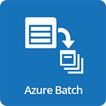 Microsoft Azure Batch

- [Description](#description)
- [Installation](#installation)
- [Usage](#usage)
- [Metrics](#metrics)
- [License](#license)

### DESCRIPTION

Use SignalFx to monitor Azure Batch via [Microsoft Azure](https://github.com/signalfx/integrations/tree/master/azure).

#### FEATURES

##### Built-in dashboards

- **Azure Batch Accounts**: Shows metrics of all batch accounts being monitored. Users can select a single batch account to view metrics related to the single account.

  [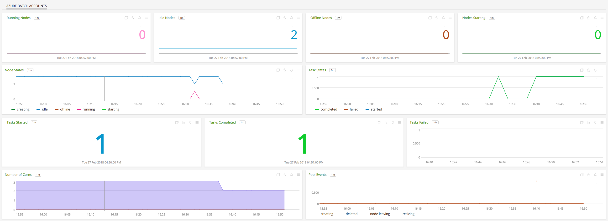](./img/batch.png)

### INSTALLATION

To access this integration, [connect to Microsoft Azure](https://github.com/signalfx/integrations/tree/master/azure).

### USAGE

#### Interpreting Built-in dashboards

**Azure Batch Accounts**

- **Running Nodes** - Number of nodes running.

  [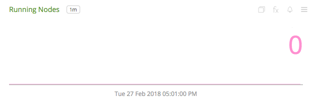](./img/batch.running.nodes.png)

- **Idle Nodes** - Number of nodes running.

  [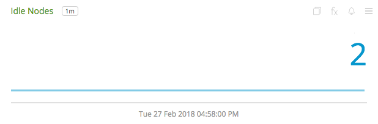](./img/batch.idle.nodes.png)

- **Offline Nodes** - Number of nodes running.

  [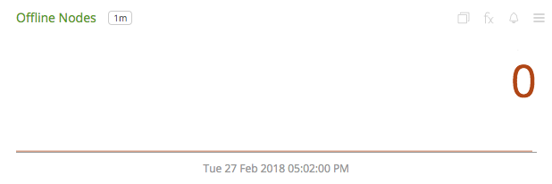](./img/batch.offline.nodes.png)

- **Starting Nodes** - Number of nodes running.

  [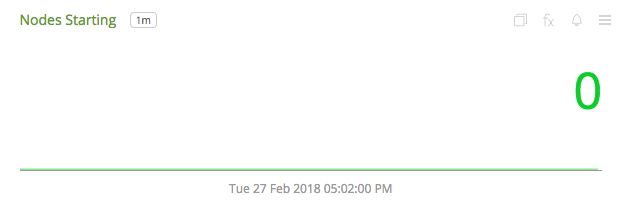](./img/batch.starting.nodes.png)

- **Node States** - Shows number of nodes in each of the states: creating, starting, running, idle or offline.

  [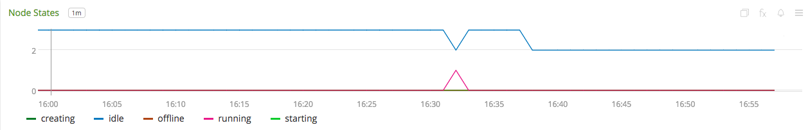](./img/batch.node.states.png)

- **Task States** - Shows number of tasks in each of the states: completed, failed, or started.

  [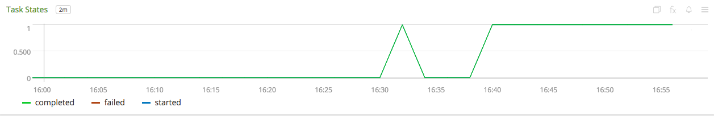](./img/batch.task.states.png)

- **Tasks Started** - Number of tasks that started.

  [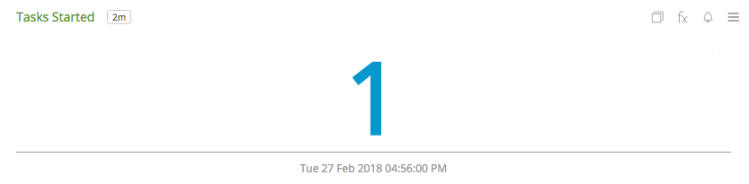](./img/batch.tasks.started.png)

- **Tasks Completed** - Number of tasks completed.

  [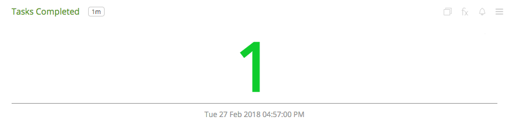](./img/batch.tasks.completed.png)

- **Tasks Failed** - Number of tasks failed.

  [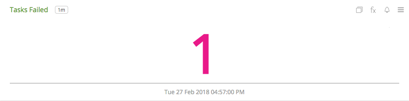](./img/batch.tasks.failed.png)

- **Number of Cores** - Number of in each of the Accounts.

  [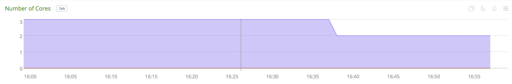](./img/batch.cores.png)

- **Pool Events** - Number of pool events in each of the states: creating, deleted, node leaving or resizing.

  [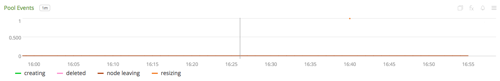](./img/batch.pool.events.png)

### METRICS

For more information about the metrics emitted by Azure Batch, visit <a target="_blank" href="https://docs.microsoft.com/en-us/azure/monitoring-and-diagnostics/monitoring-supported-metrics#microsoftbatchbatchaccounts">here</a>.

### LICENSE

This integration is released under the Apache 2.0 license. See [LICENSE](./LICENSE) for more details.
