#  Microsoft Azure Event Hubs

- [Description](#description)
- [Installation](#installation)
- [Usage](#usage)
- [Metrics](#metrics)
- [License](#license)

### DESCRIPTION

Use SignalFx to monitor Azure Event Hubs via [Microsoft Azure](https://github.com/signalfx/integrations/tree/master/azure).

#### FEATURES

- **Azure Event Hub**: Shows metrics of an Event hub.

  [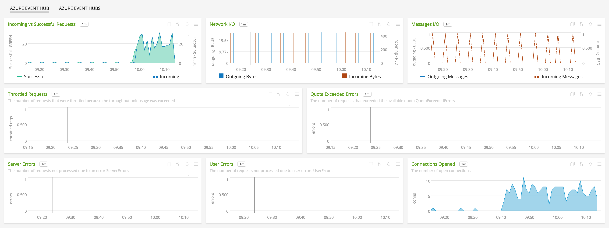](./img/hub.png)

- **Azure Event Hubs**: Shows metrics of all Event hubs being monitored.

  [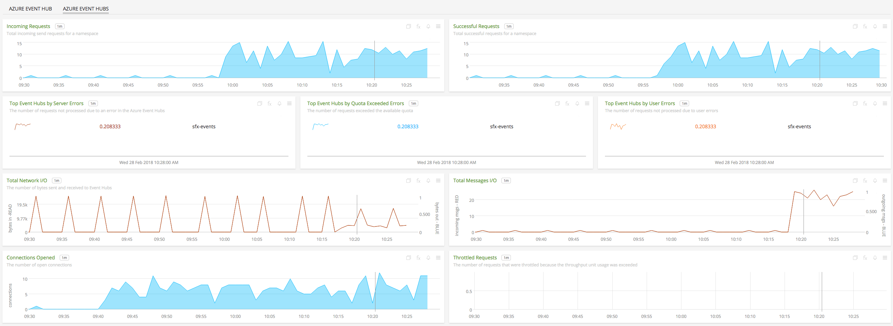](./img/hubs.png)

### INSTALLATION

To access this integration, [connect to Microsoft Azure](https://github.com/signalfx/integrations/tree/master/azure).

### USAGE

#### Interpreting Built-in dashboards

**Azure Event Hub**

- **Incoming vs Successful Requests** - Charts shows a comparison of the total number of incoming requests and the ones that failed.

  [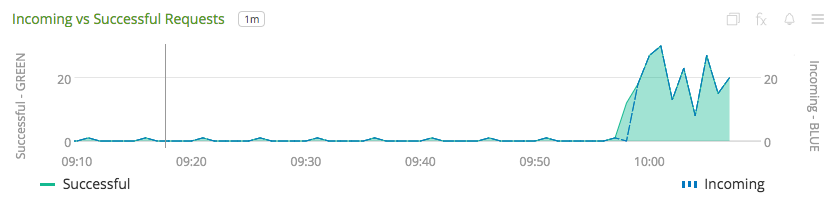](./img/hub.incoming.vs.success.reqs.png)

- **Network I/O** - Number of incoming and outgoing bytes to/from the event hub.

  [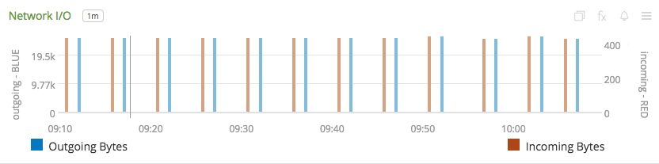](./img/hub.network.png)

- **Messages I/O** - Number of incoming and outgoing messages to/from the event hub.

  [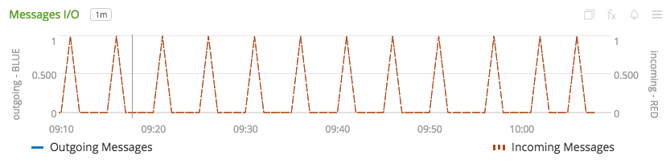](./img/hub.messages.png)

- **Throttled Requests** - Trend of the number requests throttled.

  [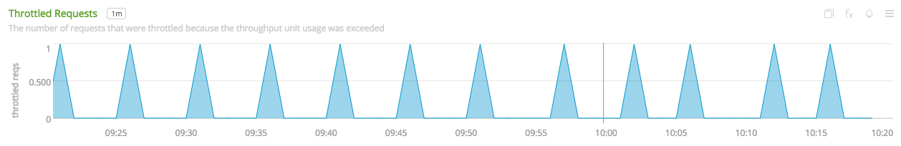](./img/hub.throttled.reqs.png)

- **Quota Exceeded Errors** - Trend of the number errors due to exceeding quota.

  [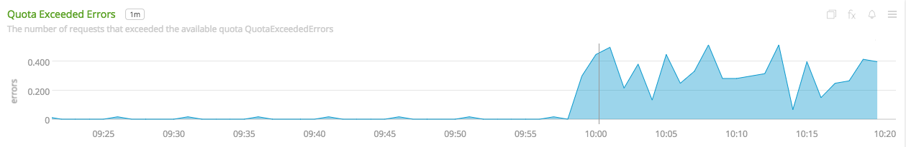](./img/hub.quota.errors.png)

- **Server Errors** - Trend of the number server errors.

  [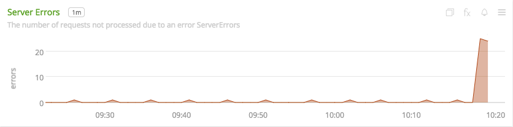](./img/hub.server.errors.png)

- **User Errors** - Trend of the number user errors.

  [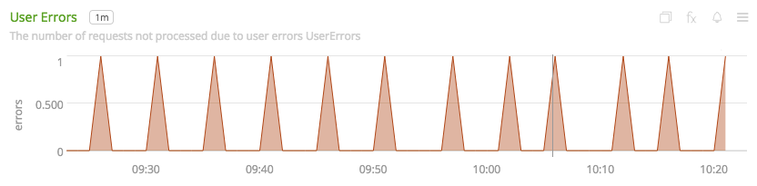](./img/hub.user.errors.png)

- **Connections Opened** - Number of connections opened.

  [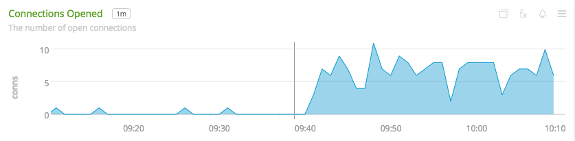](./img/hub.connections.png)

**Azure Event Hubs**

- **Incoming Requests** - Shows the trend of incoming requests for all event hubs monitored.

  [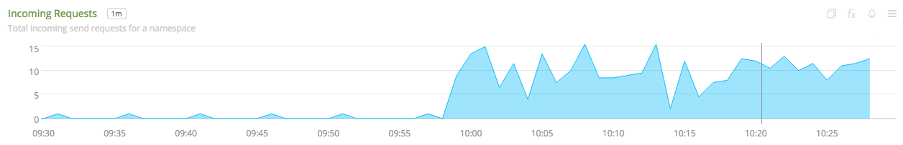](./img/hubs.incoming.reqs.png)

- **Successful Requests** - Shows the trend of successful requests for all event hubs monitored.

  [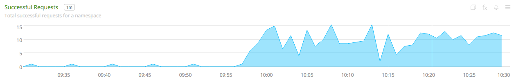](./img/hubs.successful.reqs.png)

- **Top Event Hubs by Server Errors** - List of event hubs with most number of server errors.

  [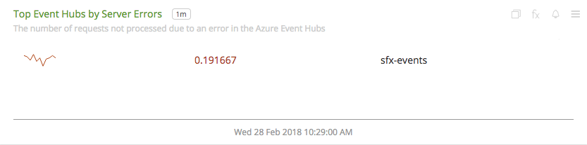](./img/hubs.top.server.errors.png)

- **Top Event Hubs by Quota Exceeded Errors** - List of event hubs with most number of quota exceeded errors.

  [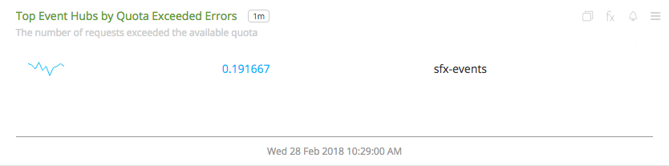](./img/hubs.top.quota.errors.png)

- **Top Event Hubs by Users Errors** - List of event hubs with most number of user errors.

  [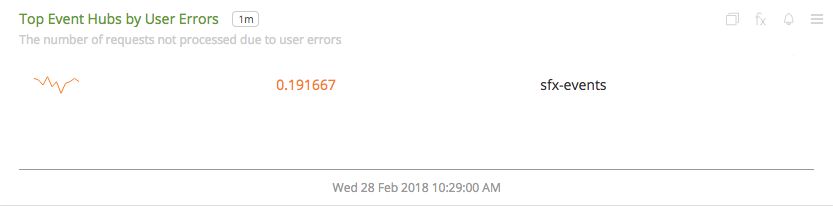](./img/hubs.top.user.errors.png)

- **Total Network I/O** - Number of incoming and outgoing bytes to/from all event hubs.

  [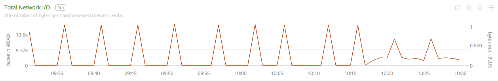](./img/hubs.network.png)

- **Total Messages I/O** - Number of incoming and outgoing messages to/from all event hubs.

  [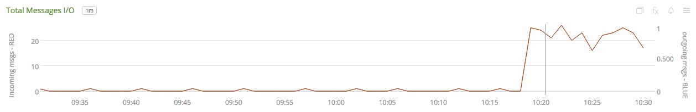](./img/hubs.messages.png)

- **Connections Opened** - Number of connections opened stacked by event hub.

  [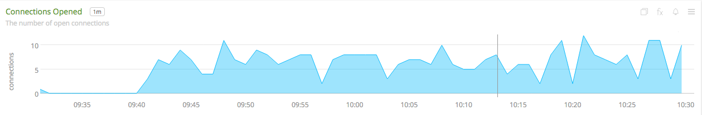](./img/hubs.connections.png)

- **Throttled Requests** - Number of requests throttled opened stacked by event hub.

  [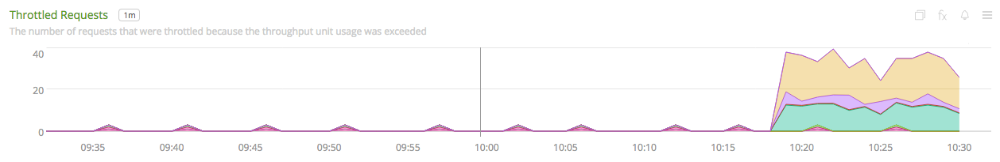](./img/hubs.throttled.reqs.png)

### METRICS

For more information about the metrics emitted by Azure Event Hubs, visit <a target="_blank" href="https://docs.microsoft.com/en-us/azure/monitoring-and-diagnostics/monitoring-supported-metrics#microsofteventhubnamespaces">here</a>.

### LICENSE

This integration is released under the Apache 2.0 license. See [LICENSE](./LICENSE) for more details.
