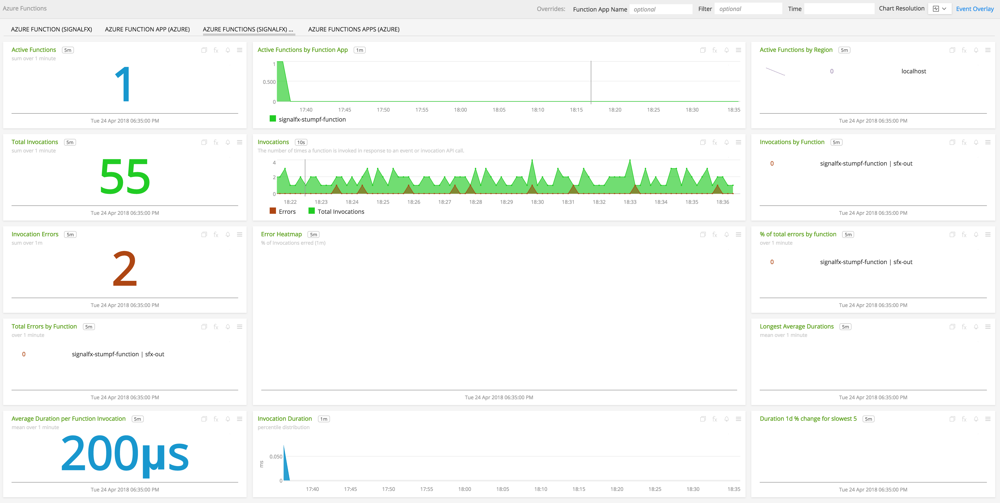
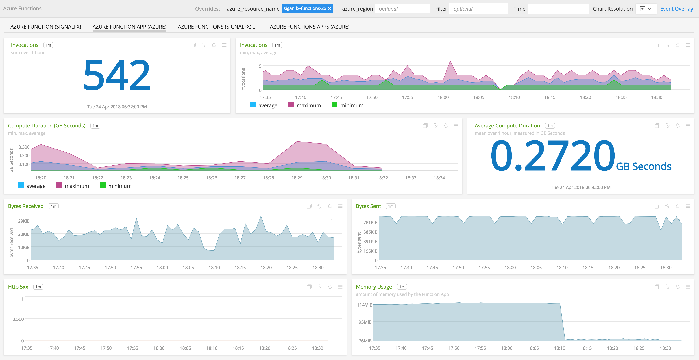
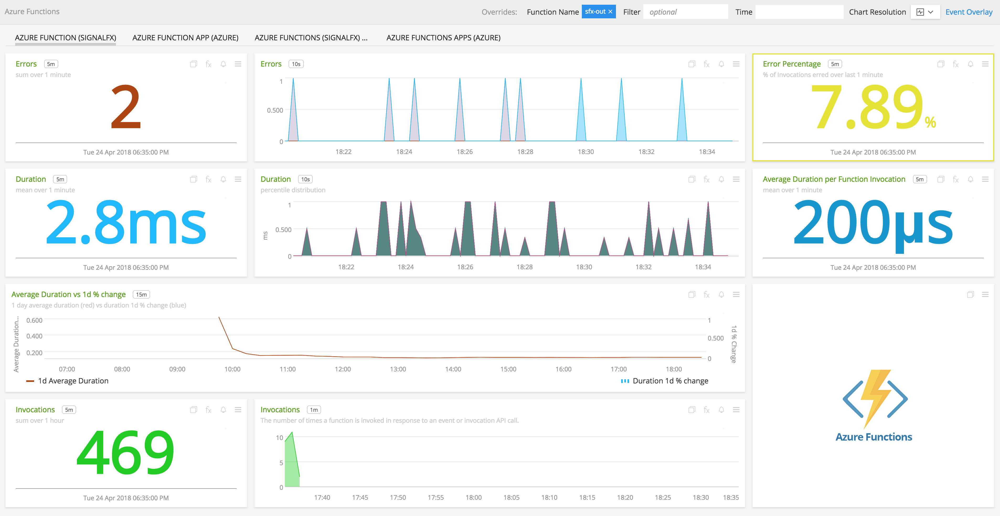

#  Azure Functions

- [Description](#description)
- [Installation](#installation)
- [Usage](#usage)
- [Metrics](#metrics)
- [License](#license)

### DESCRIPTION

SignalFx enables you to monitor the health and performance of your invidvidual Azure Functions via metrics on total invocations, errors, and durations. In addition, you can easily send custom application or business metrics from within your Azure Functions.

- If you have enabled the SignalFx Azure integration and are syncing Azure Monitor metrics, <a target="_blank" href="https://docs.microsoft.com/en-us/azure/monitoring-and-diagnostics/monitoring-supported-metrics#microsoftwebsites-functions">those metrics</a> will automatically be available to view.

-  You can use one of our language-specific wrappers to monitor your functions. Using a wrapper lets you see invocations, errors and durations for your functions in real time for indvidual functions.

-  The wrapper is also a way for you to send in custom application or business metrics from within a Azure Function, analogous to what you can do with our client libraries for code running other environments.

#### FEATURES

##### Built-in dashboards

- **Azure Function Apps (Azure)**: Overview of all data from Azure Functions via Azure Monitor.

  

- **Azure Functions (SignalFx)**: Overview of all data from Azure Functions via SignalFx Wrapper.

  

- **Azure Function App (Azure)**: Instance view for specific Azure Function App via Azure Monitor.

  

- **Azure Function (SignalFx)**: Instance view for specific Azure Function via SignalFx Wrapper.

  

### INSTALLATION

#### SignalFx Wrapper

SignalFx Wrapper provides real time monitoring of Azure Functions as well as ability to send custom metric from your applications to SignalFx.

To use SignalFx Wrapper, include SignalFx Azure Wrapper in your Azure Function.

Instructions are provided in each of the Azure Function wrapper readme files.

- <a target="_blank" href="https://github.com/signalfx/azure-function-java">Java</a>
- <a target="_blank" href="https://github.com/signalfx/azure-function-nodejs">NodeJS</a>
- <a target="_blank" href="https://github.com/signalfx/azure-function-csharp">C#</a>

#### Azure Monitor

To access this integration, [connect to Azure Monitor](https://github.com/signalfx/integrations/tree/master/azure).

By default, SignalFx will import all Azure Monitor metrics that are available in your account. To retrieve metrics for a subset of available services or regions, modify the connection on the Integrations page.

### USAGE

#### Uniquely identifying Azure Function

SignalFx uses a combination of the Function App name, function name, and region to uniquely identify a function.

#### SignalFx Wrapper Metrics

The SignalFx Azure Function wrapper sends the following metrics to SignalFx:

| Metric Name  | Type | Description |
| ------------- | ------------- | ---|
| azure.function.invocations  | Counter  | Count of function invocations|
| azure.function.errors  | Counter  | Count of errors from underlying function handler|
| azure.function.duration  | Gauge  | Milliseconds in execution time of underlying function handler|

The Azure Function wrappers add several dimensions to data points sent to SignalFx. These dimensions can be used for filtering and aggregation.

| Dimension | Description |
| ------------- | ---|
| azure_region  | Azure region where the function is executed  |
| azure_function_name  | Name of the function |
| azure_resource_name  | Name of the function app where the function is running |
| function_wrapper_version  | SignalFx function wrapper qualifier (e.g. signalfx-azurefunction-0.0.11) |
| is_Azure_Function  | Used to differentiate between Azure App Service and Azure Function metrics |
| metric_source | The literal value of 'azure_function_wrapper' |

#### Azure Monitor

For more information about the metrics emitted by Azure Functions, see the documentation at <a target="_blank" href="https://docs.signalfx.com/en/latest/integrations/integrations-reference/integrations.microsoft.azure.html">https://docs.signalfx.com/en/latest/integrations/integrations-reference/integrations.microsoft.azure.html</a>.

### LICENSE

This integration is released under the Apache 2.0 license. See [LICENSE](./LICENSE) for more details.
