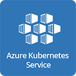
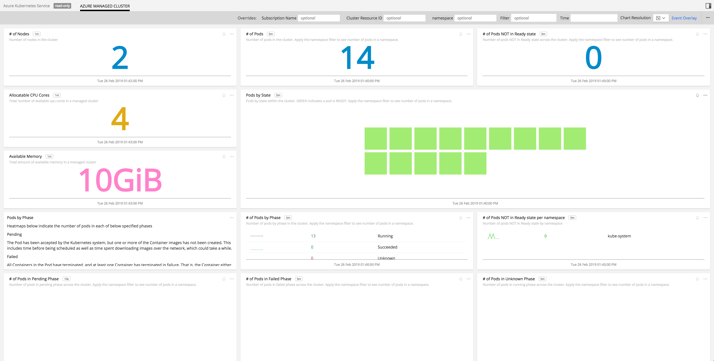
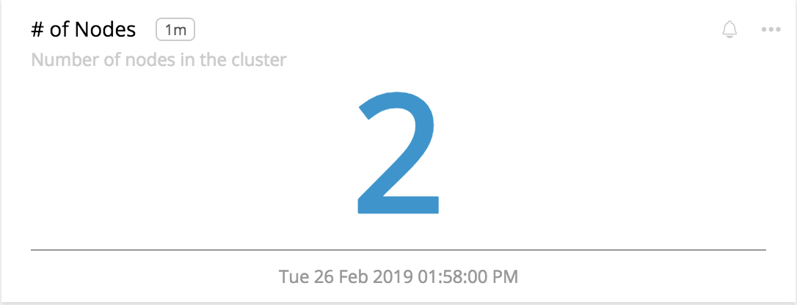
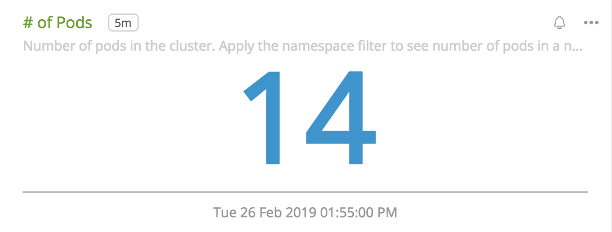
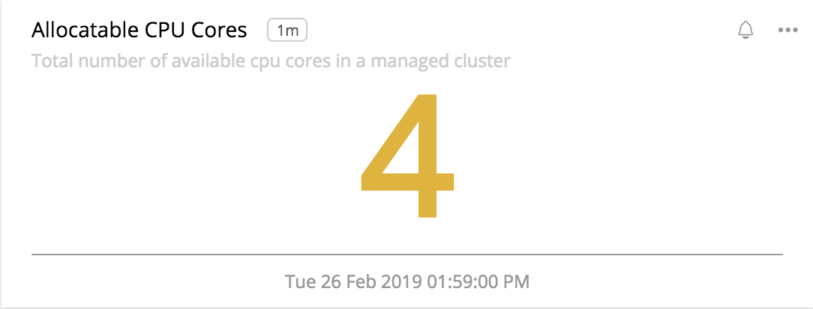
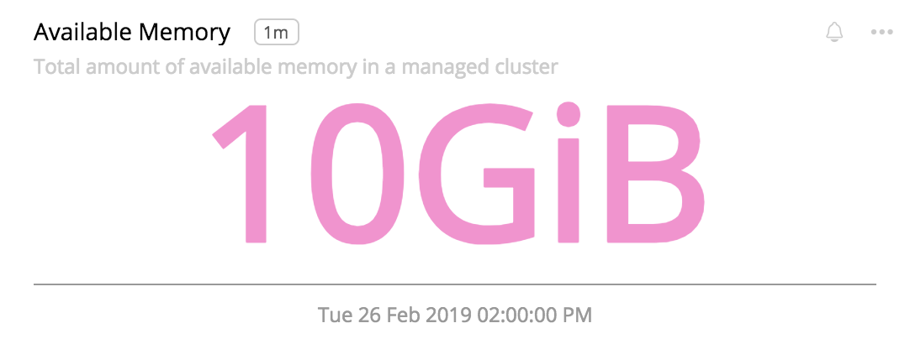
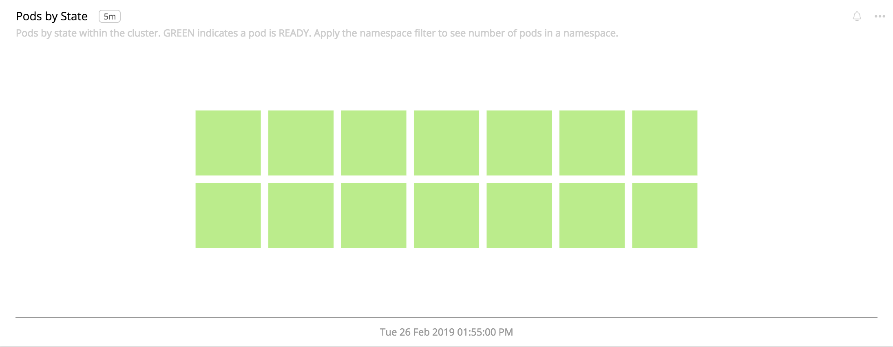
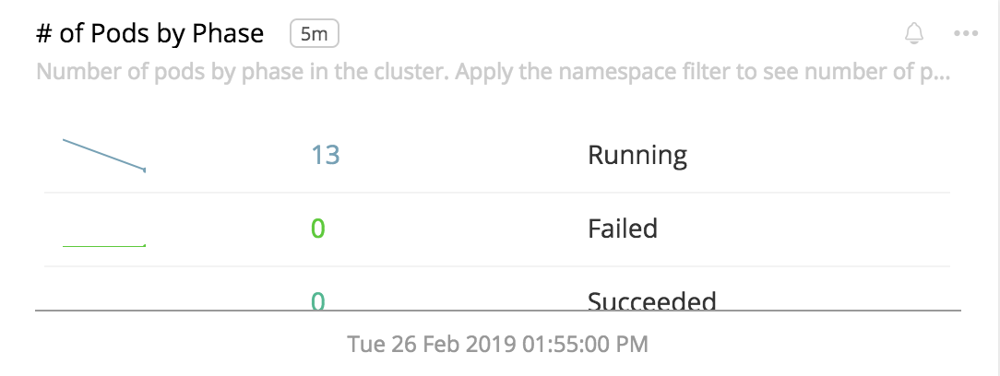
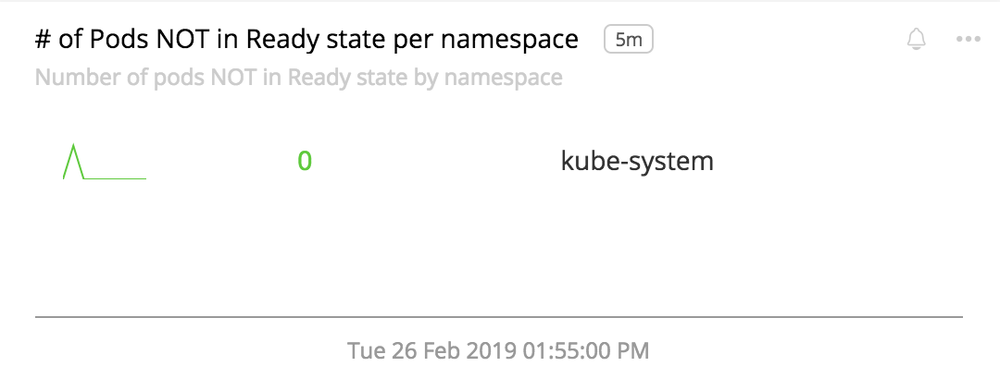

#  Microsoft Azure Kubernetes Service

- [Description](#description)
- [Installation](#installation)
- [Usage](#usage)
- [Metrics](#metrics)

### DESCRIPTION

Use SignalFx to monitor Azure Kubernetes Service via [Microsoft Azure](https://github.com/signalfx/integrations/tree/master/azure).

#### FEATURES

##### Built-in dashboards

- **Azure Managed Cluster**: Shows metrics of an Azure Managed Cluster.

  

### INSTALLATION

To access this integration, [connect to Microsoft Azure](https://github.com/signalfx/integrations/tree/master/azure).

### USAGE

#### Interpreting Built-in dashboards

**Azure Managed Cluster**

- **Number of Nodes** - Number of nodes in the Azure Kubernetes Cluster.

  

- **Number of Pods** - Number of pods in the Azure Kubernetes Cluster.

  

- **Available CPU Cores** - Available CPU cores across the cluster.

  

- **Available Memory** - Available memory in the cluster in Bytes.

  

- **Pods By State** - Heatmap showing the number of pods in Ready state across the cluster. GREEN shows pods in Ready state.

  

- **Pods by Phase** - Number of pods in different phases across the cluster.

  

- **Number of Pods NOT in Ready state per namespace** - Number of pods per namespace that are not in Ready state.

  

### METRICS

For more information about the metrics emitted by Azure Kubernetes Service, visit <a target="_blank" href="https://docs.microsoft.com/en-us/azure/azure-monitor/platform/metrics-supported#microsoftcontainerservicemanagedclusters">here</a>.
