#  Microsoft Azure Logic Apps

- [Description](#description)
- [Installation](#installation)
- [Usage](#usage)
- [Metrics](#metrics)
- [License](#license)

### DESCRIPTION

Use SignalFx to monitor Azure Logic Apps via [Microsoft Azure](https://github.com/signalfx/integrations/tree/master/azure).

#### FEATURES

##### Built-in dashboards

- **Azure Logic App**: Shows metrics of a Logic App.

  [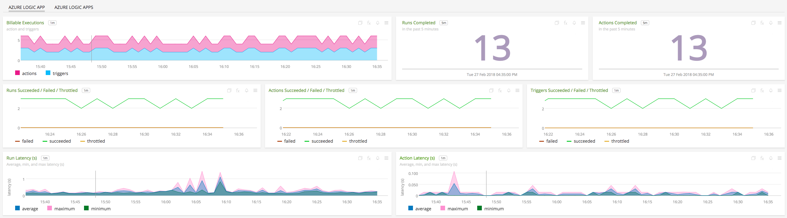](./img/logic.png)

- **Azure Logic Apps**: Shows metrics of all Logic Apps being monitored.

  [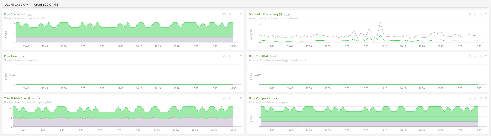](./img/logics.png)

### INSTALLATION

To access this integration, [connect to Microsoft Azure](https://github.com/signalfx/integrations/tree/master/azure).

### USAGE

#### Interpreting Built-in dashboards

**Azure Logic App**

- **Billable Executions** - Number of billable actions/triggers by app.

  [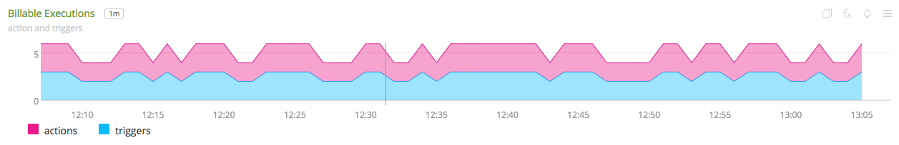](./img/logic.billable.png)

- **Runs Completed** - Number of workflow runs that have completed for the app.

  [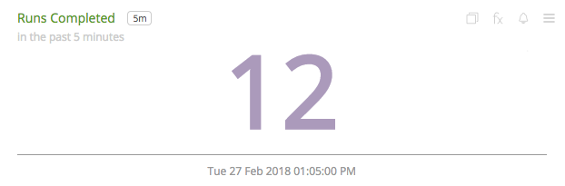](./img/logic.runs.completed.png)

- **Actions Completed** - Number of actions that completed for the app.

  [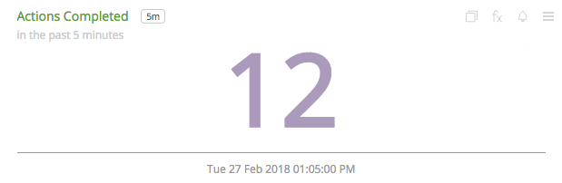](./img/logic.actions.completed.png)

- **Runs Succeeded / Failed / Throttled** - Number of workflow runs that succeeded/failed/got throttled for the app.

  [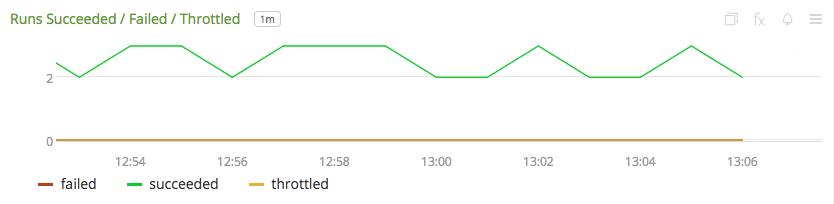](./img/logic.runs.png)

- **Actions Succeeded / Failed / Throttled** - Number of actions that succeeded/failed/got throttled for the app.

  [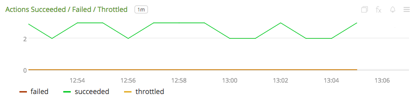](./img/logic.actions.png)

- **Triggers Succeeded / Failed / Throttled** - Number of triggers that succeeded/failed/got throttled for the app.

  [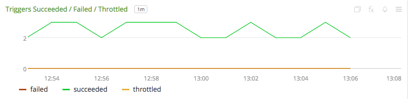](./img/logic.triggers.png)

- **Run Latency (s)** - Run latency for the app.

  [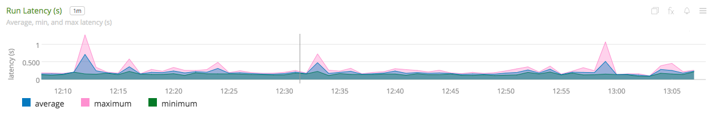](./img/logic.run.latency.png)

- **Action Latency (s)** - Action latency for the app.

  [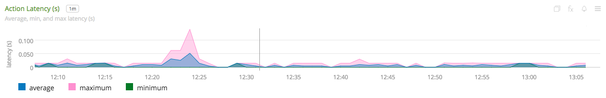](./img/logic.action.latency.png)

**Azure Logic Apps**

- **Runs Succeeded** - Aggregated number of workflow runs that succeed.

  

- **Successful Run Latency (s)** - Average latency of succeeded workflow runs.

  [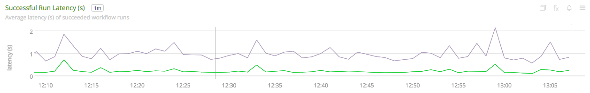](./img/logics.success.runlatency.png)

- **Runs Failed** - Aggregated number of workflow runs that failed.

  [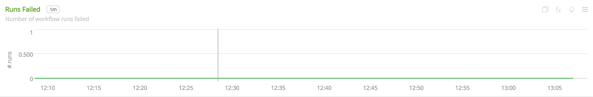](./img/logics.runs.failed.png)

- **Runs Throttled** - Aggregated number of workflow runs that throttled.

  [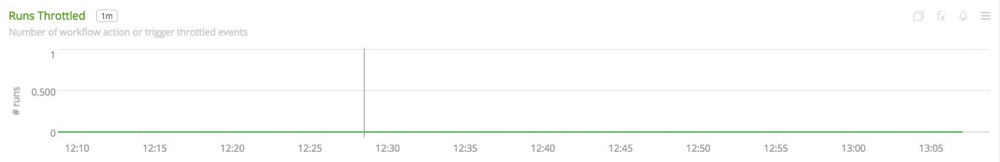](./img/logics.runs.throttled.png)

- **Runs Completed** - Aggregated number of workflow runs that completed.

  [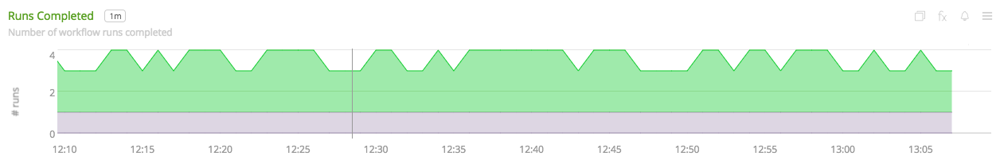](./img/logics.runs.completed.png)

- **Total Billable Executions** - Aggregated number of workflow executions that are billed.

  [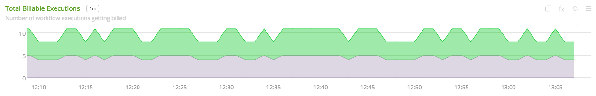](./img/logics.billable.png)

### METRICS

For more information about the metrics emitted by Azure Logic Apps, visit <a target="_blank" href="https://docs.microsoft.com/en-us/azure/monitoring-and-diagnostics/monitoring-supported-metrics#microsoftlogicworkflows">here</a>.

### LICENSE

This integration is released under the Apache 2.0 license. See [LICENSE](./LICENSE) for more details.
