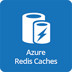

#  Microsoft Azure Redis Cache

- [Description](#description)
- [Installation](#installation)
- [Usage](#usage)
- [Metrics](#metrics)
- [License](#license)

### DESCRIPTION

Use SignalFx to monitor Azure Redis Cache via [Microsoft Azure](https://github.com/signalfx/integrations/tree/master/azure).

#### FEATURES

##### Built-in dashboards

- **Azure Redis Cache**: Shows metrics of a Redis cahce.

  

  

- **Azure Redis Caches**: Shows metrics of all Redis cahces being monitored.

  

### INSTALLATION

To access this integration, [connect to Microsoft Azure](https://github.com/signalfx/integrations/tree/master/azure).

### USAGE

#### Interpreting Built-in dashboards

**Azure Redis Cache**

- **Cache Hit Rate Percent** - Cache hit rate percent for each of the shards in the cache.

  

- **Cache Hit Rate Trend** - Cache hit rate trend for each of the shards in the cache.

  

- **Server Load** - Server load percent for each of the shards in the cache.

  

- **CPU percent** - Percentage of CPU used by each of the shards in the cache.

  

- **Number of Connections** - Number of connections to each of the shards in the cache.

  

- **Memory Fragmentation Ratio** - Memory fragmentation ratio of the cache. Ideally this value should be around 1.

  

- **Used RSS Memory** - RSS memory used by each shard.

  

- **Used Memory** - Memory used by each shard.

  

- **Total Keys** - Total number of keys on each of the shards.

  

- **Evicted Keys** - Number of keys evicted due to lack of space from each of the shards.

  

- **Expired Keys** - Number of keys expired from each of the shards.

  

- **Total Commands Processed** - Number of commands processed by each of the shards.

  

- **Get Commands** - Number of get commands processed by each of the shards.

  

- **Set Commands** - Number of set commands processed by each of the shards.

  

- **Cache Reads** - Number of cache reads by each of the shards.

  

- **Cache Writes** - Number of cache writes by each of the shards.

  

**Azure Redis Caches**

- **Number of Caches** - Total number of caches being monitored.

  

- **Lowest Cache Hit Rates** - Caches with the lowest hit rates.

  

- **Number of Connections** - Number of connections stacked per cache.

  

- **Used Memory per Cache** - Memory used stacked by cache.

  

- **Total Keys per Cache** - Number of keys, stacked by cache.

  

- **Total Keys** - Total number of keys stored across all caches.

  

### METRICS

For more information about the metrics emitted by Azure Redis Cache, visit <a target="_blank" href="https://docs.microsoft.com/en-us/azure/monitoring-and-diagnostics/monitoring-supported-metrics#microsoftcacheredis">here</a>.

### LICENSE

This integration is released under the Apache 2.0 license. See [LICENSE](./LICENSE) for more details.
