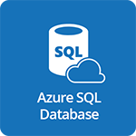

#  Microsoft Azure SQL Database

- [Description](#description)
- [Installation](#installation)
- [Usage](#usage)
- [Metrics](#metrics)
- [License](#license)

### DESCRIPTION

Use SignalFx to monitor Azure SQL Database via [Microsoft Azure](https://github.com/signalfx/integrations/tree/master/azure).

#### FEATURES

- **Azure SQL Database**: Shows metrics of a Database.

- **Azure SQL Databases**: Shows metrics of all Databases being monitored.

### INSTALLATION

To access this integration, [connect to Microsoft Azure](https://github.com/signalfx/integrations/tree/master/azure).

### USAGE

#### Interpreting Built-in dashboards

**Azure SQL Database**

- **DTU Percentage** - Shows the DTU percentage of a SQL database. If this value is consistently high, it is likely that the database sees increased latencies.

- **DTU Percentage Trend** - Trend of the DTU used percentage.

- **Server CPU Percentage** - Shows the load on the CPU

- **Server CPU Percentage Trend** - Trend of the server CPU usage

- **Total Database Size** - Total size of the SQL Database in bytes

- **Data I/O Percentage** - Shows the used percentage of Data I/O.

- **Log I/O Percentage** - Used percentage of Log I/O.

- **Database Size Percentage** - Percentage of the Database used.

- **Successful Connections** - Number of successful connections to the database.

- **Failed Connections** - Number of failed connections to the database.

- **Connections Blocked by Firewall** - Number of connections blocked by firewall.

**Azure SQL Databases**

- **Number of Databases** - Shows total number of databases being monitored.

- **Top Databases by Total Storage** - Stacked view of total storage aggregated by database.

- **Top Databases by DTU Consumption percent** - Shows the trend of DTU used percent for top databases.

- **Top Databases by Data I/O percent** - List of top databases by Data I/O percent

- **Top Databases by Connections Failed** - List of the databases with top number of connections failed.

- **SQL Server CPU percent** - Percentile distribution of server CPU used percent for all databases

- **Number of Blocked Connections** - Number of blocked connections aggregated by database.

- **Top Databases by Log I/O percent** Lists the databases with top Log I/O.

### METRICS

For more information about the metrics emitted by Azure SQL Database, visit <a target="_blank" href="https://docs.microsoft.com/en-us/azure/monitoring-and-diagnostics/monitoring-supported-metrics#microsoftsqlserversdatabases">here</a>.

### LICENSE

This integration is released under the Apache 2.0 license. See [LICENSE](./LICENSE) for more details.
