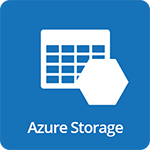

#  Microsoft Azure Storage

- [Description](#description)
- [Installation](#installation)
- [Usage](#usage)
- [Metrics](#metrics)
- [License](#license)

### DESCRIPTION

Use SignalFx to monitor Azure Storage via [Microsoft Azure](https://github.com/signalfx/integrations/tree/master/azure).

#### FEATURES

##### Built-in dashboards

- **Azure Storage Account**: Shows metrics of a storage account.

  

- **Azure Storage Accounts**: Shows metrics of all storage accounts being monitored.

  

### INSTALLATION

To access this integration, [connect to Microsoft Azure](https://github.com/signalfx/integrations/tree/master/azure).

### USAGE

#### Interpreting Built-in dashboards

**Azure Storage Account**

- **Ingress Traffic** - Amount of incoming data in bytes aggregated by API call.

  

- **Egress Traffic** - Amount of outgoing data in bytes aggregated by API call.

  

- **Latency of Successful Requests** - Average latency in milliseconds to process a successful request for each API call.

  

- **End to End Latency of Successful Requests** - Average end-to-end latency in milliseconds of successful requests made for each API call.

  

- **Availability by API Call** - Shows the availability for each of the API calls being made.

  

- **Transactions** - Number of API calls aggregated by API call.

  

- **Used Capacity** - Capacity used by the account in bytes.

  

**Azure Storage Accounts**

- **Top Accounts by Used Capacity** - List of storage accounts by top used capacity.

  

- **Lowest Available Storage Server** - Lists the storage accounts with lowest availability aggregated across all API calls.

  

- **Top Accounts by Transactions** - List of storage accounts by top transactions.

  

- **Latency of Successful Requests** - Distribution of latencies in milliseconds to process a successful request call.

  

- **End to End Latency of Successful Requests** - Distribution of end-to-end latencies in milliseconds of successful requests.

  

- **Total Network Ingress** - Amount of incoming data in bytes into all accounts combined.

  

- **Total Network Egress** - Amount of outgoing data in bytes from all accounts combined.

  

### METRICS

For more information about the metrics emitted by Azure Storage, visit <a target="_blank" href="https://docs.microsoft.com/en-us/azure/monitoring-and-diagnostics/monitoring-supported-metrics#microsoftstoragestorageaccounts">here</a>.

### LICENSE

This integration is released under the Apache 2.0 license. See [LICENSE](./LICENSE) for more details.
