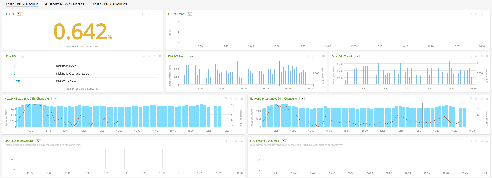
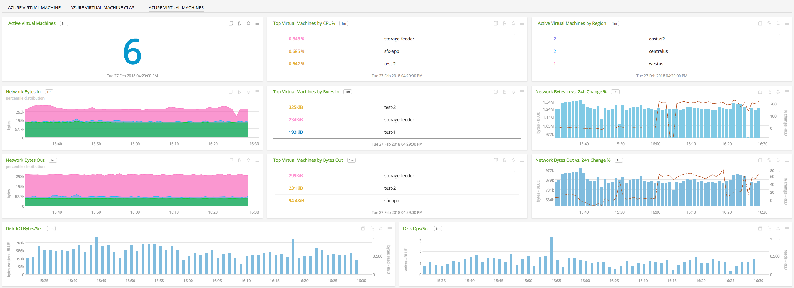
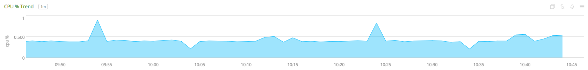
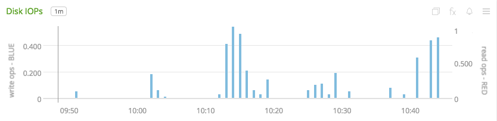
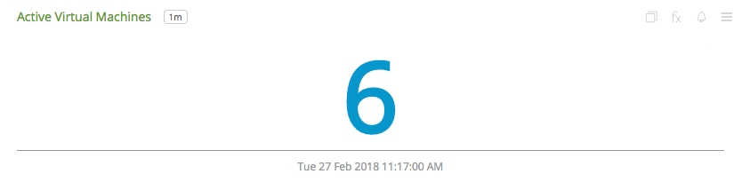
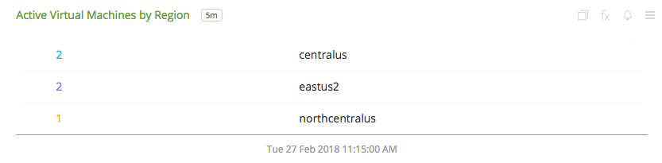
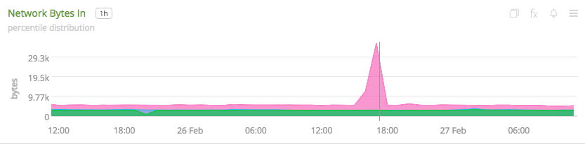
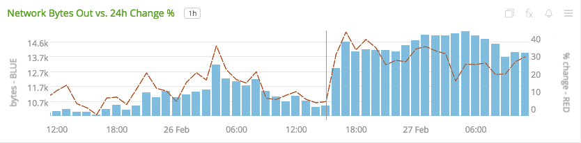

#  Microsoft Azure Virtual Machines

- [Description](#description)
- [Installation](#installation)
- [Usage](#usage)
- [Metrics](#metrics)
- [License](#license)

### DESCRIPTION

Use SignalFx to monitor Azure Virtual Machines via [Microsoft Azure](https://github.com/signalfx/integrations/tree/master/azure).

#### FEATURES

##### Built-in dashboards

- **Azure Virtual Machine**: Shows metrics of a virtual machine.

  

- **Azure Virtual Machine (Classic)**: Shows metrics of a classic virtual machine.

  

- **Azure Virtual Machines**: Shows metrics of all virtual machines being monitored.

  

### INSTALLATION

To access this integration, [connect to Microsoft Azure](https://github.com/signalfx/integrations/tree/master/azure).

### USAGE

#### Interpreting Built-in dashboards

**Azure Compute Virtual Machine**

- **CPU Percent** - Percentage of CPU used by the virtual machine.

  

- **CPU Percent Trend** - Trend of percentage of CPU used by the virtual machine.

  

- **Disk I/O** - List of counts of disk operations.

  

- **Disk I/O Trend** - Trend of disk I/O bytes per second by the virtual machine.

  

- **Disk IOPs Trend** - Trend of the disk I/O operations performed by virtual machine.

  

- **Network I/O** - Number of bytes received from/sent to the network by the virtual machine.

  

- **Network I/O Bytes Trend** - Trend of the number of bytes received/sent by the virtual machine.

  

The above charts are applicable to all Azure Virtual Machines. The following two charts, however, are only applicable to Burstable machines.

- **CPU Credits Remaining** - Number of CPU credits remaining for a burstable machine.

  

- **CPU Credits Used** - Number of CPU credits used by a burstable machine.

  

**Azure Compute Virtual Machines**

- **Azure Virtual Machines** - Total number of virtual machine being monitored.

  

- **Top Virtual Machines by CPU percent** - List of virtual machines that use most CPU.

  

- **Azure Virtual Machines by Region** - Count of Azure virtual machines by region.

  

- **Network Bytes In** - Percentile trend of bytes received by virtual machines.

  

- **Top Virtual Machines by Bytes In** - List of virtual machines with top bytes received.

  

- **Network Bytes In vs. 24h Change percent** - Comparison of change in aggregate bytes received by all virtual machines.

  

- **Network Bytes Out** - Percentile trend of bytes sent by virtual machines.

  

- **Top Virtual Machines by Bytes Out** - List of virtual machines with top bytes sent.

  

- **Network Bytes Out vs. 24h Change percent** - Comparison of change in aggregate bytes sent by all virtual machines.

  

- **Disk I/O Bytes/Sec** - Aggregated disk I/O bytes per second from all virtual machines.

  

- **Disk Ops/Sec** - Aggregated disk I/O operations per second from all virtual machines.

  

### METRICS

For more information about the metrics emitted by Azure Virtual Machines, visit <a target="_blank" href="https://docs.microsoft.com/en-us/azure/monitoring-and-diagnostics/monitoring-supported-metrics#microsoftcomputevirtualmachines">here</a>.

### LICENSE

This integration is released under the Apache 2.0 license. See [LICENSE](./LICENSE) for more details.
