# 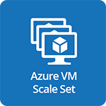 Microsoft Azure Virtual Machine Scale Sets

- [Description](#description)
- [Installation](#installation)
- [Usage](#usage)
- [Metrics](#metrics)
- [License](#license)

### DESCRIPTION

Use SignalFx to monitor Azure Virtual Machine Scale Sets via [Microsoft Azure](https://github.com/signalfx/integrations/tree/master/azure).

#### FEATURES

##### Built-in dashboards

- **Azure VM Scale Set**: Shows metrics of a VM Scale Set.

  [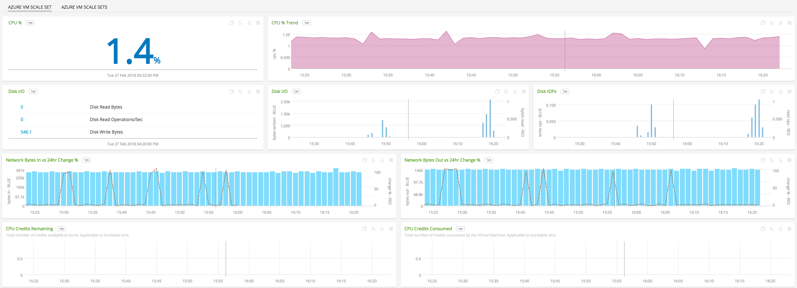](./img/vmscaleset.png)

- **Azure VM Scale Sets**: Shows metrics of all VM Scale Sets being monitored.

  [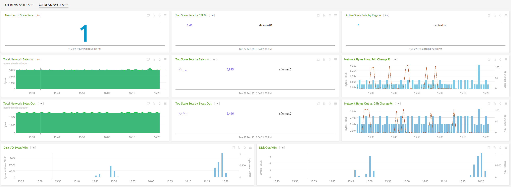](./img/vmscalesets.png)

### INSTALLATION

To access this integration, [connect to Microsoft Azure](https://github.com/signalfx/integrations/tree/master/azure).

### USAGE

#### Interpreting Built-in dashboards

**Azure VM Scale Set**

- **CPU Percent** - Percentage of CPU used by the vm scale set.

  [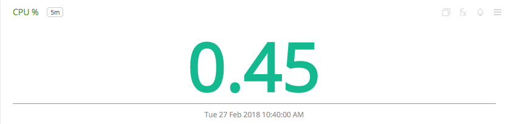](./img/vm.cpu.percent.png)

- **CPU Percent Trend** - Trend of percentage of CPU used by the vm scale set.

  

- **Disk I/O** - List of counts of disk operations.

  [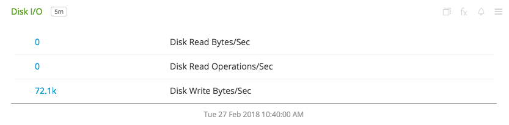](./img/vm.disk.png)

- **Disk I/O Trend** - Trend of disk I/O bytes per second by the vm scale set.

  [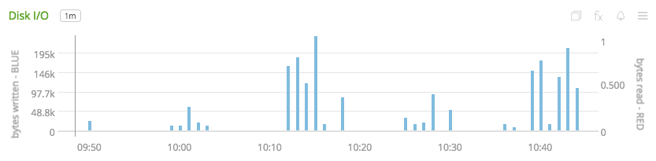](./img/vm.disk.io.trend.png)

- **Disk IOPs Trend** - Trend of the disk I/O operations performed by vm scale set.

  

- **Network I/O** - Number of bytes received from/sent to the network by the vm scale set.

  [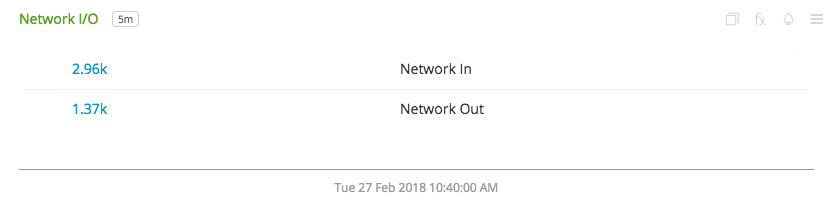](./img/vm.network.png)

- **Network I/O Bytes Trend** - Trend of the number of bytes received/sent by the vm scale set.

  [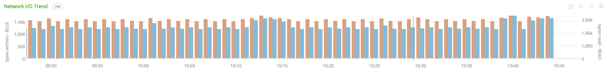](./img/vm.network.io.trend.png)

The above charts are applicable to all Azure VM Scale Sets. The following two charts, however, are only applicable to scale sets with Burstable machines.

- **CPU Credits Remaining** - Number of CPU credits remaining for a burstable scale set.

  [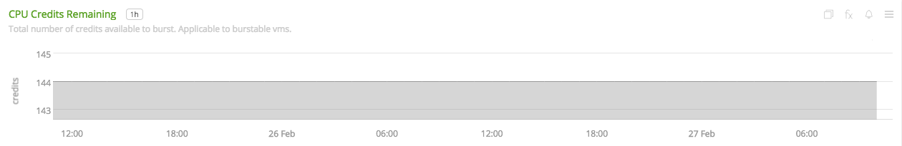](./img/vm.cpu.credits.remaining.png)

- **CPU Credits Used** - Number of CPU credits used by a burstable scaleset.

  [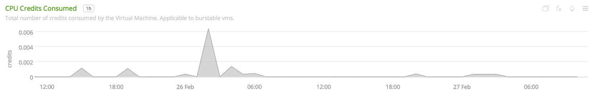](./img/vm.cpu.credits.used.png)

**Azure VM Scale Sets**

- **Number of Scale Sets** - Total number of vm scale sets being monitored.

  [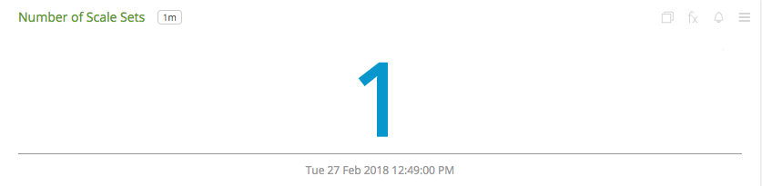](./img/vmscaleset.count.png)

- **Top Scale Sets by CPU percent** - List of vm scale sets that use most CPU.

  [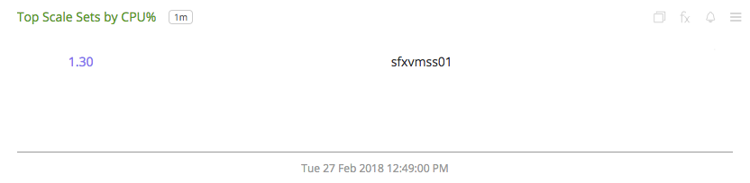](./img/vmscaleset.top.cpu.png)

- **Azure Scale Sets by Region** - Count of Azure vm scale sets by region.

  [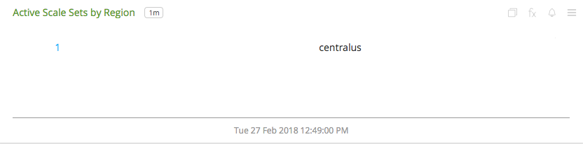](./img/vmscaleset.by.region.png)

- **Network Bytes In** - Percentile trend of bytes received by vm scale sets.

  

- **Top Scale Sets by Bytes In** - List of vm scale sets with top bytes received.

  [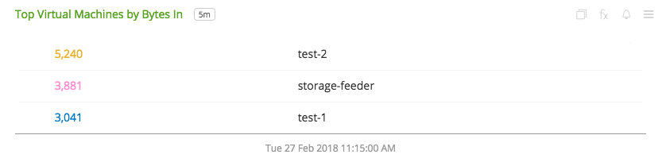](./img/vms.top.network.png)

- **Network Bytes In vs. 24h Change percent** - Comparison of change in aggregate bytes received by all vm scale sets.

  [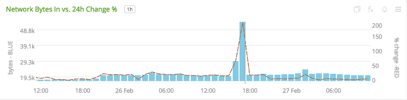](./img/vms.network.in.change.png)

- **Network Bytes Out** - Percentile trend of bytes sent by vm scale sets.

  [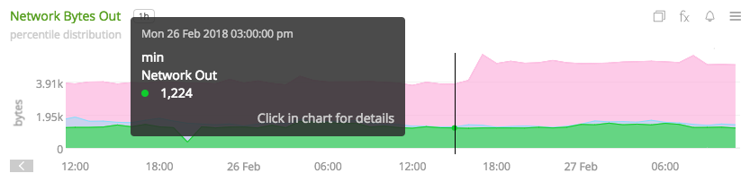](./img/vms.network.out.png)

- **Top Scale Sets by Bytes Out** - List of vm scale sets with top bytes sent.

  [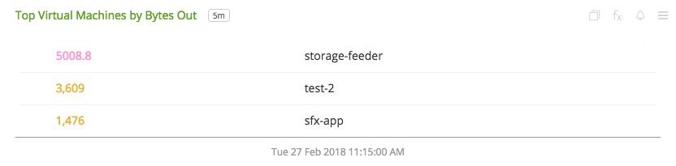](./img/vms.top.network.out.png)

- **Network Bytes Out vs. 24h Change percent** - Comparison of change in aggregate bytes sent by all vm scale sets.

  

- **Disk I/O Bytes/Sec** - Aggregated disk I/O bytes per second from all vm scale sets.

  [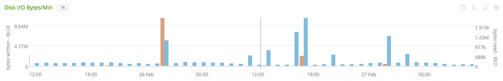](./img/vms.disk.io.bytes.png)

- **Disk Ops/Sec** - Aggregated disk I/O operations per second from all vm scale sets.

  [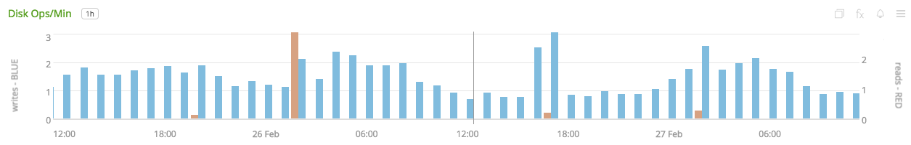](./img/vms.disk.ops.png)

### METRICS

For more information about the metrics emitted by Azure Virtual Machine Scale Sets, visit <a target="_blank" href="https://docs.microsoft.com/en-us/azure/monitoring-and-diagnostics/monitoring-supported-metrics#microsoftbatchbatchaccounts">here</a>.

### LICENSE

This integration is released under the Apache 2.0 license. See [LICENSE](./LICENSE) for more details.
