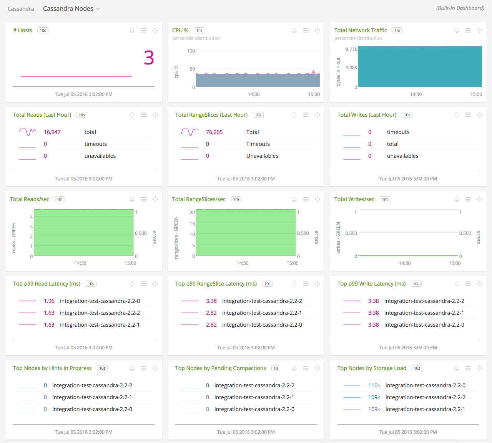
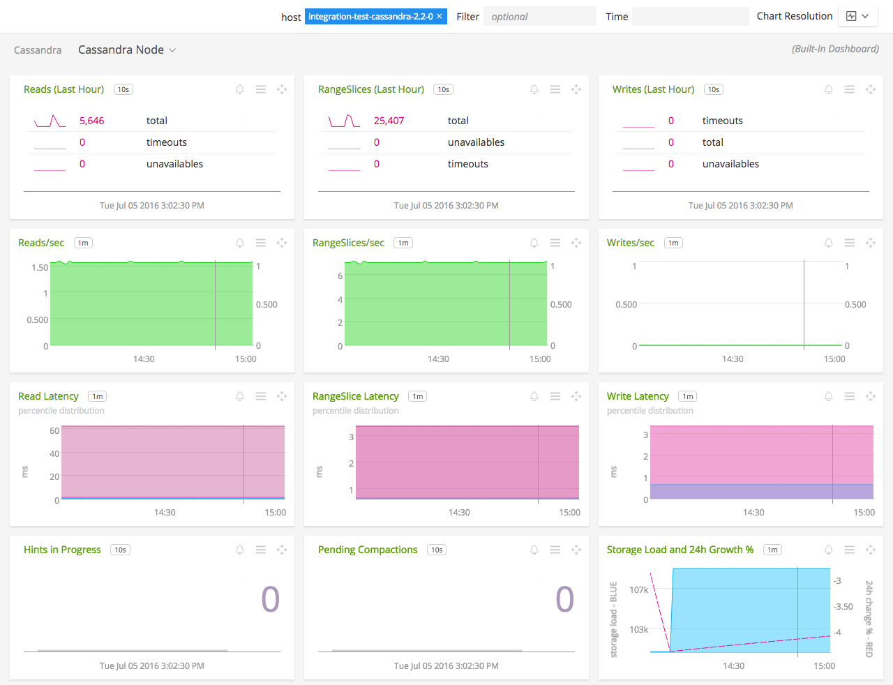
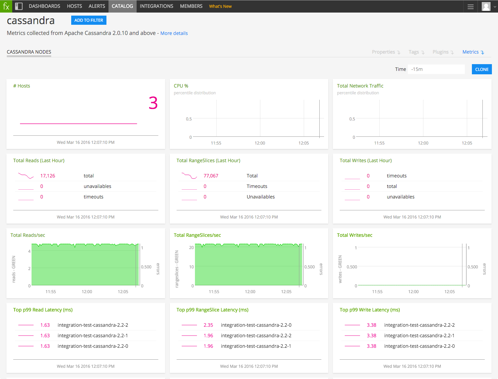

#  Cassandra

 Metadata associated with SignalFx's Cassandra integration with collectd can be found <a target="_blank" href="https://github.com/signalfx/integrations/tree/release/cassandra">here</a>.

- [Description](#description)
- [Requirements and Dependencies](#requirements-and-dependencies)
- [Installation](#installation)
- [Configuration](#configuration)
- [Usage](#usage)
- [Metrics](#metrics)
- [License](#license)

#### FEATURES

##### Built-in dashboards

- **Cassandra Nodes**: Overview of data from all Cassandra nodes.

  

- **Cassandra Node**: Focus on a single Cassandra node.

  

### USAGE

Sample of built-in dashboard in SignalFx:

### LICENSE

This integration is released under the Apache 2.0 license. See [LICENSE](./LICENSE) for more details.
