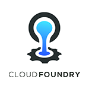
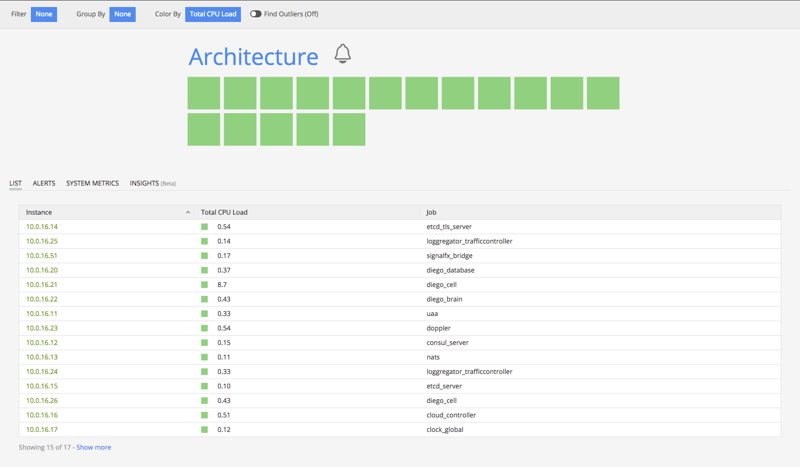
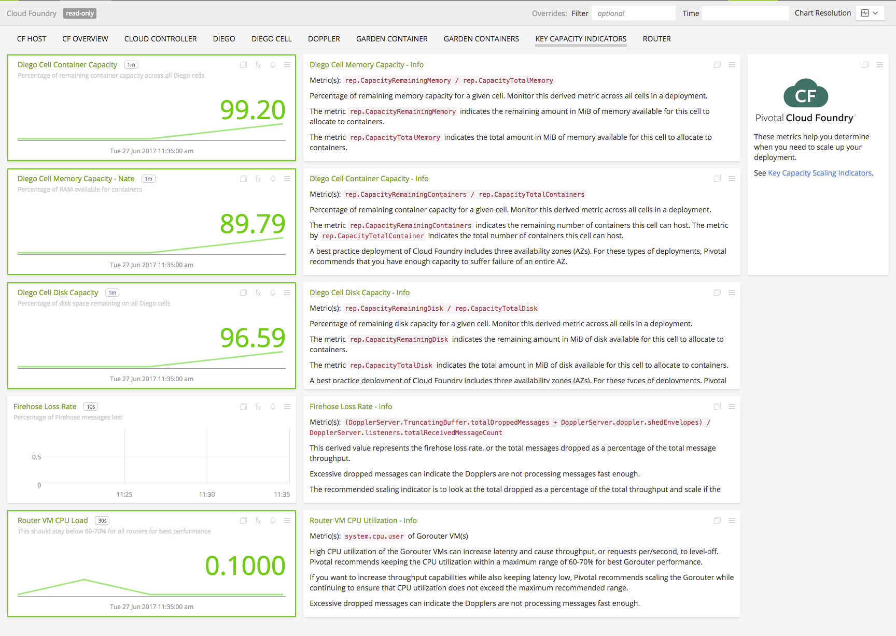
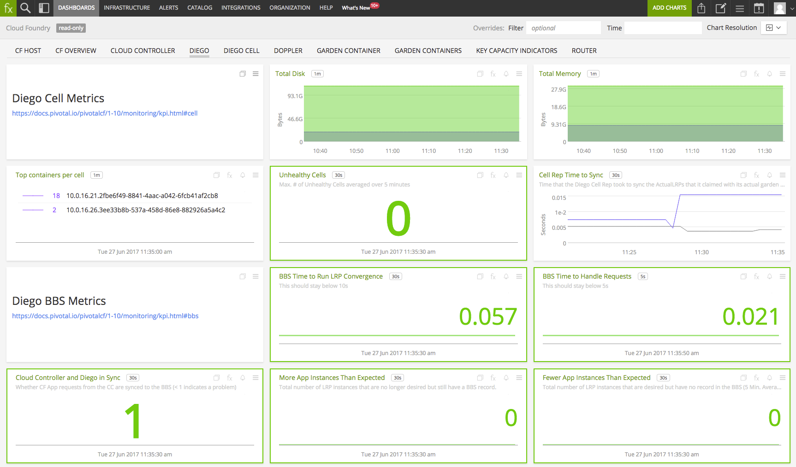
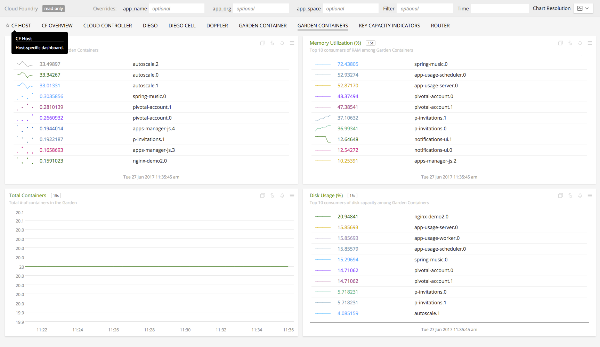

#  Cloud Foundry

_This directory consolidates all the metadata associated with the **Cloud Foundry Integration**. The relevant code for the integration can be found [here](https://github.com/search?q=topic%3Acloud-foundry+org%3Asignalfx+fork%3Atrue)_

- [Description](#description)
- [Requirements and Dependencies](#requirements-and-dependencies)
- [Installation](#installation)
- [Configuration](#configuration)
- [Metrics](#metrics)
- [License](#license)

### DESCRIPTION

Use this integration to monitor a Cloud Foundry deployment. This integration provides metrics about the performance of the various components that make up Cloud Foundry.

#### FEATURES

##### Infrastructure Page

- **Infrastructure Navigator**: On the Infrastructure page in SignalFx, the
    Infrastructure Navigator visualizes Cloud Foundry instances as squares,
    colored by metrics including CPU, disk, and network. Additional views are
    provided for focus on the health and performance of specific Cloud Foundry
    services, as well as Garden Containers. [Click here to read more about the
    Infrastructure
    Page](https://docs.signalfx.com/en/latest/built-in-content/infra-nav.html).

  You can quickly see the status of all of the VMs in your Cloud Foundry cluster:

  

  Here is a sample of the view for Garden Containers:

  

##### Built-in dashboards

This integration includes built-in dashboards listed under **Cloud Foundry** on the Dashboards page in SignalFx. Here are some examples:

- **Key Capacity Scaling Indicators**: Helps you figure out whether you need to
    add resources to your cluster.

  

- **Diego**: Metrics around Diego

  

- **Garden Containers**: High-level look at the Garden container system

  

  And many more...

### REQUIREMENTS AND DEPENDENCIES

This integration requires administrative access to a Cloud Foundry deployment. Versions known to work are:

| Software                | Version        |
|-------------------------|----------------|
| cf-release              | v248+          |

### INSTALLATION

Follow these steps to enable this integration:

1. Install the [latest BOSH release for our Bridge
   application](https://github.com/signalfx/signalfx-cloudfoundry-bridge-boshrelease/releases),
   which pulls metrics from the Loggregator Firehose and sends them to SignalFx.
   This can be installed in any deployment in your CF environment, as long as
   it has access to the BOSH Director and the Traffic Controller server.

Metrics from Cloud Foundry should begin streaming into SignalFx.

To monitor services running within **Garden containers** (e.g. webservers) you will
need to use [our buildpack
decorator](https://github.com/signalfx/signalfx-cloudfoundry-buildpack-decorator)
along with the CF meta-buildpack.

To get our agent on to your own **BOSH deployments**, you can use [our BOSH
release](https://github.com/signalfx/agent-boshrelease).

### METRICS

For documentation of the metrics and dimensions emitted by this plugin, [click here](././docs).

### LICENSE

This integration is released under the Apache 2.0 license. See [LICENSE](https://github.com/signalfx/collectd-example/blob/master/LICENSE) for more details.
