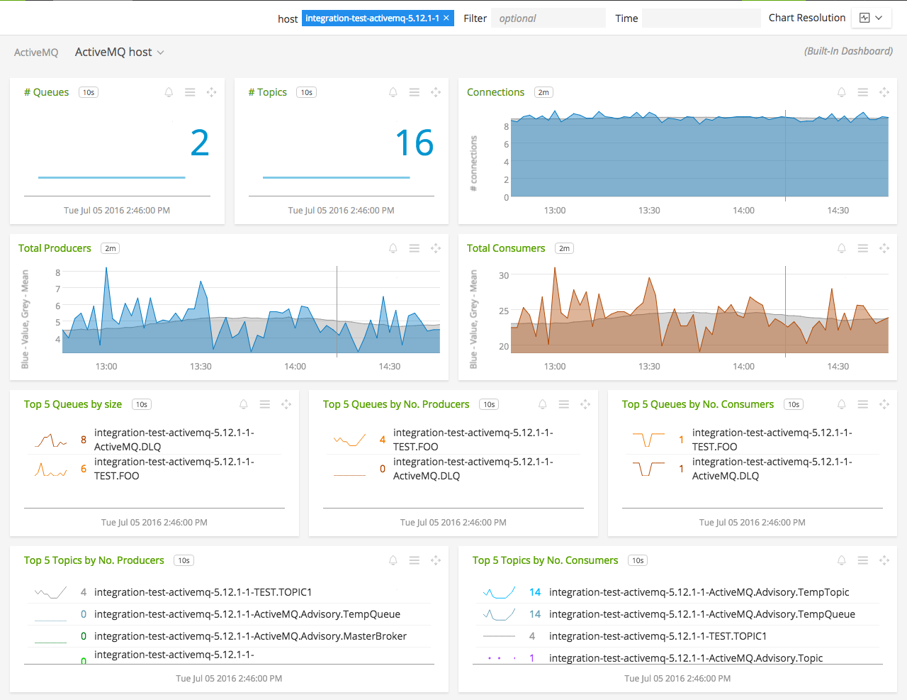
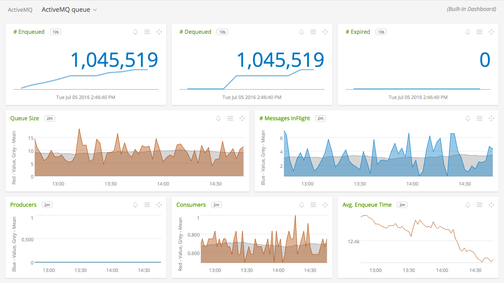
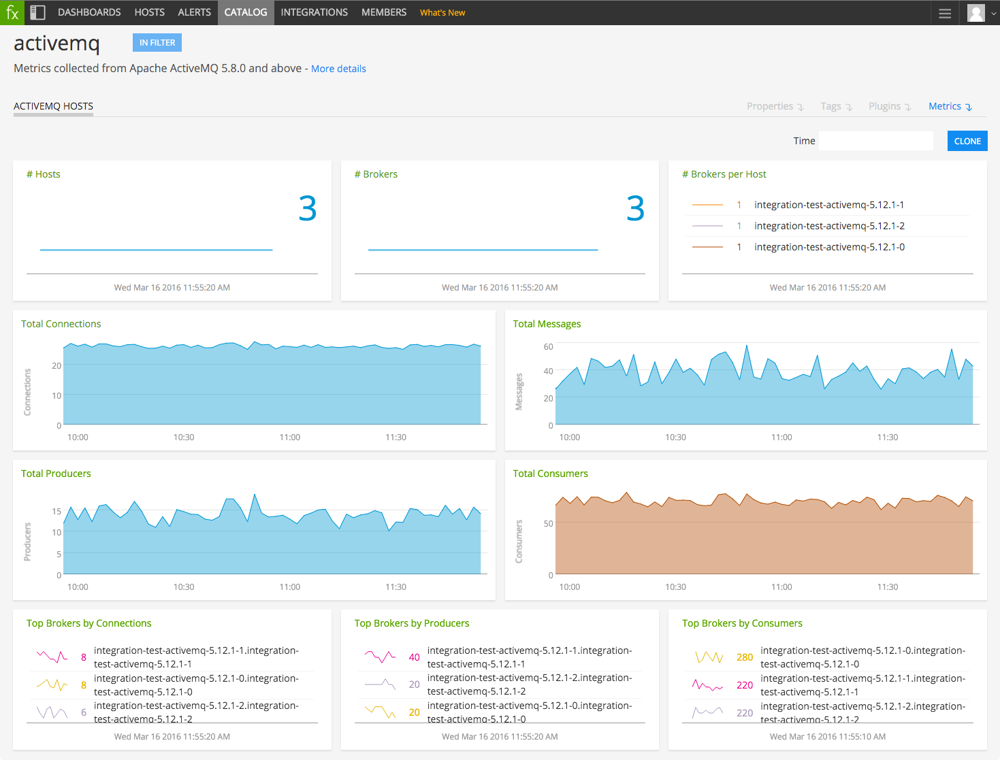

#  ActiveMQ

Metadata associated with SignalFx's integration with ActiveMQ can be found <a target="_blank" href="https://github.com/signalfx/integrations/tree/release/collectd-activemq">here</a>. The relevant code for the plugin can be found <a target="_blank" href="https://github.com/signalfx/activemq-integration">here</a>.

- [Description](#description)
- [Requirements and Dependencies](#requirements-and-dependencies)
- [Installation](#installation)
- [Configuration](#configuration)
- [Usage](#usage)
- [Metrics](#metrics)
- [License](#license)

### DESCRIPTION

SignalFx's integration with ActiveMQ configures the Java plugin for collectd to monitor ActiveMQ.

Use this plugin to monitor the following types of information from ActiveMQ:

* Broker (Totals per broker)
* Queue (Queue status)
* Topic (Topic status)

To monitor the age of messages inside ActiveMQ queues, see [ActiveMQ message age listener](https://github.com/signalfx/integrations/tree/master/amq-message-age).

#### FEATURES

##### Built-in dashboards

- **ActiveMQ Hosts**: Overview of all data from ActiveMQ hosts.

  

- **ActiveMQ Host**: Focus on a single ActiveMQ host.

  

- **ActiveMQ Queue**: Focus on a single ActiveMQ queue.

  

- **ActiveMQ Topic**: Focus on a single ActiveMQ topic.

  

- **ActiveMQ Message Age**: (if enabled) Shows the average age of messages in ActiveMQ queues. See [ActiveMQ message age listener](https://github.com/signalfx/integrations/tree/master/amq-message-age).

  

### REQUIREMENTS AND DEPENDENCIES

| Software  | Version        |
|-----------|----------------|
| collectd  |  4.9 or later  |
| ActiveMQ  | 5.8.0 or later |
| [Java plugin for collectd](https://github.com/signalfx/integrations/tree/master/collectd-java) |  (match collectd version) |

### INSTALLATION

**If you are using the new Smart Agent, see the docs for [the collectd/activemq
monitor](https://github.com/signalfx/signalfx-agent/tree/master/docs/monitors/collectd-activemq.md)
for more information.  The configuration documentation below may be helpful as
well, but consult the Smart Agent repo's docs for the exact schema.**

1. RHEL/CentOS and Amazon Linux users: Install the [Java plugin for collectd](https://github.com/signalfx/integrations/tree/master/collectd-java) if it is not already installed.

2. Download SignalFx's example ActiveMQ configuration file to `/etc/collectd/managed_config`:  <a target="_blank" href="https://github.com/signalfx/integrations/blob/master/collectd-activemq/20-activemq.conf">20-activemq.conf</a>

3. Modify `20-activemq.conf` to provide values that make sense for your environment, as described in [Configuration](#configuration), below.

4. Restart collectd.

### CONFIGURATION

Using the example configuration file <a target="_blank" href="https://github.com/signalfx/integrations/blob/master/collectd-activemq/20-activemq.conf">20-activemq.conf</a> as a guide, provide values for the configuration options listed below that make sense for your environment and allow you to connect to the ActiveMQ instance to be monitored.

| configuration option | definition | example value |
| ---------------------|------------|---------------|
| Host | The name of this ActiveMQ broker. Appears as dimension `host` in SignalFx. 
 Note: Do not modify or remove the `[hostHasService=activemq]` section. | `"ActiveMQ_Host1[hostHasService=activemq]"` |
| ServiceURL | URL of the ActiveMQ service. | `ServiceURL "service:jmx:rmi:///jndi/rmi://localhost:1099/jmxrmi"` |

### USAGE

Sample of built-in dashboard in SignalFx:

### METRICS

For documentation of the metrics and dimensions emitted by this plugin, [click here](./docs).

### LICENSE

This integration is released under the Apache 2.0 license. See [LICENSE](./LICENSE) for more details.
