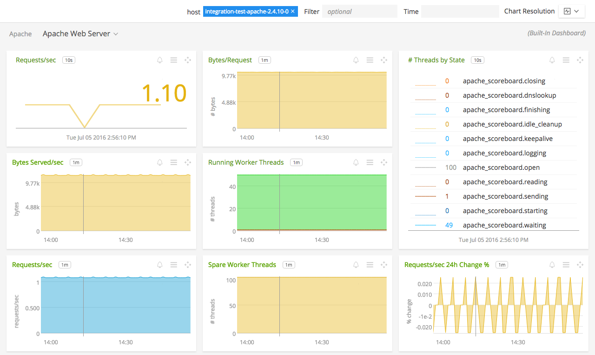
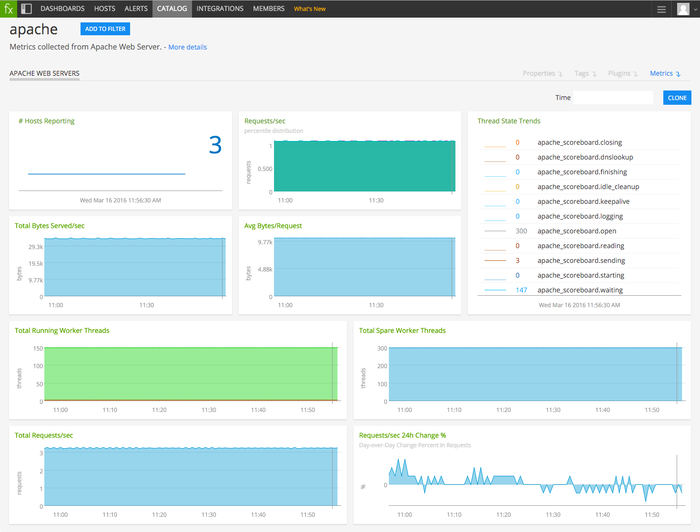

#  Apache

Metadata associated with the Apache collectd plugin can be found <a target="_blank" href="https://github.com/signalfx/integrations/tree/release/collectd-apache">here</a>. The relevant code for the plugin can be found <a target="_blank" href="https://github.com/signalfx/collectd/blob/master/src/apache.c">here</a>.

- [Description](#description)
- [Requirements and Dependencies](#requirements-and-dependencies)
- [Installation](#installation)
- [Configuration](#configuration)
- [Usage](#usage)
- [Metrics](#metrics)
- [License](#license)

### DESCRIPTION

The Apache plugin for collectd monitors Apache Webserver using the information provided in the module `mod_status`.

#### FEATURES

##### Built-in dashboards

- **Apache Web Servers**: Overview of data from all Apache webserver instances.

  

- **Apache Web Server**: Focus on a single Apache webserver instance.

  

### REQUIREMENTS AND DEPENDENCIES

This plugin collects metrics from the module `mod_status`.

#### Version information

| Software  | Version        |
|-----------|----------------|
| collectd  |  3.9 or later  |

### INSTALLATION

**If you are using the new Smart Agent, see the docs for [the collectd/apache
monitor](https://github.com/signalfx/signalfx-agent/tree/master/docs/monitors/collectd-apache.md)
for more information.  The configuration documentation below may be helpful as
well, but consult the Smart Agent repo's docs for the exact schema.**

1. Enable the <a target="_blank" href="http://httpd.apache.org/docs/2.4/mod/mod_status.html">mod_status</a> module in your Apache server.

2. Add the following configuration to your Apache server:

        ExtendedStatus on
        <Location /mod_status>
        SetHandler server-status
        </Location>

3. Restart Apache.

4. Install the plugin:

    * On RHEL/CentOS and Amazon Linux systems, run the following command to install this plugin:

            yum install collectd-apache

    * On Ubuntu and Debian systems, this plugin is included by default with the [SignalFx collectd agent](https://github.com/signalfx/integrations/tree/master/collectd).

5. Download SignalFx's <a target="_blank" href="https://github.com/signalfx/integrations/blob/master/collectd-apache/10-apache.conf">sample configuration file</a> for this plugin to `/etc/collectd/managed_config`.

6. Modify the sample configuration file to provide values that make sense for your environment, as described in [Configuration](#configuration) below.

7. Restart collectd.

### CONFIGURATION

Using the example configuration file <a target="_blank" href="https://github.com/signalfx/integrations/tree/master/collectd-apache/10-apache.conf">10-apache.conf</a> as a guide, provide values for the configuration options listed below that make sense for your environment.

| configuration option | definition | example value |
| ---------------------|------------|---------------|
| Instance | The name of the server to be monitored. This value appears in the dimension `plugin_instance`. | myapacheinstance |
| URL | The location at which collectd can retrieve output of `mod_status`. | `http://localhost/mod_status?auto` |

_Note_: Make sure that the URL you provide for your `mod_status` module ends in `?auto`. This returns the status page as `text/plain`, which this plugin requires.

### USAGE

Apache worker threads can be in one of the following states:

| State        | Remark                                  |
|--------------|-----------------------------------------|
| Open         | Open (unused) slot - no process         |
| Waiting      | Idle and waiting for request            |
| Sending      | Serving response                        |
| KeepAlive    | Kept alive for possible next request    |
| Idle\_cleanup | Idle and marked for cleanup             |
| Closing      | Closing connection                      |
| Logging      | Writing to log file                     |
| Reading      | Reading request                         |
| Finishing    | Finishing as part of graceful shutdown  |
| Starting     | Starting up to serve                    |

Sample of built-in dashboard in SignalFx:

### METRICS

For documentation of the metrics and dimensions emitted by this plugin, [click here](./docs).

### LICENSE

This integration is released under the Apache 2.0 license. See [LICENSE](./LICENSE) for more details.
