#  Consul

Metadata associated with the consul plugin for collectd can be found <a target="_blank" href="https://github.com/signalfx/integrations/tree/release/collectd-consul">here</a>. The relevant code for the plugin can be found <a target="_blank" href="https://github.com/signalfx/collectd-consul">here</a>.

- [Description](#description)
- [Requirements and Dependencies](#requirements-and-dependencies)
- [Installation](#installation)
- [Configuration](#configuration)
- [Usage](#usage)
- [Metrics](#metrics)
- [License](#license)

### DESCRIPTION

This is the SignalFx Consul plugin. Follow these instructions to install the Consul plugin for collectd.

The <a target="_blank" href="https://github.com/signalfx/collectd-consul">consul-collectd</a> plugin collects metrics from Consul instances hitting these endpoints:  
- <a target="_blank" href="https://www.consul.io/api/agent.html#read-configuration">/agent/self</a>  
- <a target="_blank" href="https://www.consul.io/api/agent.html#view-metrics">/agent/metrics</a>  
- <a target="_blank" href="https://www.consul.io/api/catalog.html#list-nodes">/catalog/nodes</a>  
- <a target="_blank" href="https://www.consul.io/api/catalog.html#list-services-for-node">/catalog/node/:node</a>  
- <a target="_blank" href="https://www.consul.io/api/status.html#get-raft-leader">/status/leader</a>  
- <a target="_blank" href="https://www.consul.io/api/status.html#list-raft-peers">/status/peers</a>  
- <a target="_blank" href="https://www.consul.io/api/coordinate.html#read-wan-coordinates">/coordinate/datacenters</a>  
- <a target="_blank" href="https://www.consul.io/api/coordinate.html#read-lan-coordinates">/coordinate/nodes</a>  
- <a target="_blank" href="https://www.consul.io/api/health.html#list-checks-in-state">/health/state/any</a>  

#### FEATURES

#### Built-in dashboards

- **CONSUL CLUSTER**: Provides a high-level overview of metrics for a single Consul cluster.

  [](./img/dashboard_cluster_top.png)

  [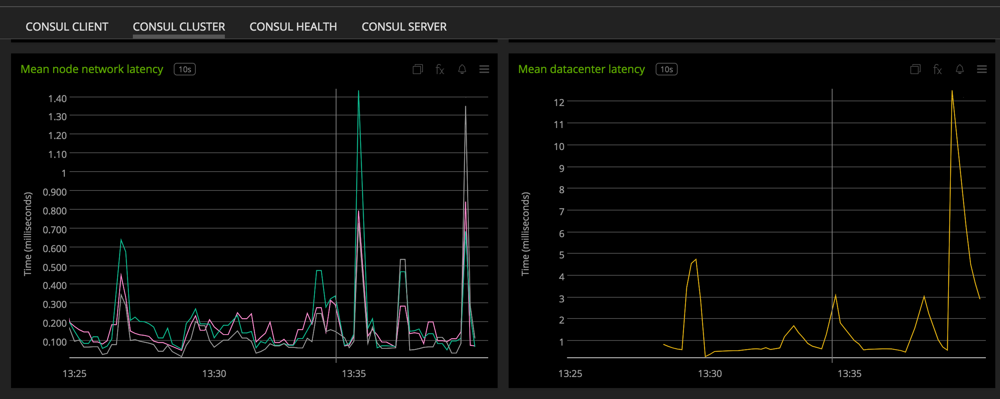](./img/dashboard_cluster_bottom.png)

- **CONSUL HEALTH**: Provides key metrics to monitoring Consul's performance.

  [](./img/dashboard_health_top.png)

  [](./img/dashboard_health_middle.png)

  [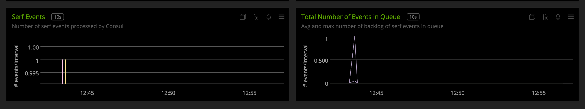](./img/dashboard_health_bottom.png)

- **CONSUL SERVER**: Provides server-specific metrics.

  [](./img/dashboard_server_top.png)

  [](./img/dashboard_server_bottom.png)

- **CONSUL CLIENT**: Provides client-specific metrics.

  [](./img/dashboard_client.png)


### REQUIREMENTS AND DEPENDENCIES

#### Version information

| Software  | Version        |
|-----------|----------------|
| collectd  |  4.9 or later  |
| python | 2.6 or later |
| Consul | 0.7.0 or later |
| Python plugin for collectd | (included with [SignalFx collectd agent](https://github.com/signalfx/integrations/tree/master/collectd)[](sfx_link:sfxcollectd)) |

### INSTALLATION

**If you are using the new Smart Agent, see the docs for [the collectd/consul
monitor](https://github.com/signalfx/signalfx-agent/tree/master/docs/monitors/collectd-consul.md)
for more information.  The configuration documentation below may be helpful as
well, but consult the Smart Agent repo's docs for the exact schema.**


1. Download <a target="_blank" href="https://github.com/signalfx/collectd-consul">collectd-consul</a>. Place the `consul_plugin.py` and `urllib_ssl_handler.py` file in `/usr/share/collectd/collectd-consul`

2. Place the <a target="_blank" href="https://github.com/signalfx/integrations/tree/release/collectd-consul/10-consul.conf">sample configuration file</a> for this plugin to `/etc/collectd/managed_config`

3. Modify the sample configuration file as described in [Configuration](#configuration), below

4. Install the Python requirements with sudo ```pip install -r requirements.txt```

5. Restart collectd


### CONFIGURATION

If running Consul version below 0.9.1, configure the Consul agents that are to be monitored to send telemetry by adding the below configuration to Consul agents configuration file.

```
{"telemetry":
  {"statsd_address": "host:port"}
}
```

This plugin will start a UDP server listening at above host and port.

Using the example configuration file <a target="_blank" href="https://github.com/signalfx/integrations/tree/release/collectd-consul/10-consul.conf">10-consul.conf</a> as a guide, provide values for the configuration options listed below that make sense for your environment and allow you to connect to the consul members

| Configuration Option | Description | Default Value |
|------------------------|----------------|------------------|
| ApiHost | IP address or DNS to which the Consul HTTP/HTTPS server binds to on the instance to be monitored | `localhost` |
| ApiPort | Port to which the Consul HTTP/HTTPS server binds to on the instance to be monitored | `8500` |
| ApiProtocol | Possible values - *http* or *https* | `http` |
| AclToken | Consul ACL token. | None |
| TelemetryServer | Possible values - *true* or *false*<br>Set to *true* to enable collecting Consul's internal metrics via UDP from Consul's telemetry.<br>If set to *false* and Consul version is 0.9.1 and above, the metrics will be collected from API.<br>If set to *false* and Consul version is less than 0.9.1, Consul's internal metrics will not be available. | `false` |
| TelemetryHost | IP address or DNS to which consul is configured to send telemetry UDP packets. Relevant if TelemetryServer set to true. | `localhost` |
| TelemetryPort | Port to which consul is configured to send telemetry UDP packets. Relevant if TelemetryServer set to true. |  `8125` |
| EnhancedMetrics | Possible values - *true* or *false*<br>Set to *true* to enable collecting all metrics from Consul's runtime telemetry send via UDP or from the `/agent/metrics` endpoint. | `false` |
| ExcludeMetric | Blocks metrics by prefix matching, if *EnhancedMetrics* is true. This can be used to exclude metrics sent from `/agent/metrics` endpoint or from Consul's runtime telemetry send via UDP. | None |
| IncludeMetric | Allows metrics by prefix matching, if *EnhancedMetrics* is false. This can be used to include metrics sent from `/agent/metrics` endpoint or from Consul's runtime telemetry send via UDP. | None |
| SfxToken |  SignalFx org access token (YOUR_SIGNALFX_API_TOKEN). If added to the config, an event is sent to SignalFx on leader transition and can be viewed on the Consul dashboard. | None |
| Dimension | Add single custom global dimension to your metrics, formatted as "key=value" | None |
| Dimensions | Add multiple global dimensions, formatted as "key1=value1,key2=value2,..." | None |
| CaCertificate | If Consul server has https enabled for the API, provide the path to the CA Certificate. | None |
| ClientCertificate | If client-side authentication is enabled, provide the path to the certificate file. | None |
| ClientKey | If client-side authentication is enabled, provide the path to the key file. | None |
| Debug | Possible values - *true* or *false*<br> | `false` |

Example configuration:

```apache
LoadPlugin python

<Plugin python>
  ModulePath "/usr/share/collectd/collectd-consul"

  Import consul_plugin
  <Module consul_plugin>
    ApiHost "server-1"
    ApiPort 8500
    ApiProtocol "http"
    AclToken "token"
    SfxToken "YOUR_SIGNALFX_API_TOKEN"
    TelemetryServer true
    TelemetryHost "17.2.3.4"
    TelemetryPort 8125
    EnhancedMetrics true
    ExcludeMetric "consul.consul.http"
    ExcludeMetric "consul.memberlist"
    Dimension "foo=bar"
    Dimensions "foo=bar,bar=baz"
    CaCertificate "path/to/ca_cert"
    ClientKey "path/to/client_key"
    ClientCertificate "path/to/client/certificate"
    Debug true
  </Module>
</Plugin>
```

The plugin can be configured to collect metrics from multiple instances in the following manner.

```apache
LoadPlugin python

<Plugin python>
  ModulePath "/usr/share/collectd/collectd-consul"

  Import consul_plugin
  <Module consul_plugin>
    ApiHost "server-1"
    ApiPort 8500
    ApiProtocol "http"
    AclToken "token"
    SfxToken "YOUR_SIGNALFX_API_TOKEN"
    TelemetryServer true
    TelemetryHost "17.2.3.4"
    TelemetryPort 8125
    EnhancedMetrics true
    ExcludeMetric "consul.consul.http"
    ExcludeMetric "consul.memberlist"
    Dimension "foo=bar"
    Debug true
  </Module>
  <Module consul_plugin>
    ApiHost "server-2"
    ApiPort 8500
    ApiProtocol "http"
    IncludeMetric "consul.fsm"
    Dimensions "foo=bar,bar=baz"
    TelemetryServer false
  </Module>
</Plugin>
```

### USAGE

#### Interpreting Built-in dashboards

- **CONSUL CLUSTER**:

  - **Total Services**: Shows the total number of services registered with the Consul cluster.

    [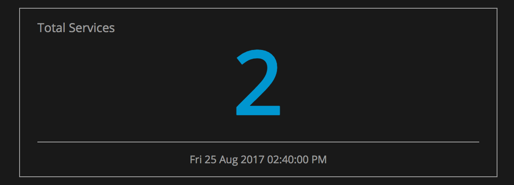](./img/chart_cluster_total_services.png)

  - **Total Nodes**: Shows the total number of nodes in the Consul cluster's catalog. Nodes include instances running consul agent in either client or server mode and external nodes registered with the Consul store.

    [](./img/chart_cluster_total_nodes.png)

  - **Number of services by node**: Descending list showing the number of services that are registered with a given node. The node name displayed is the Consul NodeName config value.

    [](./img/chart_services_by_node.png)

  - **Number of Nodes by Service**: Descending list showing the number of nodes that are providing a given service in the datacenter.

    [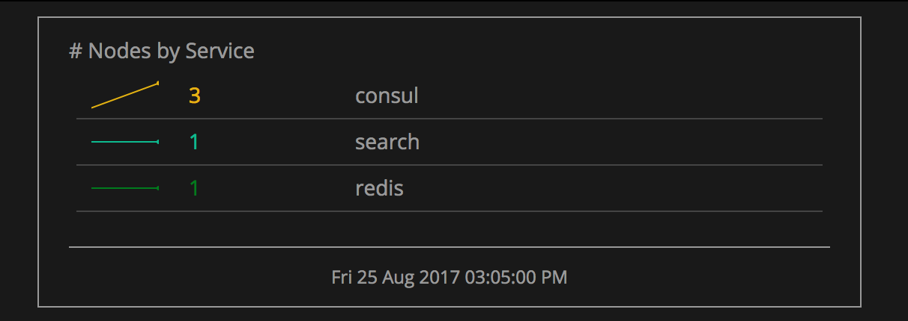](./img/chart_nodes_by_service.png)

  - **Service health check results**: A list showing the results of service health checks that are registered with Consul. Checks can result in 3 states - passing, warning and critical.

    [](./img/chart_service_health_check.png)

  - **Node health check results**: Node checks are done on the individual host level. If a host fails a check, all services registered with it are marked as failed and Consul no longer returns the node in service discovery requests. The chart is a list showing the results of node health checks. Checks can result in 3 states - passing, warning and critical.

    [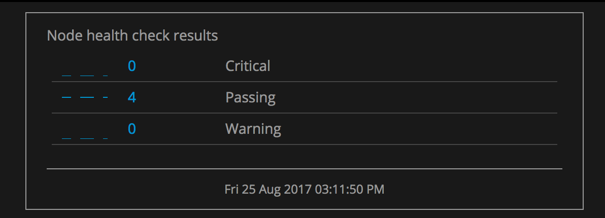](./img/chart_node_health_check.png)

  - **Total Peers**: Number of consul Raft peers or consul agents in server mode in a given datacenter.

    [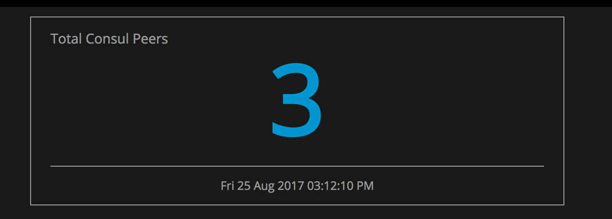](./img/chart_total_peers.png)

  - **Consul Server Map**: Displays the followers and leader in given datacenter.

    [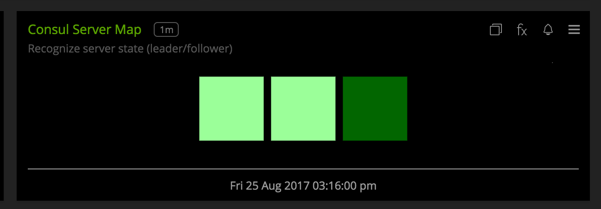](./img/chart_consul_server_map.png)

  - **Mean node network latency**: Shows the average latency of a given node from other nodes in the Consul cluster. The dimension consul\_node corresponds to the source node. The maximum and minimum values for this metric are also available.

    [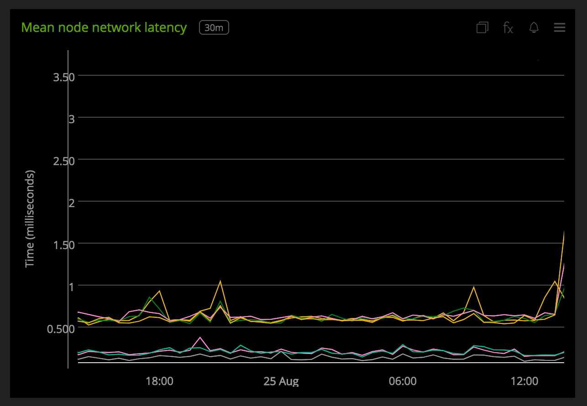](./img/chart_mean_node_latency.png)

  - **Mean datacenter latency**: Average datacenter latency between 2 datacenters. This metric has the additional dimension destination\_dc dimension. The latency is calculated between this destination datacenter and the agent's datacenter given by the datacenter dimension. The maximum and minimum values for this metric are also available.

    [](./img/chart_mean_dc_latency.png)

- **CONSUL HEALTH**:

  - **Leadership Change Event**: Event feed showing leader tranisiton events. The event has the new and old leader node name as dimensions.

    [](./img/chart_leader_change_event.png)

  - **Leadership Transitions**: Tracks number of leadership transitions. If there are frequent leadership changes this may be an indication that the servers are overloaded and aren't meeting the soft real-time requirements for Raft, or that there are networking problems between the servers.

    [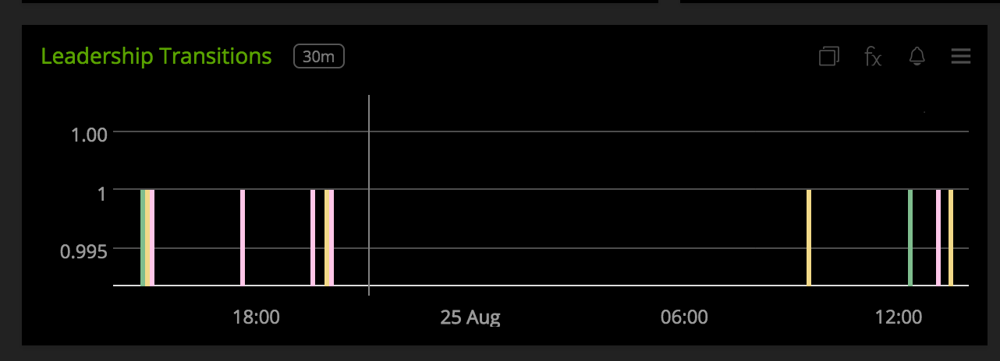](./img/chart_leader_transition.png)

  - **Leader last contact with followers**: This shows the time since the leader was last able to contact the follower nodes when checking its leader lease. It can be used as a measure for how stable the Raft timing is and how close the leader is to timing out its lease.

    [](./img/chart_leader_last_contact.png)

  - **Leader latency to commit to disk**: Time it takes for the leader to write log entries to disk.

    [](./img/chart_leader_disk_commit.png)

  - **Raft commit time**: Time it takes to commit a new entry to the Raft log on the leader.

    [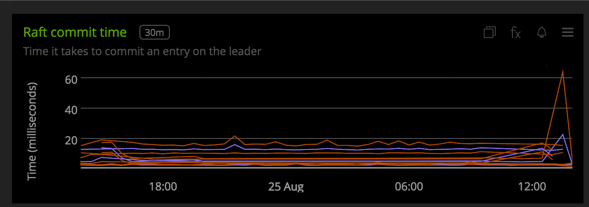](./img/chart_raft_commit_time.png)

  - **Number of Raft Transactions**: This is a general indicator of the write load on the Consul servers.

    [](./img/chart_raft_transactions.png)

  - **Leader Time to Append Entries**: This measures the time it takes the leader to replicate log entries to followers. This is a general indicator of the load pressure on the Consul servers, as well as the performance of the communication between the servers.

    [](./img/chart_time_to_append_entries.png)

  - **Number of RPC queries**: Total number of rpc queries per interval. This is a general measure of all read volume.

    [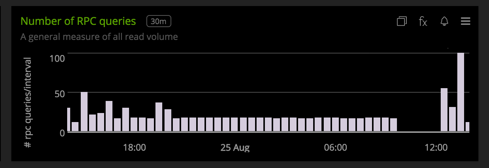](./img/chart_number_of_rpc_queries.png)

  - **Cluster Joins and Leaves**: This chart tracks successful node joins and leaves in the Serf memberlist.

    [](./img/chart_join_leave.png)

  - **Leader time to reconcile**: Shows the time it takes for the leader to reconcile Serf membership and what is reflected in Consul's store.

    [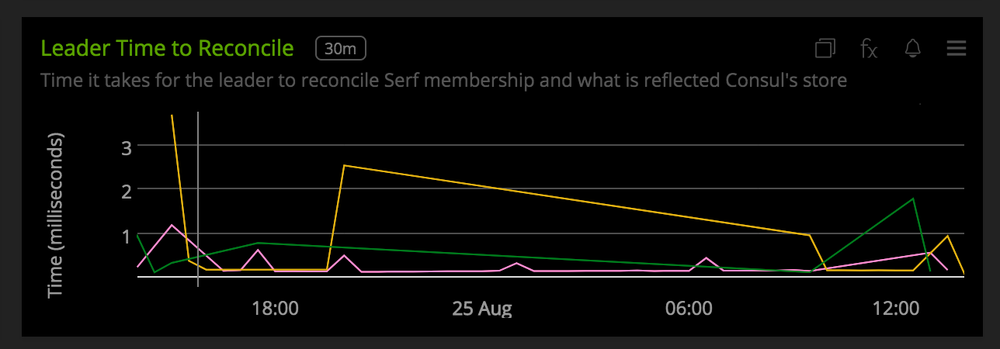](./img/chart_leader_reconcile.png)

  - **Serf Events**: Consul provides an event feature by which custom events can be propagated across your entire datacenter. This chart shows the number of events processed by Consul agents per interval. Using this chart you can track if triggered events were processed by a consul node. Additinally, you can also easily setup a chart to track events for a selected node in the CLIENT and SERVER dashboard.

    [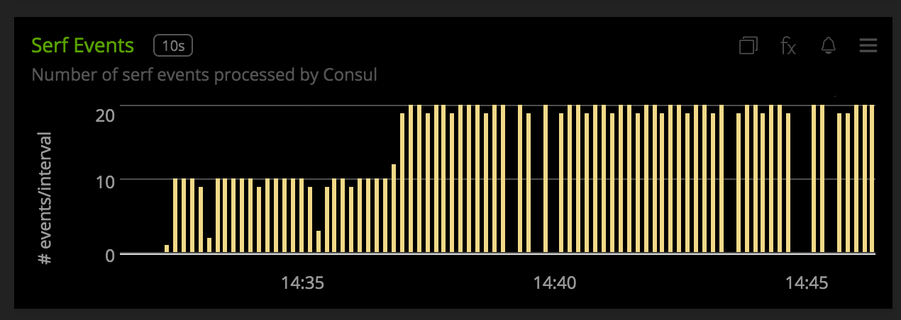](./img/chart_serf_events.png)

  - **Serf Event Queue**: Shows the avg and max number of backlog of serf events in queue of Consul agents.

    [](./img/chart_serf_event_queue.png)

- **CONSUL CLIENT**

  - **Number of allocated heap objects**: Gives the number of heap objects allocated to the consul process. Indicates memory pressure on a Consul node.

    [](./img/chart_heap_objects.png)

  - **Allocated Bytes**: Number of allocated bytes to the Consul process.

    [](./img/chart_allocated_bytes.png)

  - **Number of GO routines**: The number of GO routines Consul is running. This is a general load pressure indicator for Consul agent.

    [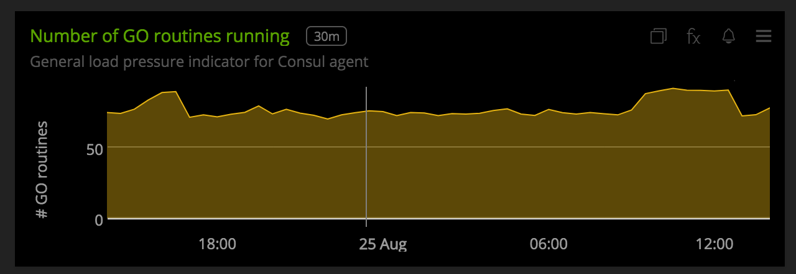](./img/chart_go_routines.png)

  - **Network Latency**: Shows the avg, max and min network latency between the node and other nodes in the datacenter.

    [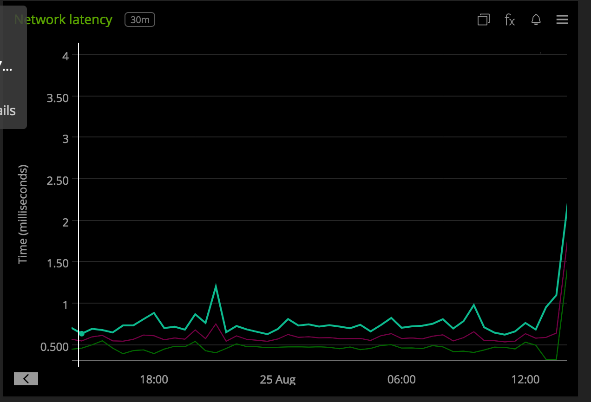](./img/chart_network_latency.png)

  - **Time to service DNS queries**: Consul provides both DNS and HTTP interfaces for service discovery. This shows the time it takes to service forward and reverse DNS lookups by the selected node.

    [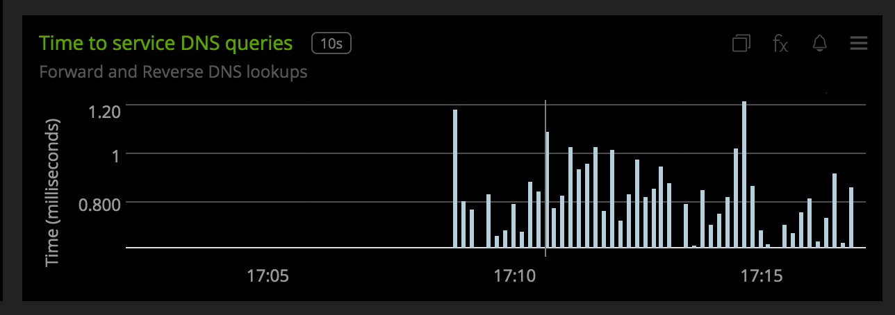](./img/chart_dns_queries.png)

- **CONSUL SERVER**
All charts metioned in the Client dashboard are also present in the Server dashboard. In addition to those, the following charts are present

  - **Raft candidate state**: This chart tracks if the selected Consul server starts an election. If this metric increments without a leadership change occurring it could indicate that a single server is overloaded or is experiencing network connectivity issues.

    [](./img/chart_raft_candidate.png)

All metrics reported by the Consul collectd plugin will contain the following dimensions by default:

* `datacenter`, this is the datacenter to which the Consul agent belongs to. The value for this dimension is read from the agents configuration
* `consul_node`, this is the Consul node name as seen in Consul agents configuration
* `consul_mode`, consul agent is in client or server mode

The metric `consul.is_leader` is reported by consul servers and have the dimension - `consul_server_state` which can be either leader or follower.

Additional default metrics to track

  - `consul.memberlist.msg.suspect` - This metric counts the number of times an agent suspects another as failed when executing random probes as part of the gossip protocol. These can be an indicator of overloaded agents, network problems, or configuration errors where agents can not connect to each other on the <a target="_blank" href="https://www.consul.io/docs/agent/options.html#ports">required ports</a>.

  - `consul.serf.member.flap` -  This metric tracks when an agent is marked dead and then recovers within a short time period. This can be an indicator of overloaded agents, network problems, or configuration errors where agents can not connect to each other on the <a target="_blank" href="https://www.consul.io/docs/agent/options.html#ports">required ports</a>.

  - `consul.dns.stale_queries` - This metric tracks when an agent serves a DNS query based on information from a server that is more than 5 seconds out of date.


A few other details:

* `plugin` is always set to `consul`
* To add additional metrics from the telemetry stream or ```/agent/metrics``` endpoint, use the configuration options mentioned in [configuration](#configuration). If metrics are being included individually, make sure to give valid prefixes. For e.g., to add metrics which track time taken to serve http requests, Consul emits these metrics in the form `consul.http.<verb>.<path>`. So to enable metrics which track time taken to service GET requests on Key/Value endpoint, add this `consul.http.GET.v1.kv` to the IncludeMetric cofiguration. If you want to allow metrics which track time taken to service all GET requests, add `consul.http.GET` to the configuration. When enhance metrics are enabled, you can block metrics in a similar manner.
* The metrics from `/agent/metric` endpoint are aggregated over an interval of 10 seconds. Keep this in mind when changing the default collectd interval from 10 seconds.

### METRICS
List of default metrics collected from telemetry stream or `agent/metrics` endpoint-
 - consul.raft.state.leader
 - consul.raft.state.candidate
 - consul.raft.leader.lastContact
 - consul.raft.leader.dispatchLog
 - consul.raft.commitTime
 - consul.raft.apply
 - consul.raft.replication.appendEntries.rpc.<FOLLOWER\_IP>
 - consul.rpc.query
 - consul.consul.leader.reconcile
 - consul.serf.events
 - consul.serf.queue.Event
 - consul.serf.queue.Query
 - consul.serf.member.join
 - consul.serf.member.left
 - consul.runtime.heap\_objects
 - consul.runtime.alloc\_bytes
 - consul.runtime.num\_goroutines
 - consul.dns.domain\_query.<HOST>
 - consul.dns.ptr\_query.<HOST>
 - consul.dns.stale\_queries.<HOST>
 - consul.serf.member.flap
 - consul.memberlist.msg.suspect

List of default metrics collected from additional endpoints -
 - consul.is\_leader
 - consul.peers
 - consul.catalog.nodes.total
 - consul.catalog.service.total
 - consul.catalog.nodes\_by\_service
 - consul.catalog.services\_by\_node
 - consul.health.nodes.passing
 - consul.health.nodes.warning
 - consul.health.nodes.critical
 - consul.health.services.passing
 - consul.health.services.warning
 - consul.health.services.critical
 - consul.network.node.latency
 - consul.network.dc.latency

### LICENSE

This integration is released under the Apache 2.0 license. See [LICENSE](./LICENSE) for more details.
