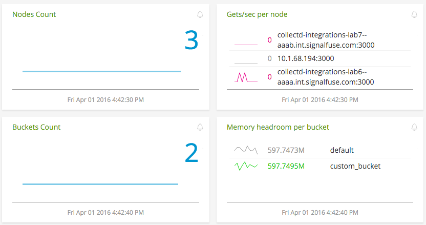
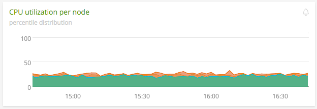
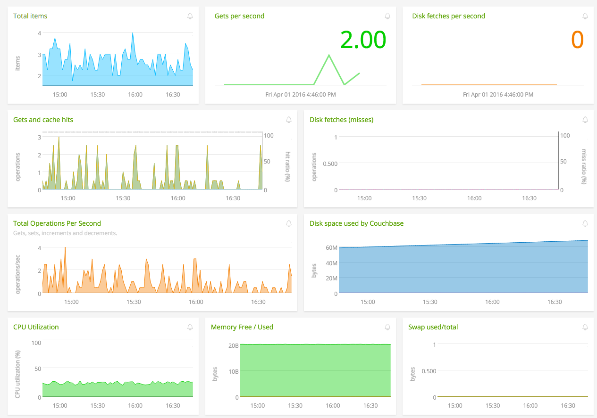
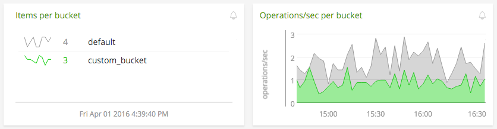
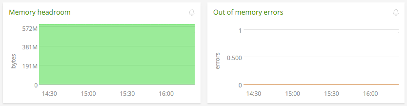
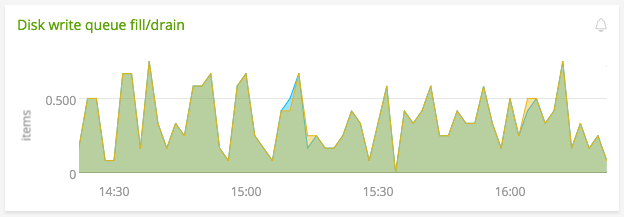

# Couchbase Plugin

- [Description](#description)
- [Requirements and Dependencies](#requirements-and-dependencies)
- [Installation](#installation)
- [Configuration](#configuration)
- [Usage](#usage)
- [Metrics](#metrics)
- [License](#license)

### DESCRIPTION

`collectd-couchbase` is a [collectd](http://www.collectd.org/) plugin that
collects statistics from Couchbase.

### REQUIREMENTS AND DEPENDENCIES

### Version information

| Software  | Version        |
|-----------|----------------|
| collectd  |  4.9 or later  |
| python | 2.7 or later |
| couchbase | 4.1 or later |


### INSTALLATION

1. Install the Python plugin for collectd.

  **RHEL/CentOS 6.x & 7.x, and Amazon Linux 2014.09, 2015.03 & 2015.09**

  Run the following command to install the Python plugin for collectd:
  ```
   yum install collectd-python
  ```

  **Ubuntu 12.04, 14.04, 15.04 & Debian 7, 8**:

  This plugin is included with [SignalFx's collectd package](https://github.com/signalfx/integrations/tree/master/collectd).

2. Download the [Python module for Couchbase](https://github.com/signalfx/collectd-couchbase).

3. Download SignalFx's [sample configuration file](https://github.com/signalfx/signalfx-collectd-configs/blob/master/managed_config/10-couchbase.conf) for this plugin.
 
4. Modify the sample configuration file as described in [Configuration](#configuration), below.

5. Add the following line to `/etc/collectd.conf`, replacing the example path with the location of the configuration file:

  ```
  Include "/path/to/10-couchbase.conf"
  ```
 
6. Restart collectd.
 
### CONFIGURATION

Using the example configuration file [`10-couchbase.conf`](././10-couchbase.conf) as a guide, provide values for the configuration options listed below that make sense for your environment and allow you to connect to the Couchbase nodes and buckets to be monitored.

| configuration option | definition | example value |
| ---------------------|------------|---------------|
| ModulePath | Path on disk where collectd can find this module. | "/opt/collectd-couchbase" |
| CollectTarget | Define what this Module block will monitor: "NODE", for a Couchbase node, or "BUCKET" for a Couchbase bucket. | "BUCKET" |
| CollectBucket | If CollectTarget is "BUCKET", the name of the bucket that this Module block will monitor. | "custom_bucket" |
| Host | Hostname or IP address of the Couchbase server. | "localhost" |
| Port | Port at which the Couchbase server can be reached. | "8091" | 
| CollectMode | Change to "detailed" to collect all available metrics from Couchbase stats API. Defaults to "default", collecting a curated set that works well with SignalFx. See [`metric_info.py`](https://github.com/signalfx/collectd-couchbase/blob/master/metric_info.py) for more information. | "default" |
| Interval | Number of seconds between calls to Couchbase API. | 10 | 
| Username | If CollectTarget is "BUCKET" and this bucket requires authentication, username to authenticate to this bucket. If this bucket does not require authentication, do not include this option in the Module block. | "USERNAME" |
| Password | f CollectTarget is "BUCKET" and this bucket requires authentication, password to authenticate to this bucket. If this bucket does not require authentication, do not include this option in the Module block. | "PASSWORD" | 
| FieldLength | The number of characters used to encode dimension data. **CAUTION**: Modify this value only if you specifically compiled collectd with a non-default value for `DATA_MAX_NAME_LEN` in `plugin.h`. |  "1024" |

### USAGE

Below are screen captures of dashboards created for this plugin by SignalFx, illustrating the metrics emitted by this plugin. The dashboards are included in this repository and can be imported into SignalFx or other monitoring products. [Click here to download](././Page_Couchbase.json).

For general reference on how to monitor Couchbase, see [Couchbase Monitoring](http://blog.couchbase.com/monitoring-couchbase-cluster) and [Monitor using the REST API](http://developer.couchbase.com/documentation/server/4.0/monitoring/monitoring-rest.html).

**Monitoring a Couchbase cluster**

On the Couchbase Nodes overview dashboard, you can see at a glance the status the nodes and buckets in a given cluster. Nodes in the cluster should be seeing balanced activity. Buckets in the cluster should each have adequate memory remaining. 



*This cluster's three nodes have roughly the same number of gets per second, and its two buckets have plenty of headroom.*

This dashboard also includes a percentile distribution of CPU utilization per node, allowing quick identification of unusually hot nodes. This chart shows minimum, 10th percentile, median (50th percentile), 90th percentile, and maximum CPU utilization for each node in the cluster. 



*This cluster's CPU utilization distribution shows only a small amount of variation in utilization, suggesting that each of the nodes is using about the same amount.*

**Monitoring a Couchbase node**

Zooming in to an individual node shows that node's activity, cache performance, and compute resource usage. 



*This node is lightly loaded. To compare its activity to other nodes in this cluster, we'd use the Couchbase Nodes dashboard above.*

We can check the node's cache performance using a graph that shows the number of gets per second in yellow, overlaid on the number of cache hits in blue. The ratio between gets and cache hits is computed as "hit ratio" and is shown as a dotted line. When every get request results in a cache hit, the graph is green and the dotted line remains high. When there are fewer cache hits than gets, the graph shows yellow areas and the dotted line drops. 


*This lightly-loaded node has a 100% cache hit ratio: it can serve every get request that it receives from memory.*

**Monitoring Couchbase buckets** 

The Couchbase Buckets overview shows activity for all buckets being monitored. 



*The buckets in this cluster happen to have about the same number of items and are serving about the same number of operations per second.*

**Monitoring a single Couchbase bucket**

Selecting a particular bucket to show on the Couchbase Bucket dashboard lets us go deep on that bucket's performance. 

Resident items ratio and cache miss rate are inversely related: as the ratio of items in this bucket that are resident in memory drops, the number of get requests that require a fetch from disk will increase.


*This bucket has a 100% resident items ratio: all of the items that it contains can be served from memory, instead of disk.*

The performance of Couchbase buckets is bound by memory. When memory is exhausted, new items can be stored only by ejecting old items. An attempt to store a new item in a bucket with insufficient memory headroom produces an out-of-memory error: either a "temp" error (an old item will be ejected, try again) or a "non-temp" error (this item cannot be stored at all). Any out-of-memory error is cause for concern.



*This bucket has available memory, and shows no out-of-memory errors.*

Couchbase persists in-memory items to disk. This graph shows the number of items that have been added to the disk write queue in yellow, and the number of items that have been successfully written in blue. When Couchbase is able to keep up with disk writes, these metrics are equal and the graph is green. When the disk queue is filling faster than it can be drained, this graph shows yellow areas.  



*This bucket is keeping up with disk writes: the number of items added to the queue is about equal to the number of items successfully written to disk.*

### METRICS

For full documentation of the metrics and dimensions emitted by this plugin, see the `docs` directory in this repository.

### LICENSE

This plugin is released under the Apache 2.0 license. See LICENSE for more details.
