#  CouchDB

Metadata associated with the couchdb plugin for collectd can be found <a target="_blank" href="https://github.com/signalfx/integrations/tree/release/collectd-couchdb">here</a>. The relevant code for the plugin can be found <a target="_blank" href="https://github.com/signalfx/collectd-couchdb">here</a>.

- [Description](#description)
- [Requirements and Dependencies](#requirements-and-dependencies)
- [Installation](#installation)
- [Configuration](#configuration)
- [Usage](#usage)
- [Metrics](#metrics)
- [License](#license)

### DESCRIPTION

This is the SignalFx CouchDB plugin. Follow these instructions to install the CouchDB plugin for collectd.

The <a target="_blank" href="https://github.com/signalfx/collectd-couchdb">couchdb-collectd</a> plugin collects metrics from CouchDB instances by calling the api endpoint: <a target="_blank" href="http://docs.couchdb.org/en/2.1.0/api/server/common.html#stats">stats</a>

#### FEATURES

#### Built-in dashboards

- **COUCHDB CLUSTER**: Provides a high-level overview of metrics for a single CouchDB cluster.

  [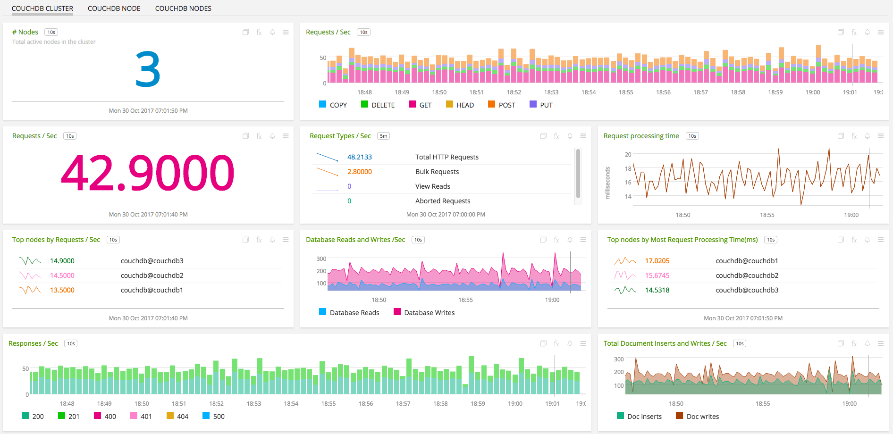](./img/couchdb-cluster-dashboard-top.png)

  [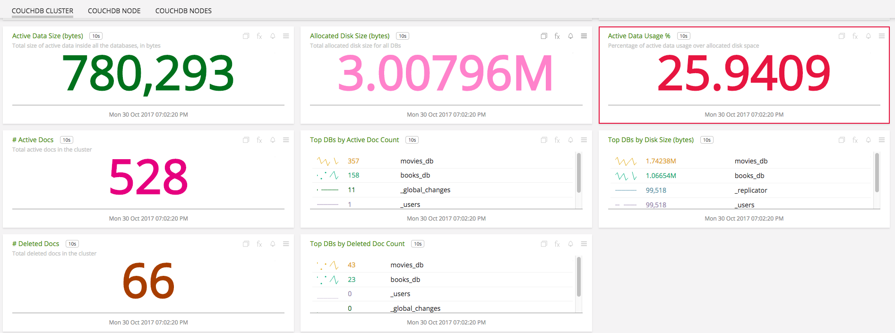](./img/couchdb-cluster-dashboard-bottom.png)  

- **COUCHDB NODE**: Provides metrics from a single CouchDB node.

  [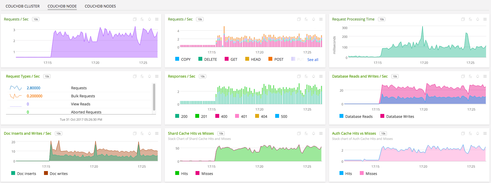](./img/couchdb-node-dashboard.png)

- **COUCHDB NODES**: Provides metrics from CouchDB nodes on a particular host.

  [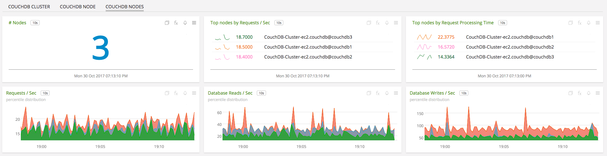](./img/couchdb-nodes-dashboard.png)


### REQUIREMENTS AND DEPENDENCIES

#### Version information

| Software  | Version        |
|-----------|----------------|
| collectd  |  4.9 or later  |
| python | 2.6 or later |
| CouchDB | 2.0.0 or later |
| Python plugin for collectd | (included with [SignalFx collectd agent](https://github.com/signalfx/integrations/tree/master/collectd)[](sfx_link:sfxcollectd)) |

### INSTALLATION

1. Download <a target="_blank" href="https://github.com/signalfx/collectd-couchdb">collectd-couchdb</a>. Place the `couchdb_plugin.py` file in `/usr/share/collectd/collectd-couchdb`

2. Modify the <a target="_blank" href="https://github.com/signalfx/integrations/blob/master/collectd-couchdb/10-couchdb.conf">sample configuration file</a> for this plugin to `/etc/collectd/managed_config`

3. Modify the sample configuration file as described in [Configuration](#configuration), below

4. Install the Python requirements with sudo ```pip install -r requirements.txt```

5. Restart collectd


### CONFIGURATION

Using the example configuration file <a target="_blank" href="https://github.com/signalfx/integrations/blob/master/collectd-couchdb/10-couchdb.conf">10-couchdb.conf</a> as a guide, provide values for the configuration options listed below that make sense for your environment and lets you to connect to the CouchDB members

| Configuration option | Definition | Example value |
| ---------------------|------------|---------------|
| ModulePath | Path on disk where collectd can find this module. | "/usr/share/collectd/collectd-couchdb/" |
| Host | Host name of the CouchDB member | "localhost" |
| Port | Port at which the member can be reached | "5984" |
| Node | Name of the CouchDB node in the cluster | "couchdb@test\_node" |
| EnhancedMetrics | Boolean; `true` to indicate if the uncommented enhanced metrics in couchdb_metrics.py are needed. | "false" |
| Username | Username required for authentication of CouchDB | "admin" |
| Password | Password required for authentication of CouchDB | "admin" |
| IncludeMetric | Metric emitted by `_stats` api to be enabled. | "metric listed in docs" |
| ExcludeMetric | Metric emitted by `_stats` api to be disabled. | "metric listed in docs" |
| Dimension | Space-separated key-value pair for a user-defined dimension | dimension\_name dimension\_value |
| Interval | Number of seconds between calls to CouchDB API. | 10 |
| ssl\_keyfile | Path to the keyfile | "path/to/file" |
| ssl\_certificate | Path to the certificate | "path/to/file" |
| ssl\_ca\_certs | Path to the ca file | "path/to/file" |

### USAGE

#### Interpreting Built-in dashboards

- **COUCHDB CLUSTER**:

  - **Number of Nodes**: Total number of active nodes in the cluster.

    [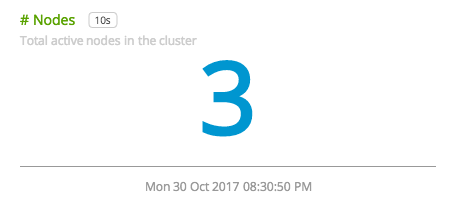](./img/chart-couchdb-cluster-active-nodes.png)

  - **Number of Requests**: Total number of requests handled per second by all the nodes in the cluster.

    [](./img/chart-couchdb-cluster-total-requests.png)

  - **Request Processing Time**: Average request processing time of all the nodes in the cluster.

    [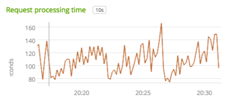](./img/chart-couchdb-cluster-request-time.png)

  - **Database Reads and Writes**: Total number of database reads and writes performed by all the nodes in the cluster.

    [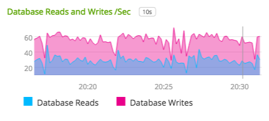](./img/chart-couchdb-cluster-db-reads-writes.png)

  - **Active Data Usage**: Active data usage percentage. As the CouchDB does only soft deletes, all the deleted records are still present in the database. This chart will indicate the percentage of active data in the database. We recommend you to compact database when the value is below 50%.

    [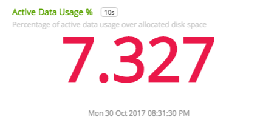](./img/chart-couchdb-cluster-active-data-usage.png)

  - **Active Docs vs Deleted Docs**: Total number of active and deleted docs present in the cluster.

    [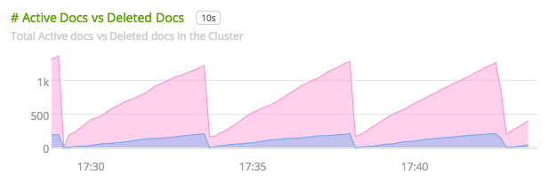](./img/chart-couchdb-cluster-active-del-docs.png)


- **COUCHDB NODE**:

  - **Number of Requests**: Total number of requests handled by the node per second.

    [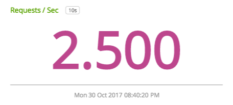](./img/chart-couchdb-node-requests.png)

  - **Request Processing Time**: Average request processing time of the node.

    [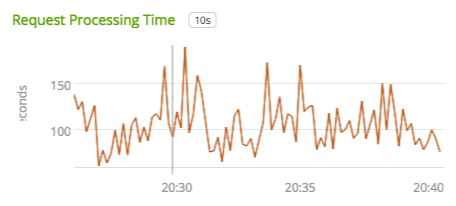](./img/chart-couchdb-node-request-time.png)

  - **Database Reads and Writes**: Total number of database reads and writes performed by the node.

    [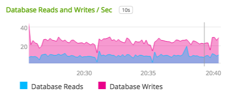](./img/chart-couchdb-node-db-reads-writes.png)  

  - **Auth Cache Hits vs Misses**: Stack chart of auth cache hits and misses.

    [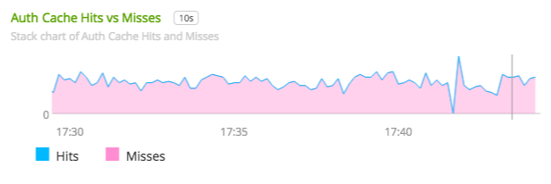](./img/chart-couchdb-node-auth-hits-misses.png)

  - **Shard Cache Hits vs Misses**: Stack chart of shard cache hits and misses.

    [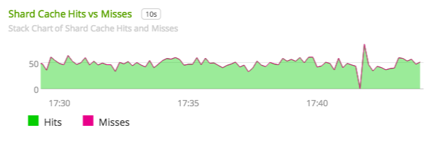](./img/chart-couchdb-node-shard-hits-misses.png)

- **COUCHDB NODES**: Provides metrics from nodes on a particular host.

  - **Number of Nodes**: Total number of CouchDB nodes running on the host.

    [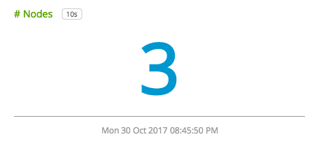](./img/chart-couchdb-nodes-active-nodes.png)

  - **Top Requests**: List of top nodes handling highest requests per second on the host.

    [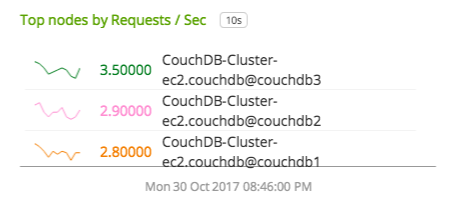](./img/chart-couchdb-nodes-top-requests.png)

  - **Top Request Processing Time**: List of nodes having highest request processing time on the host.

    [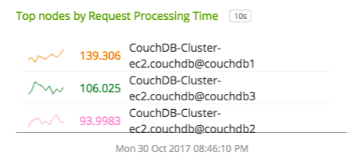](./img/chart-couchdb-nodes-top-request-time.png)

  - **Database Reads**: Percentile distribution of database reads of all the nodes present in the host.

    [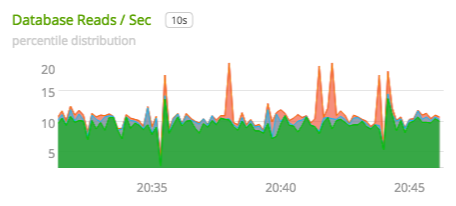](./img/chart-couchdb-nodes-db-reads.png)

  - **Database Writes**: Percentile distribution of database writes of all the nodes present in the host.

    [](./img/chart-couchdb-nodes-db-writes.png)


All metrics reported by the CouchDB collectd plugin will contain the following dimensions by default:

* `node`, name of the node as in the cluster
* `cluster`, human readable cluster name
* `plugin` is always set to `couchdb`
* `plugin_instance` will contain the IP address and the port of the member given in the configuration


### METRICS
By default, basic metrics are provided. For documentation of the metrics and dimensions emitted by this plugin, [click here](./docs). See [usage](#usage) for details.


### LICENSE

This integration is released under the Apache 2.0 license. See [LICENSE](./LICENSE) for more details.
