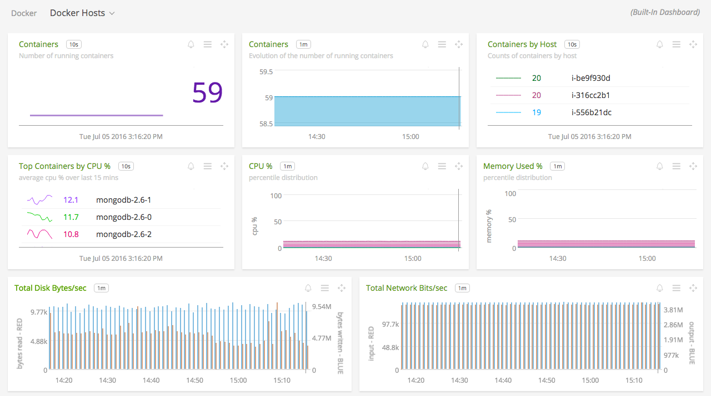
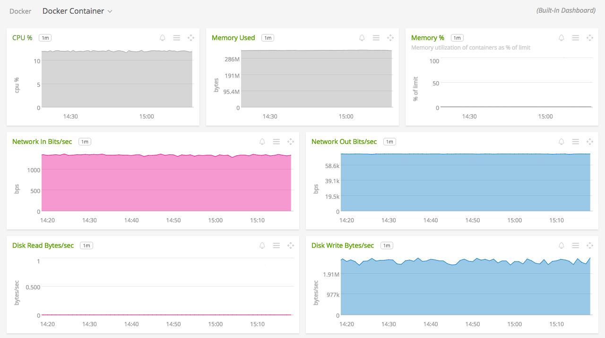
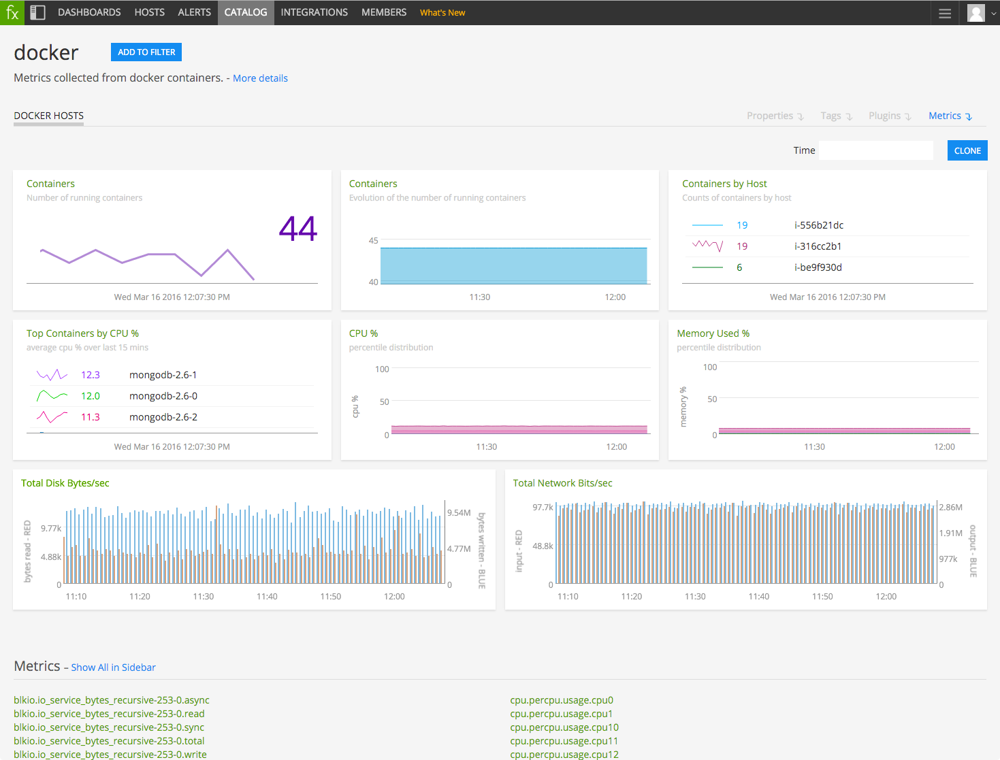

#  Docker

Metadata associated with the Docker plugin for collectd can be found <a target="_blank" href="https://github.com/signalfx/integrations/tree/release/collectd-docker">here</a>. The relevant code for the plugin can be found <a target="_blank" href="https://github.com/signalfx/docker-collectd-plugin">here</a>.

- [Description](#description)
- [Requirements and Dependencies](#requirements-and-dependencies)
- [Installation](#installation)
- [Configuration](#configuration)
- [Usage](#usage)
- [Metrics](#metrics)
- [License](#license)

### DESCRIPTION

This is the SignalFx Docker plugin. Follow these instructions to install the Docker plugin for collectd.

The <a target="_blank" href="https://github.com/signalfx/docker-collectd-plugin">docker-collectd</a> plugin collects metrics about the Docker containers running on the system using Docker's stats API. It reports metrics about the CPU utilization of each container, their memory consumption, and their network and disk activity.

#### FEATURES

##### Built-in dashboards

- **Docker Hosts**: Overview of all data from Docker hosts.

  [](./img/dashboard_docker_hosts.png)

- **Docker Host**: Focus on a single Docker host.

  [](./img/dashboard_docker_host.png)

- **Docker Container**: Focus further on a single running Docker container.

  [](./img/dashboard_docker_container.png)

- **Docker Neighbors**: (Optional Dashboard) Container resource allocation metrics.

  [](./img/dashboard_docker_neighbours.png)

### REQUIREMENTS AND DEPENDENCIES

#### Version information

| Software | Version      |
|----------|--------------|
| collectd | 5.0 or later |
| Python   | 2.6 or later |
| Docker   | 1.9 or later |
| Python plugin for collectd | (included with [SignalFx collectd agent](https://github.com/signalfx/integrations/tree/master/collectd)[](sfx_link:sfxcollectd)) |


### INSTALLATION

**If you are using the new Smart Agent, see the docs for [the collectd/docker
monitor](https://github.com/signalfx/signalfx-agent/tree/master/docs/monitors/collectd-docker.md)
for more information.  The configuration documentation below may be helpful as
well, but consult the Smart Agent repo's docs for the exact schema.**


1. Download the <a target="_blank" href="https://github.com/signalfx/docker-collectd-plugin">docker-collectd-plugin</a> Python module.

2. Run the following command to install the module’s dependencies using `pip`, replacing the example path with the download location of the `docker-collectd-plugin` module:

        sudo pip install -r /path/to/docker-collectd-plugin/requirements.txt

    * **On Amazon Linux**: Run the following commands instead:

            yum install python26-pip
            sudo pip-2.6 install -r /path/to/docker-collectd-plugin/requirements.txt

3. Download SignalFx’s <a target="_blank" href="https://github.com/signalfx/integrations/blob/master/collectd-docker/10-docker.conf">sample configuration file</a> for this plugin to `/etc/collectd/managed_config`.

4. Modify the configuration file to provide values that make sense for your environment, as described in [Configuration](#configuration) below.

5. Restart collectd.


6. Optional metrics regarding CPU quota and CPU shares can be enabled in the plugin configuration file. To enable the optional metrics:
    * Set the CpuQuotaPercent and CpuSharesPercent configuration options to true
    * Configure the filter to emit the optional metrics. Please see the configuration details [here](#configuration)

7. The optional dashboard `Docker Neighbors` offers visualizations based on the CPU quota and CPU shares metrics. To view the dashboard:
    * Manually import the dashboard into your organization in SignalFx.
        * Download the <a target="_blank" href="https://github.com/signalfx/integrations/blob/master/collectd-docker/dashboards/Page_Docker.json">dashboard group</a> with the optional dashboard
        * Click to open the Actions menu, hover over Import, then select Dashboard Group
        * Specify the path to the downloaded `Page_Docker.json` file
        * The new dashboard group should appear under Custom Dashboard Groups

### CONFIGURATION

Using the example configuration file <a target="_blank" href="https://github.com/signalfx/integrations/tree/master/collectd-docker/10-docker.conf">10-docker.conf</a> as a guide, provide values for the configuration options listed below that make sense for your environment.

| configuration option | definition | default value |
| ---------------------|------------|---------------|
| TypesDB | Path on disk where collectd can find the Types.db file included in this module. | "/usr/share/collectd/docker-collectd-plugin/dockerplugin.db" |
| ModulePath | Path on disk where collectd can find this module. | "/usr/share/collectd/docker-collectd-plugin" |
| BaseURL | URL of your Docker daemon's remote API | "unix://var/run/docker.sock" |
| Timeout  | Time in seconds that collectd will wait for a response from Docker   | 3 |
| Verbose | Turns on verbose log statements | false |
| CpuQuotaPercent | Turns on cpu quota metric | false |
| CpuSharesPercent | Turns on cpu shares metric | false |
| CollectNetworkStats | Turns on network stat gathering | true |


#### How to send metrics about resource allocation

If a filter has been configured, then additional resource allocation metrics can be gathered by adding the following snippet to the plugin's filter configuration.

```apache
<Rule "CpuShares">
  <Match "regex">
    Type "^cpu.shares$"
  </Match>
  Target "return"
</Rule>
<Rule "CpuQuota">
<Match "regex">
  Type "^cpu.quota$"
</Match>
Target "return"
</Rule>
<Rule "CpuThrottlingData">
  <Match "regex">
    Type "^cpu.throttling_data$"
  </Match>
  Target "return"
</Rule>
<Rule "MemoryStats">
  <Match "regex">
    Type "^memory.stats$"
    TypeInstance "^swap"
  </Match>
  Target "return"
</Rule>
```

### USAGE

All metrics reported by the Docker collectd plugin will contain the following dimensions:

* `host` will contain the hostname (as known by collectd) of the machine reporting the metrics
* `plugin` is always set to `docker`
* `plugin_instance` will contain the name of the container the metrics are from. The container name is used because that's usually a more stable value than the container ID, which changes on every restart.

Sample of built-in dashboard in SignalFx:



### METRICS

For documentation of the metrics and dimensions emitted by this plugin, [click here](./docs).

### LICENSE

This integration is released under the Apache 2.0 license. See [LICENSE](./LICENSE) for more details.
