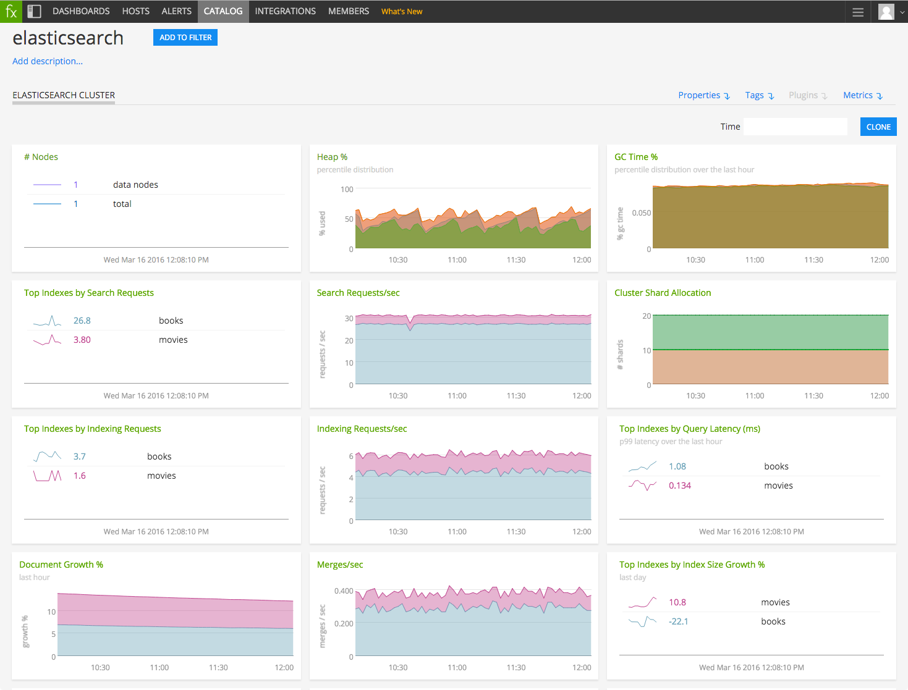
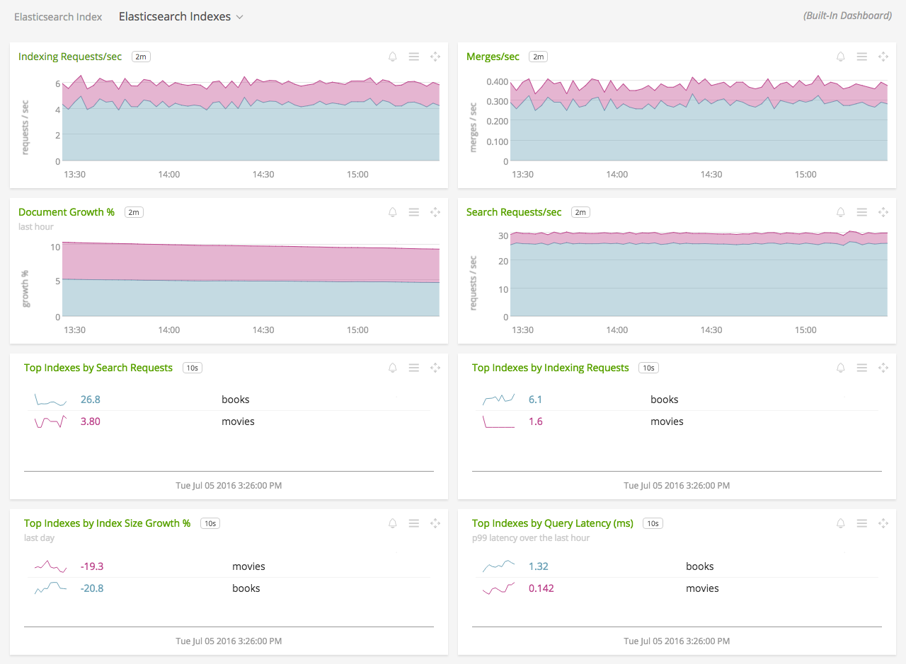

#  Elasticsearch

Metadata associated with the Elasticsearch collectd plugin can be found <a target="_blank" href="https://github.com/signalfx/integrations/tree/release/collectd-elasticsearch">here</a>. The relevant code for the plugin can be found <a target="_blank" href="https://github.com/signalfx/collectd-elasticsearch">here</a>.

- [Description](#description)
- [Requirements and Dependencies](#requirements-and-dependencies)
- [Installation](#installation)
- [Configuration](#configuration)
- [Usage](#usage)
- [Metrics](#metrics)
- [License](#license)

### DESCRIPTION

This is the SignalFx Elasticsearch plugin. This will send data about Elasticsearch to SignalFx, enabling built-in Elasticsearch monitoring dashboards.

Use this plugin to monitor the following types of information from an Elasticsearch node:

  * node statistics (cpu, os, jvm, indexing, search, thread pools, etc..)
  * per-index statistics
  * cluster statistics

Original Elasticsearch Documentation <a target="_blank" href="https://www.elastic.co/guide/en/elasticsearch/reference/current/index.html">https://www.elastic.co/guide/en/elasticsearch/reference/current/index.html<a/>

#### FEATURES

##### Built-in dashboards

- **Elasticsearch**: Overview of all data from Elasticsearch hosts.

  [](./img/dashboard_elasticsearch.png)

- **Elasticsearch Cluster**: Focus on a single Elasticsearch cluster.

  [](./img/dashboard_elasticsearch_cluster.png)

- **Elasticsearch Node**: Focus further on a single Elasticsearch node.

  [](./img/dashboard_elasticsearch_node.png)

- **Elasticsearch Indexes**: Overview of all Elasticsearch indexes.

  [](./img/dashboard_elasticsearch_indexes.png)

- **Elasticsearch Index**: Focus on a single Elasticsearch index.

  [](./img/dashboard_elasticsearch_index.png)

### REQUIREMENTS AND DEPENDENCIES

#### Version information

| Software          | Version        |
|-------------------|----------------|
| collectd          | 4.9 or later   |
| Elasticsearch     | 1.0.0 or later |
| Python plugin for collectd | (included with [SignalFx collectd agent](https://github.com/signalfx/integrations/tree/master/collectd)[](sfx_link:sfxcollectd)) |

### INSTALLATION

**If you are using the new Smart Agent, see the docs for [the collectd/elasticsearch
monitor](https://github.com/signalfx/signalfx-agent/tree/master/docs/monitors/collectd-elasticsearch.md)
for more information.  The configuration documentation below may be helpful as
well, but consult the Smart Agent repo's docs for the exact schema.**


1. Download the <a target="_blank" href="https://github.com/signalfx/collectd-elasticsearch">collectd-elasticsearch</a> Python module.

2. Download SignalFx’s <a target="_blank" href="https://github.com/signalfx/integrations/blob/master/collectd-elasticsearch/20-elasticsearch.conf">sample configuration file</a> to `/etc/collectd/managed_config`.

3. Modify the configuration file to provide values that make sense for your environment, as described [below](#configuration).

4. Restart collectd.

### CONFIGURATION

Using the example configuration file <a target="_blank" href="https://github.com/signalfx/integrations/tree/master/collectd-elasticsearch/20-elasticsearch.conf">20-elasticsearch.conf</a> as a guide, provide values for the configuration options listed below that make sense for your environment and allow you to connect to the Elasticsearch instance to be monitored.

The plugin is intended to be run on a per-node basis. Define only one "Module" element per `20-elasticsearch.conf` configuration file.

| configuration option | definition | example value |
| ---------------------|------------|---------------|
| ModulePath | Path on disk where collectd can find this module. | "/usr/share/collectd/collectd-elasticsearch" |
| Verbose | Enable verbose logging. | false |
| Cluster | A name for this cluster. Appears in the dimension `plugin_instance`. If specified, this value will override the cluster name returned by the ES endpoint. | "elasticsearch" |
| Indexes | Identifies the indexes for which the plugin should collect statistics. See note below. | ["_all"] |
| EnableIndexStats | Enable or disable collection of index statistics. | false |
| IndexStatsMasterOnly | When `true`, index stats will only be sent if the node is the active master.  When `false`, index stats will be sent if the node is master eligible.  This requires EnableIndexStats to be `true`. | false |
| EnableClusterHealth | Enable or disable collection of cluster health statistics. | true |
| Interval | The interval in seconds at which the plugin will report metrics, independent of the overall collectd collection interval. | 10 |
| Host | The hostname of this instance of Elasticsearch. | "localhost" |
| Port | The port number of this instance of Elasticsearch. | "9200" |
| DetailedMetrics | Turns on additional metric time series. Acceptable values: (true/false). | false |
| IndexInterval | Interval in seconds at which the plugin will report index metrics.  Must be greater than or equal and divisible by the Interval.  Incorrect values are automatically rounded to a compatible value. | 300 |
| AdditionalMetrics | A python list of additional metrics to be emitted.  The names provided must match a metric defined in the elasticsearch\_collectd.py file. | \[""\] |
| Username | The plain text username for accessing the Elasticsearch installation (Basic Authentication Only). | `Unconfigured` |
| Password | The plain text password for accessing the Elasticsearch installation (Basic Authentication Only). | `Unconfigured` |
| ThreadPools | "search" and "index" thread pools are required, but additional threadpools can be specified in the list. See [note regarding available thread pools](#note-available-thread-pools) below. | \["search","index"\] |

#### Note: Available thread pools

The following table indicates thread pools that can be monitored by this plugin in each version of Elasticsearch. Add thread pools of interest to the configuration parameter `ThreadPools`.

| thread pool name | ES 1.x | ES 2.0 | ES 2.1+ |
|------------------|--------|--------|--------|
| merge            | &#x2713;      |        |        |
| optimize         |&#x2713;     |        |        |
| bulk             |&#x2713;     |&#x2713;     |&#x2713;     |
| flush            |&#x2713;     |&#x2713;     |&#x2713;     |
| generic          |&#x2713;     |&#x2713;     |&#x2713;     |
| get              |&#x2713;     |&#x2713;     |&#x2713;     |
| snapshot         |&#x2713;     |&#x2713;     |&#x2713;     |
| warmer           |&#x2713;     |&#x2713;     |&#x2713;     |
| refresh          |&#x2713;     |&#x2713;     |&#x2713;     |
| fetch\_shard\_started|      |&#x2713;     |&#x2713;     |
| fetch\_shard\_store|        |&#x2713;     |&#x2713;     |
| listener         |        |&#x2713;     |&#x2713;     |
| management       |        |&#x2713;     |&#x2713;     |
| percolate        |        |&#x2713;     |&#x2713;     |
| suggest          |        |&#x2713;     |&#x2713;     |
| force\_merge      |        |        |&#x2713;     |


#### Note: Using this plugin from a container deployment

 If you are running the Elasticsearch plugin via a collectd deployment within a container, configure the Host and Port values inside of the 20-elasticsearch.conf file to correspond to the desired Elasticsearch instance.

 ex:
```
   <Module "elasticsearch_collectd">
       Host "XXX.XXX.XXX.XXX"
       Port "XXXX"
   </Module>
```
#### Note: Authentication

Currently only Basic Authentication is supported for the plugin.

#### Note: Collecting index statistics

By default, the configuration parameter Indexes is set to `"_all"`. This means that when EnableIndexStats is set to `true`, the plugin will collect statistics about all indexes. To collect statistics from only one index, set the configuration parameter Indexes to the name of that index: for example, `["index1"]`. To collect statistics from multiple indexes (but not all), include them as a comma-separated list: for example, `["index1", "index2"]`.

This plugin collects index statistics only on master-eligible Elasticsearch nodes.

The call to collect index statistics can be CPU-intensive. For this reason SignalFx recommends using the `Interval` configuration parameter to decrease the reporting interval for nodes that report index statistics.

### USAGE

Sample of built-in dashboard in SignalFx:


### METRICS

For documentation of the metrics and dimensions emitted by this plugin, [click here](./docs).

### LICENSE

This integration is released under the Apache 2.0 license. See [LICENSE](./LICENSE) for more details.
