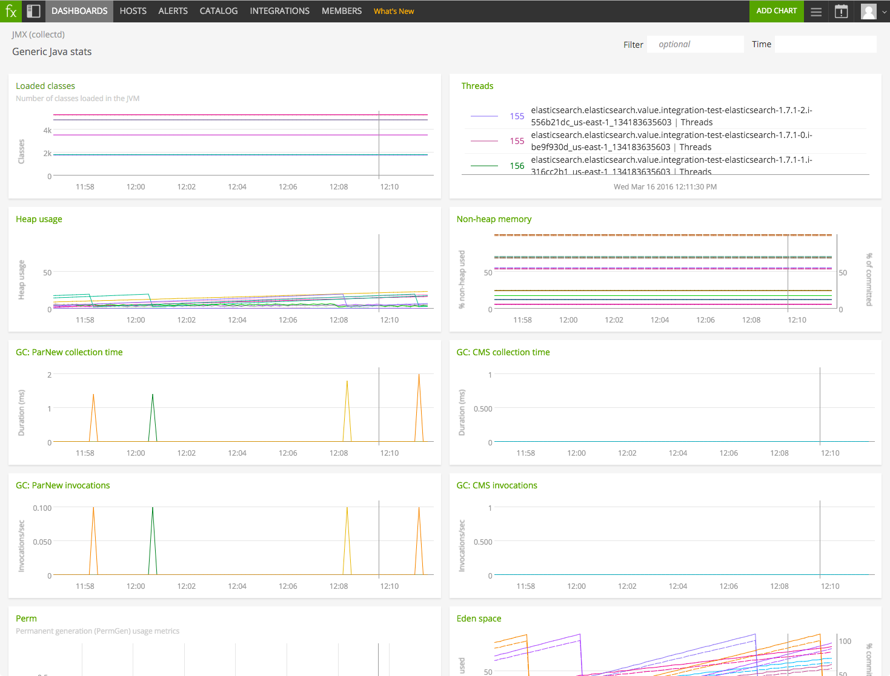

#  GenericJMX collectd Plugin

Metadata associated with the GenericJMX collectd plugin can be found <a target="_blank" href="https://github.com/signalfx/integrations/tree/release/collectd-genericjmx">here</a>. The relevant code for the plugin can be found <a target="_blank" href="https://github.com/signalfx/collectd/blob/master/bindings/java/org/collectd/java/GenericJMX.java">here</a>.

- [Description](#description)
- [Requirements and Dependencies](#requirements-and-dependencies)
- [Installation](#installation)
- [Configuration](#configuration)
- [Usage](#usage)
- [Metrics](#metrics)
- [License](#license)

### DESCRIPTION

From <a target="_blank" href="https://collectd.org/wiki/index.php/Plugin:GenericJMX">collectd wiki</a>:

> The GenericJMX plugin reads Managed Beans (MBeans) from an MBeanServer using JMX. The plugin is written in Java and requires the [Java plugin](https://github.com/signalfx/integrations/tree/master/collectd-java) to function.

> The Java Management Extensions (JMX) is a generic framework to provide and query various management information. The interface is used by the Java Virtual Machine (JVM) to provide information about the memory used, threads and so on. These basic performance values can therefore be collected for every Java process without any support in the Java process itself.

> Advanced Java processes can use the JMX interface to provide performance information themselves. The Apache Tomcat application server, for example, provides information on the number of requests processed, the number of bytes sent, processing time, and thread counts.

### REQUIREMENTS AND DEPENDENCIES

| Software  | Version        |
|-----------|----------------|
|  collectd | 4.8+ |
| Java      | 1.6+ |

### INSTALLATION

**If you are using the new Smart Agent, see the docs for [the collectd/genericjmx
monitor](https://github.com/signalfx/signalfx-agent/tree/master/docs/monitors/collectd-genericjmx.md)
for more information.  The configuration documentation below may be helpful as
well, but consult the Smart Agent repo's docs for the exact schema.**

1. Install the Java plugin.

    * RHEL/CentOS 6.x & 7.x, and Amazon Linux 2014.09, 2015.03 & 2015.09. Run the following command to install the Java plugin for collectd:

            yum install collectd-java

    * Ubuntu 12.04, 14.04, 16.04 & Debian 7, 8:
        - This plugin is included with [SignalFx's collectd package](https://support.signalfx.com/hc/en-us/articles/208080123).

2. Download SignalFx's sample JMX configuration file <a target="_blank" href="https://github.com/signalfx/integrations/blob/master/collectd-genericjmx/20-javageneric.conf">20-javageneric.conf</a>

3. Modify the configuration file providing values that make sense for your environment, as described [below](#configuration).

4. Add the following line to /etc/collectd.conf, replacing the example path with the location of the configuration file you downloaded in step 3:

        include '/path/to/20-javageneric.conf'

5. Restart collectd.

collectd will be ready to be configured for your Java-based application.

### CONFIGURATION

From <a target="_blank" href="https://collectd.org/wiki/index.php/Plugin:GenericJMX">collectd wiki</a>:

> The configuration of the GenericJMX plugin consists of two blocks:
> * _MBean blocks_ that define a mapping of MBean attributes to the “types” used by collectd
> * _Connection blocks_ which define the parameters needed to connect to an MBeanServer and what data to collect.

> The configuration of the SNMP plugin is similar in nature, in case you know it.

> **MBean blocks**

> _MBean blocks_ specify what data is retrieved from MBeans and how that data is mapped on the collectd data types. The block requires one string argument, a name. This name is used in the _Connection blocks_ (see below) to refer to a specific MBean block. Therefore, the names must be unique.
The following options are recognized within MBean blocks:

| configuration option | type | definition |
| ---------------------|------------|---------------|
|ObjectName | pattern | Sets the pattern which is used to retrieve MBeans from the MBeanServer. If more than one MBean is returned you should use the InstanceFrom option (see below) to make the <a target="_blank" href="https://collectd.org/wiki/index.php/Identifier">identifiers</a> unique. See also: <a target="_blank" href="http://java.sun.com/javase/6/docs/api/javax/management/ObjectName.html">ObjectName</a>.|
|InstancePrefix| prefix| Prefixes the generated plugin instance with prefix. (optional)|
|InstanceFrom| property| The object names used by JMX to identify MBeans include so called “properties” which are basically key-value-pairs. If the given object name is not unique and multiple MBeans are returned, the values of those properties usually differ. You can use this option to build the plugin instance from the appropriate property values. This option is optional and may be repeated to generate the plugin instance from multiple property values.|

> `<value />` blocks

> The value blocks map one or more attributes of an MBean to a <a target="_blank" href="https://collectd.org/wiki/index.php/Value_list">value list</a> in _collectd_. **There must be at least one `<value />` block within each MBean block.**

| configuration option | type | definition |
| ---------------------|------------|---------------|
|Type |type| Sets the data set used within collectd to handle the values of the MBean attribute.|
|InstancePrefix| prefix| Works like the option of the same name directly beneath the MBean block, but sets the type instance instead. (optional)|
|InstanceFrom| prefix| Works like the option of the same name directly beneath the MBean block, but sets the type instance instead. (optional)|
|Table| true/false| Set this to true if the returned attribute is a _composite_ type. If set to true, the keys within the composite type is appended to the type instance.|
|Attribute |path| Sets the name of the attribute from which to read the value. You can access the keys of composite types by using a dot to concatenate the key name to the attribute name. For example: “attrib0.key42”. If Table is set to true path must point to a composite type, otherwise it must point to a numeric type.|

>**Connection blocks**

> Connection blocks specify how to connect to an MBeanServer and what data to retrieve. The following configuration options are available:

| configuration option | type | definition |
| ---------------------|------------|---------------|
| Host | name | Host name used when dispatching the values to collectd. See <a target="_blank" href="https://collectd.org/wiki/index.php/Naming_schema">naming schema</a> for details. The option sets this field only, it is not used to connect to anything and doesn't need to be a real, resolvable name. |
| ServiceURL | URL | Specifies how the MBeanServer can be reached. Any string accepted by the JMXServiceURL is valid. See also: <a target="_blank" href="http://java.sun.com/javase/6/docs/api/javax/management/remote/JMXServiceURL.html">JMXServiceURL</a> |
| User | name | Use name to authenticate to the server. If not configured, “monitorRole” will be used. |
| Password | password | Use password to authenticate to the server. If not given, unauthenticated access is used. |
| InstancePrefix | prefix | Prefixes the generated plugin instance with prefix. If a second InstancePrefix is specified in a referenced MBean block, the prefix specified in the Connection block will appear at the beginning of the plugin instance, the prefix specified in the MBean block will be appended to it. (optional, since version 5.0) |
| Collect | mbean\_block\_name | Configures which of the _MBean_ blocks to use with this connection. May be repeated to collect multiple _MBeans_ from this server. |

### USAGE

The GenericJMX collectd plugin by itself gathers generic Java metrics. By default this plugin will collect the following metrics when using the <a target="_blank" href="https://github.com/signalfx/integrations/blob/master/collectd-genericjmx/20-javageneric.conf">default configuration</a>:

| configuration option | type | definition |
| ---------------------|------------|---------------|
|Collect "classes"| mbean\_block\_name | The classes that are running on the host|
|Collect "garbage\_collector"| mbean\_block\_name| Number of garbage collections and time spent. |
|Collect "memory-heap"| mbean\_block\_name| Total size and usage of Heap Memory |
|Collect "memory-nonheap"| mbean\_block\_name | Total size and usage of non-heap memory|
|Collect "memory\_pool"| mbean\_block\_name | Total size and use of memory pool |

### METRICS

Sample of built-in dashboard in SignalFx:

### LICENSE

This integration is released under the Apache 2.0 license. See [LICENSE](./LICENSE) for more details.
