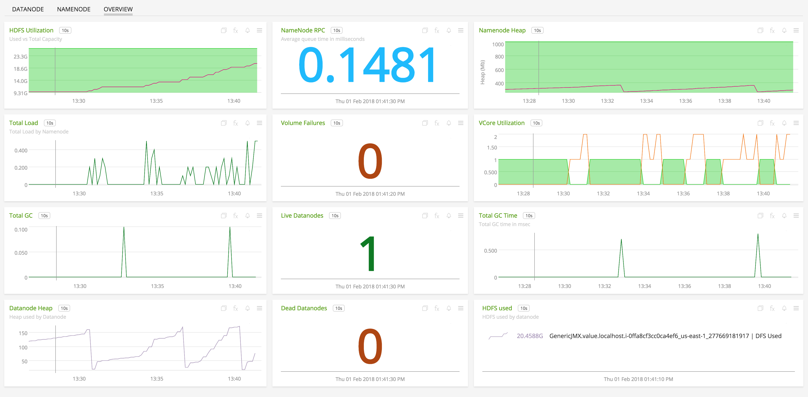
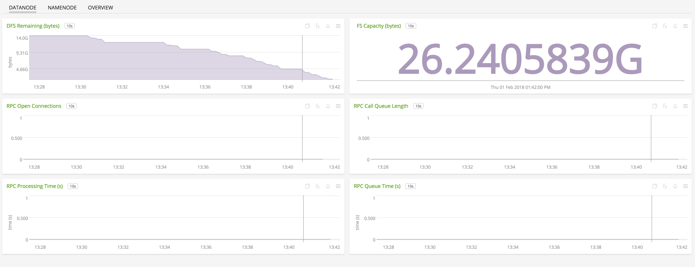
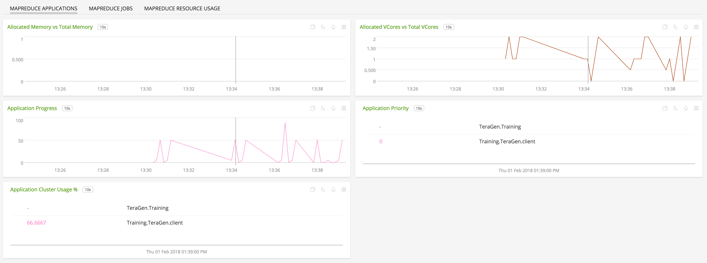
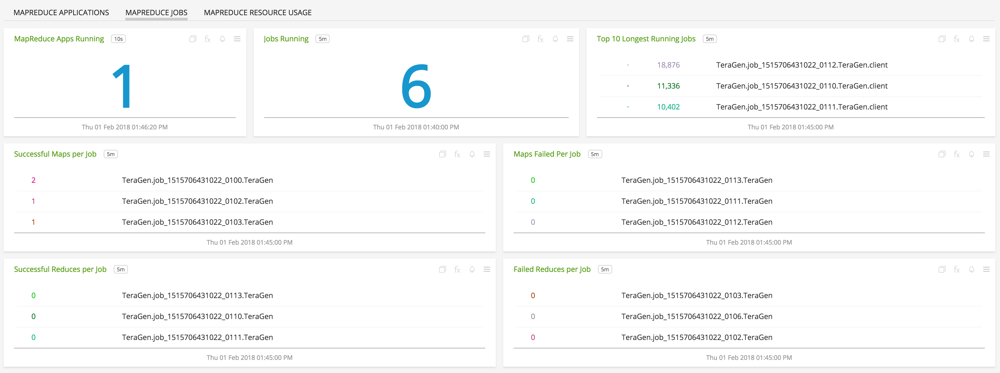
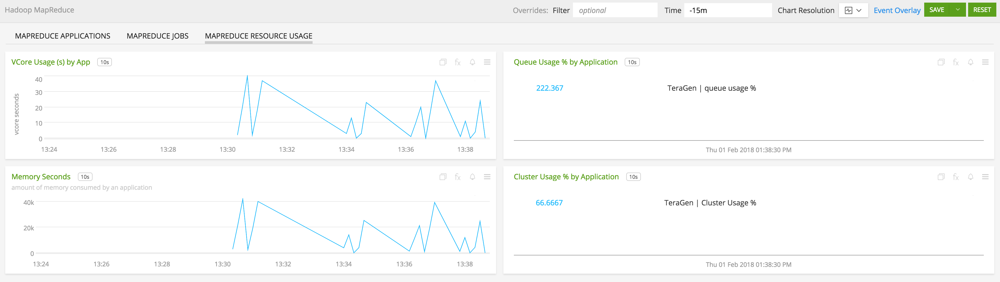

#  Apache Hadoop  

An Apache Hadoop plugin for collectd which users can use to send metrics from Hadoop clusters to SignalFx

- [Description](#description)
- [Requirements and Dependencies](#requirements-and-dependencies)
- [Installation](#installation)
- [Usage](#usage)
- [Configuration](#configuration)
- [License](#license)

### DESCRIPTION

This is the SignalFx Apache Hadoop Integration.  Follow these instructions to install the integration, which is comprised of both a python-based collectd plugin for Hadoop as well as a JMX configuration file.
The Hadoop collectd plugin and JMX plugin are not dependent on each other, however not installing both will cause some of the SignalFx built-in dashboard content to not be populated.

The Hadoop collectd plugin will collect metrics from the Resource Manager REST API for the following:
- <a target="_blank" href="https://hadoop.apache.org/docs/current/hadoop-yarn/hadoop-yarn-site/ResourceManagerRest.html#Cluster_Metrics_API">Cluster Metrics</a>
- <a target="_blank" href="https://hadoop.apache.org/docs/current/hadoop-yarn/hadoop-yarn-site/ResourceManagerRest.html#Cluster_Scheduler_API">Cluster Scheduler</a>
- <a target="_blank" href="https://hadoop.apache.org/docs/current/hadoop-yarn/hadoop-yarn-site/ResourceManagerRest.html#Cluster_Applications_API">Cluster Applications</a>
- <a target="_blank" href="https://hadoop.apache.org/docs/current/hadoop-yarn/hadoop-yarn-site/ResourceManagerRest.html#Cluster_Nodes_API">Cluster Nodes</a>
- <a target="_blank" href="https://hadoop.apache.org/docs/current/hadoop-mapreduce-client/hadoop-mapreduce-client-core/MapredAppMasterRest.html#Jobs_API">MapReduce Jobs</a>

The collectd GenericJMX will provide detailed metrics for the following:
- <a target="_blank" href="https://github.com/signalfx/integrations/blob/master/collectd-hadoop/20-datanode.conf">DataNode</a>
- <a target="_blank" href="https://github.com/signalfx/integrations/blob/master/collectd-hadoop/20-namenode.conf">NameNode</a>
- <a target="_blank" href="https://github.com/signalfx/integrations/blob/master/collectd-hadoop/20-node-manager.conf">Node Manager</a>
- <a target="_blank" href="https://github.com/signalfx/integrations/blob/master/collectd-hadoop/20-resource-manager.conf">Resource Manager</a>

#### Features

##### Built-in Dashboards
- **Hadoop YARN** Resource Manager and Application metrics

  
  

- **Hadoop HDFS** HDFS Overview, NameNode, and DataNode metrics

  
  
  

- **Hadoop MapReduce** MapReduce applications, jobs, and resource usage

  
  
  

### REQUIREMENTS AND DEPENDENCIES

>For the JMX-based metrics it is required that JMX be enabled on the Hadoop side. To enable JMX in Hadoop, add the following JVM options to your hadoop-env.sh and yarn-env.sh scripts respectively:

**hadoop-env.sh:**

    export HADOOP_NAMENODE_OPTS="-Dcom.sun.management.jmxremote.ssl=false -Dcom.sun.management.jmxremote.authenticate=false -Dcom.sun.management.jmxremote.port=5677 $HADOOP_NAMENODE_OPTS"
    export HADOOP_DATANODE_OPTS="-Dcom.sun.management.jmxremote.ssl=false -Dcom.sun.management.jmxremote.authenticate=false -Dcom.sun.management.jmxremote.port=5679 $HADOOP_DATANODE_OPTS"

**yarn-env.sh:**

    export YARN_NODEMANAGER_OPTS="-Dcom.sun.management.jmxremote.ssl=false -Dcom.sun.management.jmxremote.authenticate=false -Dcom.sun.management.jmxremote.port=5678 $YARN_NODEMANAGER_OPTS"
    export YARN_NODEMANAGER_OPTS="-Dcom.sun.management.jmxremote.ssl=false -Dcom.sun.management.jmxremote.authenticate=false -Dcom.sun.management.jmxremote.port=5678 $YARN_NODEMANAGER_OPTS"

This plugin requires:

| Software          | Version        |
|-------------------|----------------|
| collectd | 4.9+ |
| Python plugin for collectd | (included with [SignalFx collectd agent](https://github.com/signalfx/integrations/tree/master/collectd)) |
| Python |  2.6+  |
| Apache Hadoop | 2.0+ |

### INSTALLATION

Follow these steps to install this plugin:

1. RHEL/CentOS and Amazon Linux users: Install the [Java plugin for collectd](https://github.com/signalfx/integrations/tree/master/collectd-java) if it is not already installed as a part of your collectd installation.

2. Download both parts of the Hadoop collectd plugin: <a target="_blank" href="https://github.com/signalfx/collectd-hadoop/blob/master/hadoop_plugin.py">hadoop_plugin.py</a> and <a target="_blank" href="https://github.com/signalfx/collectd-hadoop/blob/master/metrics.py">metrics.py</a>

3. Download SignalFx's example configuration file for the Hadoop collectd Plugin to `/etc/collectd/managed_config`:  <a target="_blank" href="https://github.com/signalfx/integrations/blob/master/collectd-hadoop/10-hadoop.conf">10-hadoop.conf</a>.

4. Modify your Hadoop collectd Plugin's configuration file to provide values that make sense for your environment, as described in [Configuration](#configuration), below.

4. For JMX-based metrics, place the <a target="_blank" href="https://github.com/signalfx/integrations/blob/master/collectd-hadoop/20-datanode.conf">20-datanode.conf</a>, <a target="_blank" href="https://github.com/signalfx/integrations/blob/master/collectd-hadoop/20-namenode.conf">20-namenode.conf</a>, <a target="_blank" href="https://github.com/signalfx/integrations/blob/master/collectd-hadoop/20-node-manager.conf">20-node-manager.conf</a>, <a target="_blank" href="https://github.com/signalfx/integrations/blob/master/collectd-hadoop/20-resource-manager.conf">20-resource-manager.conf</a> on the correct respective node and/or adjust JMX port & host provided in the conf files.

5. Restart collectd.

### USAGE
SignalFx provides several built-in dashboards for Hadoop YARN, HDFS, and MapReduce. Examples are shown below.

- **Hadoop YARN** Resource Manager and Application metrics

  
  

- **Hadoop HDFS** HDFS Overview, NameNode, and DataNode metrics

  
  
  

- **Hadoop MapReduce** MapReduce applications, jobs, and resource usage

  
  
  

### CONFIGURATION

>See the following links for more information about specific metric endpoints:

><a target="_blank" href="https://hadoop.apache.org/docs/r2.7.4/hadoop-project-dist/hadoop-common/Metrics.html">https://hadoop.apache.org/docs/r2.7.4/hadoop-project-dist/hadoop-common/Metrics.html</a>

><a target="_blank" href="https://hadoop.apache.org/docs/r2.7.4/hadoop-yarn/hadoop-yarn-site/ResourceManagerRest.html">https://hadoop.apache.org/docs/r2.7.4/hadoop-yarn/hadoop-yarn-site/ResourceManagerRest.html</a>

><a target="_blank" href="https://hadoop.apache.org/docs/current/hadoop-mapreduce-client/hadoop-mapreduce-client-core/MapredAppMasterRest.html">https://hadoop.apache.org/docs/current/hadoop-mapreduce-client/hadoop-mapreduce-client-core/MapredAppMasterRest.html</a>

Using the example configuration file <a target="_blank" href="https://github.com/signalfx/integrations/blob/master/collectd-hadoop/10-hadoop.conf">10-hadoop.conf</a> as a guide, provide values for the configuration options listed below that make sense for your environment.

| Configuration Option | Definition | Example Value |
| ---------------------|------------|---------------|
| ModulePath* | Path on disk where collectd can find this module. | "/usr/share/collectd/collectd-hadoop" |
| ResourceManagerURL*  | Host where Resource Manager REST API is running | "http://127.0.0.1" |
| ResourceManagerPort*  | Port where Resource Manager REST API is running | 8088 |
| ExcludeMetrics  | An individual metric name to be excluded | "hadoop.cluster.metrics.allocated_mb" |
| Interval | How often this plugin will emit metrics, in second | 10 |
| Dimension | A custom dimension to add to the metrics | Key Value |

\* denotes required configuration option.

### LICENSE

> This integration is released under the Apache 2.0 license. See [LICENSE](https://github.com/signalfx/collectd-example/blob/master/LICENSE) for more details.
