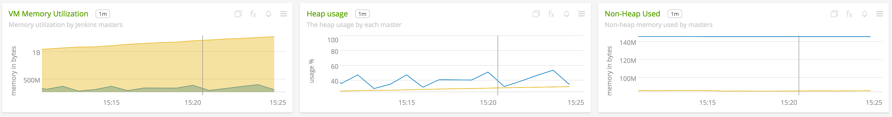
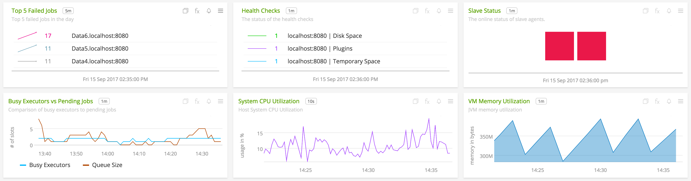
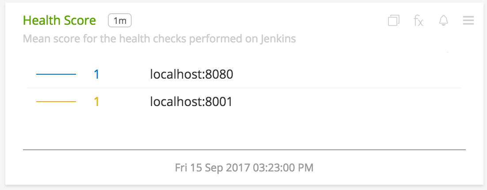
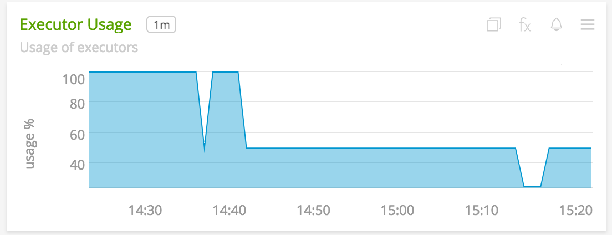
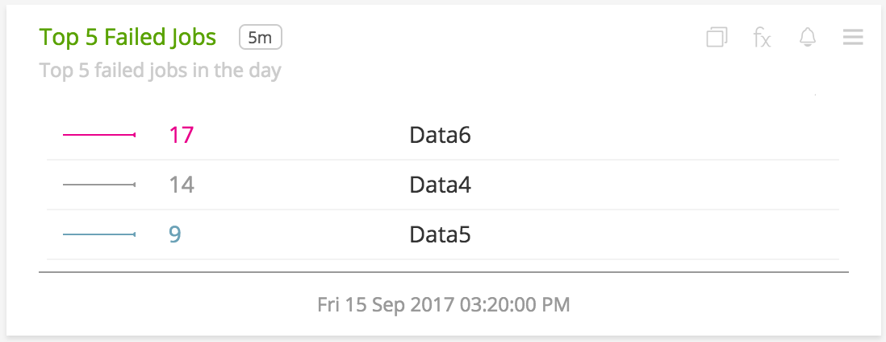
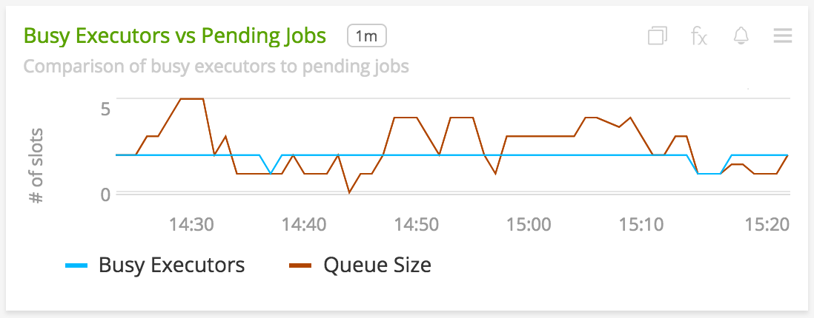
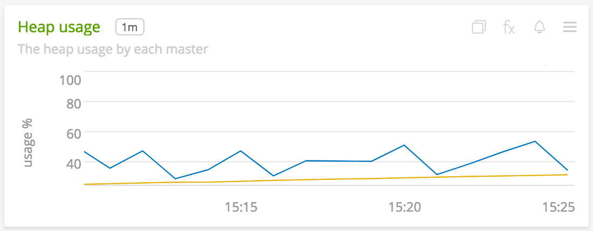
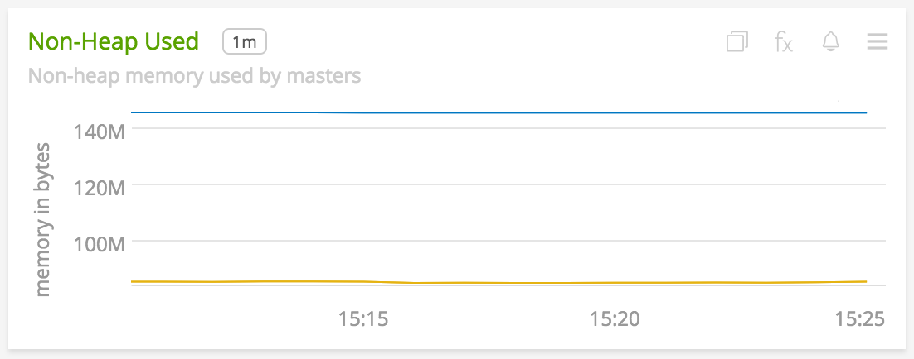
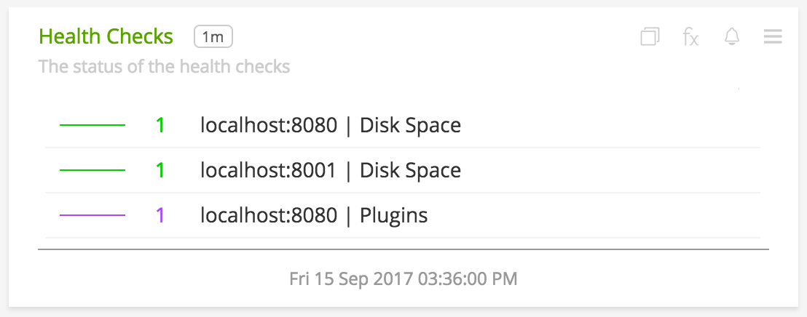
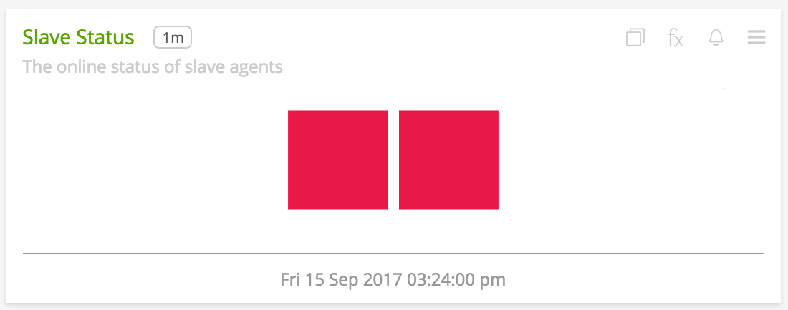

#  Jenkins

This directory consolidates all the metadata associated with the jenkins plugin for collectd. The relevant code for the plugin can be found <a target="_blank" href="https://github.com/signalfx/collectd-jenkins">here</a>

- [Description](#description)
- [Requirements and Dependencies](#requirements-and-dependencies)
- [Installation](#installation)
- [Configuration](#configuration)
- [Usage](#usage)
- [Metrics](#metrics)
- [License](#license)

### DESCRIPTION

This is the SignalFx Jenkins plugin. Follow these instructions to install the Jenkins plugin for collectd.

The <a target="_blank" href="https://github.com/signalfx/collectd-jenkins">collectd-jenkins</a> plugin collects metrics from jenkins instances hitting these endpoints: <a target="_blank" href="https://wiki.jenkins.io/display/jenkins/remote+access+api">../api/json</a> (job metrics)  and <a target="_blank" href="https://wiki.jenkins.io/display/JENKINS/Metrics+Plugin">metrics/&lt;MetricsKey&gt;/..</a> (default and optional Codahale/Dropwizard JVM metrics).

#### FEATURES

#### Built-in dashboards

- **Jenkins**: Provides a high-level overview of metrics for a jenkins cluster.

  [](./img/jenkins-dashboard-top.png)

  [](./img/jenkins-dashboard-bottom.png)  

- **Jenkins MASTER**: Provides metrics from jenkins instance(s) on a particular host.

  [](./img/jenkins-master-dashboard.png)  


### REQUIREMENTS AND DEPENDENCIES

#### Version information

| Software  | Version        |
|-----------|----------------|
| collectd  |  4.9 or later  |
| python | 2.6 or later |
| Jenkins | 1.580.3 or later |
| Python plugin for collectd | (included with [SignalFx collectd agent](https://github.com/signalfx/integrations/tree/master/collectd)[](sfx_link:sfxcollectd)) |

### INSTALLATION

1. Download <a target="_blank" href="https://github.com/signalfx/collectd-jenkins">collectd-jenkins</a>. Place the `jenkins.py` file in `/usr/share/collectd/collectd-jenkins`

2. Copy the <a target="_blank" href="https://github.com/signalfx/integrations/tree/release/collectd-jenkins/10-jenkins.conf">sample configuration file</a> for this plugin in `/etc/collectd/managed_config`

3. Modify the sample configuration file as described in [Configuration](#configuration), below

4. Install the Metrics Plugin in Jenkins. `Manage Jenkins > Manage Plugins > Available > Search "Metrics Plugin"`

5. Install the Python requirements with `sudo pip install -r requirements.txt`

6. Restart collectd


### CONFIGURATION

Using the example configuration file <a target="_blank" href="https://github.com/signalfx/integrations/tree/release/collectd-jenkins/10-jenkins.conf">10-jenkins.conf</a> as a guide, provide values for the configuration options listed below that make sense for your environment and allow you to connect to the jenkins instances

Metrics from `/metrics/<MetricsKey>/metrics` endpoint can be activated through the configuration file. Note, that SignalFx does not support `histograms`, `meter` and `timer` metric types as they are too verbose in Jenkins and also values of type string and list(hence, metrics of these will be skipped if provided in the configuration)

| configuration option | definition | example value |
| ---------------------|------------|---------------|
| ModulePath | Path on disk where collectd can find this module. | "/usr/share/collectd/collectd-jenkins/" |
| Host | Host name of the jenkins instance | "localhost" |
| Port | Port at which the instance can be reached | "2379" |
| MetricsKey | Access key required to fetch Codahale metrics | "6ZHwGBkGR91dxbFenpfz_g2h0-ocmK-CvdHLdmg" |
| Username | User with security access if configured | "admin" |
| APIToken | API Token of the user | "YOUR_SIGNALFX_API_TOKEN" |
| EnhancedMetrics | Boolean to indicate whether advanced stats from `/metrics/<MetricsKey>/metrics` are needed | "false" |
| IncludeMetric | Metric name from the `/metrics/<MetricsKey>/metrics` endpoint to include(valid when EnhancedMetrics is "false") | "vm.daemon.count" |
| ExcludeMetric | Metric name from the `/metrics/<MetricsKey>/metrics` endpoint to exclude(valid when EnhancedMetrics is "true") | "vm.terminated.count" |
| Dimension | Space-separated key-value pair for a user-defined dimension | dimension\_name dimension\_value |
| Interval | Number of seconds between calls to Jenkins API. | 10 |
| ssl\_keyfile | Path to the keyfile | "path/to/file" |
| ssl\_certificate | Path to the certificate | "path/to/file" |
| ssl\_ca\_certs  | Path to the ca file | "path/to/file" |

Example configuration:

```apache
LoadPlugin python
<Plugin python>
    ModulePath "/usr/share/collectd/collectd-jenkins"
    Import jenkins
    <Module jenkins>
        Host "127.0.0.1"
        Port "8080"
        Username "admin"
        APIToken "YOUR_SIGNALFX_API_TOKEN"
        MetricsKey "6ZHwGBkGR91dxbFenpfz_g2h0-ocmK-CvdHLdmg"
        Interval 60
        ssl_keyfile "/etc/cert/jenkins.key"
        ssl_certificate "/etc/cert/jenkins.crt"
        ssl_ca_certs "/etc/cert/ca.crt"
    </Module>
</Plugin>
```

The plugin can be configured to collect metrics from multiple instances in the following manner.

```apache
LoadPlugin python
<Plugin python>
    ModulePath "/usr/share/collectd/collectd-jenkins"
    Import jenkins
    <Module jenkins>
        Host "127.0.0.1"
        Port "8080"
        Username "admin"
        APIToken "YOUR_SIGNALFX_API_TOKEN"
        MetricsKey "6ZHwGBkGR91dxbFenpfz_g2h0-ocmK-CvdHLdmg"
        Interval 10
    </Module>
    <Module jenkins>
        Host "127.0.0.1"
        Port "8010"
        Username "admin"
        APIToken "YOUR_SIGNALFX_API_TOKEN"
        MetricsKey "6Z76HwGBHOj4uBOlsxbFenpfz_g2UAh0-ocmK-CvdHLSRdmg"
        EnhancedMetrics False
        IncludeMetric "vm.daemon.count"
        IncludeMetric "vm.terminated.count"
    </Module>
    <Module jenkins>
        Host "127.0.0.1"
        Port "8000"
        MetricsKey "6Z95HwOj4uBOakGR91dxbFenpfz_g2wBlUAh0-ocmK-CvdSvE1LGRdmg"
        EnhancedMetrics True
        ExcludeMetric "vm.terminated.count"
        ExcludeMetric "vm.daemon.count"
        Dimension foo bar
    </Module>
</Plugin>
```

### USAGE

#### Interpreting Built-in dashboards

- **Jenkins**:

  - **Alive Status**: Shows the number of Jenkins Masters that are alive.

    [](./img/chart-jenkins-alive-status.png)

  - **Health Score**: Shows the mean health score of each Jenkins instance on all hosts.

    [](./img/chart-jenkins-health-score.png)

  - **Job Failure Rate**: Shows the rate of jobs failed in the past day.

    [](./img/chart-jenkins-job-failure-rate.png)

  - **Executor Usage**: Shows the usage pattern of the executors. Gives an overview of the load on the Jenkins instances.

    [](./img/chart-jenkins-executor-usage.png)

  - **Top 5 Failed Jobs**: Shows the top 5 failed jobs over the past day based on the total failure count.

    [](./img/chart-jenkins-top-5-failed-jobs.png)

  - **Busy Executors vs Pending Jobs**: A line graph showing comparison between in-use executors and pending jobs in queue. On comparing this chart with two above, reason for job failures can be narrowed down further quickly.

    [](./img/chart-jenkins-busy-executors-vs-pending-jobs.png)

  - **Average Duration - Past Day**: Shows average duration of top 5 jobs that are taking the most time.

    [](./img/chart-jenkins-average-duration-past-day.png)

  - **Slave Status**: Shows the number of slave agents that are alive.

    [](./img/chart-jenkins-slave-status.png)

  - **VM Memory Utilization**: Area graph of the memory used by each Jenkins JVM.

    [](./img/chart-jenkins-vm-memory-utilization.png)

  - **Heap Usage**: Line graph of the utilization percentage of Heap memory by each Jenkins instance.

    [](./img/chart-jenkins-heap-usage.png)

  - **Non-Heap Used**: Line graph of the non-heap memory used by each Jenkins instance.

    [](./img/chart-jenkins-non-heap-used.png)

- **Jenkins Master**:

  - **Top 5 Failed Jobs**: Shows the top 5 failed jobs over the past day based on the total failure count in an instance(s).
    
    [](./img/chart-jenkins-master-top-5-failed-jobs.png)

  - **Health Checks**: The status of each health check as reported by DropWizard Metrics. This gives a quick overview of what's wrong with the instance.

    [](./img/chart-jenkins-master-health-checks.png)

  - **Slave Status**: Shows the number of slave agents of the instance(s) that are alive.
  
      [](./img/chart-jenkins-master-slave-status.png)

  - **Busy Executors vs Pending Jobs**: A line chart showing comparison between in-use executors and pending jobs in queue in an instance(s). On comparing this chart with two above, reason for job failures can be narrowed down further quickly.
  
      [](./img/chart-jenkins-busy-executors-vs-pending-jobs.png)
  
  - **VM Memory Utilization**: Area chart of the memory used by the Jenkins JVM instance(s) on a host.
  
      [](./img/chart-jenkins-vm-memory-utilization.png)

All DropWizard metrics reported by the jenkins collectd plugin will not contain any dimensions by default. Whereas, the job metrics sent will contain the following dimensions by default:

* `Job`, name of the job
* `Result`, the status of the job

A few other details:

* `plugin` is always set to `jenkins`
* `plugin_instance` will contain the IP address and the port of the member given in the configuration
* To add metrics from the `/metrics/<MetricsKey>/metrics` endpoint, use the configuration options mentioned in [configuration](#configuration). If metrics are being included individually, make sure to give names that are valid. For example, `vm.daemon.count` or `vm.terminated.count`


### METRICS
By default, metrics about a job and instance are provided. Click [here](./docs) for details. Metrics from `/metrics/<MetricsKey>/metrics` endpoint can be activated through the configuration file. Note, that SignalFx does not support `histograms`, `meter` and `timer` metric types as they are too verbose in Jenkins and also values of type string and list(hence, metrics of these will be skipped if provided in the configuration). See [usage](#usage) for details.


#### Metric naming
`<metric type>.jenkins.node.<name of metric>`. This is the format of default metric names reported by the plugin. Optional metrics are named as available from the `/metrics/<MetricsKey>/metrics` endpoint.


### LICENSE

This integration is released under the Apache 2.0 license. See [LICENSE](./LICENSE) for more details.
