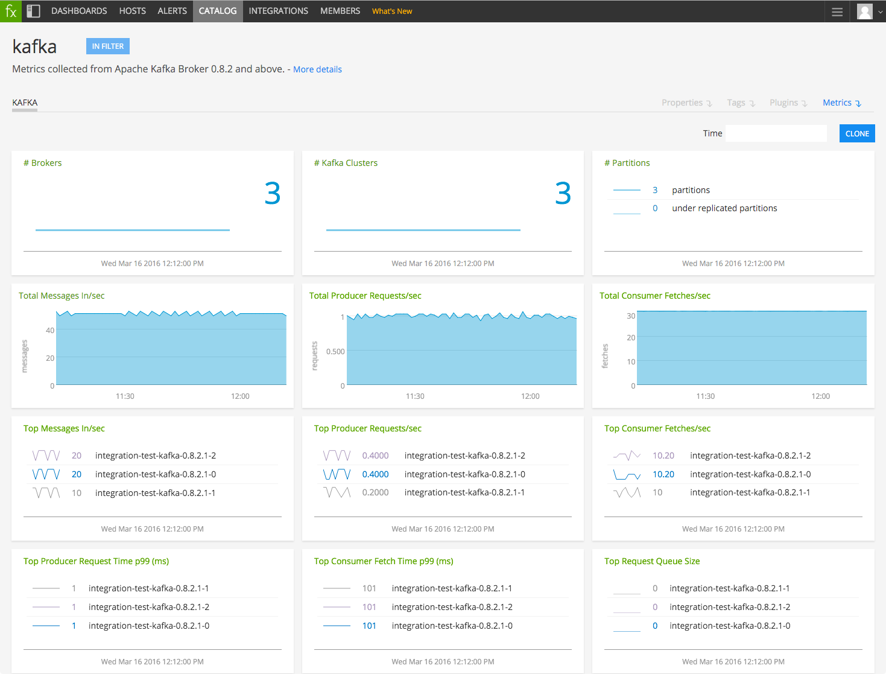

#  Kafka

Metadata associated with SignalFx's integration with Kafka can be found <a target="_blank" href="https://github.com/signalfx/integrations/tree/release/collectd-kafka">here</a>. The relevant code for the plugin can be found <a target="_blank" href="https://github.com/signalfx/collectd/blob/master/src/java.c">here</a>.

- [Description](#description)
- [Requirements and Dependencies](#requirements-and-dependencies)
- [Installation](#installation)
- [Configuration](#configuration)
- [Usage](#usage)
- [Metrics](#metrics)
- [License](#license)

### DESCRIPTION

This is the Kafka plugin for collectd. It will send data about Kafka to SignalFx, enabling built-in Kafka monitoring dashboards.

#### FEATURES

##### Built-in dashboards

- **Broker**: Focus on a single Kafka broker.

- **Brokers**: Overview of data from all Kafka brokers. `cluster` dimension which is available in the SignalFx Agent can be used to get a per cluster view of Brokers.

- **Producer**: Focus on a single Java based Producer.

- **Producers**: Overview of Java based Producers.

- **Consumer**: Focus on a single Java based Consumer.

- **Consumers**: Overview of Java based Consumers.

- **JVM**: Focus on the java virtual machine performance on a single instance.

**Note**: Metrics from Java based Kafka consumers and producers are available by default only when using the SignalFx Agent.

### REQUIREMENTS AND DEPENDENCIES

#### Version information

| Software          | Version        |
|-------------------|----------------|
| collectd          | 4.9 or later   |

### INSTALLATION

**If you are using the new Smart Agent, see the docs for [the collectd/kafka
monitor](https://github.com/signalfx/signalfx-agent/tree/master/docs/monitors/collectd-kafka.md)
for more information.  The configuration documentation below may be helpful as
well, but consult the Smart Agent repo's docs for the exact schema.**

1. RHEL/CentOS and Amazon Linux users: Install the [Java plugin for collectd](https://github.com/signalfx/integrations/tree/master/collectd-java) if it is not already installed.

2. Download SignalFx's example Kafka configuration file to `/etc/collectd/managed_config`:  <a target="_blank" href="https://github.com/signalfx/integrations/blob/master/collectd-kafka/20-kafka_82.conf">20-kafka82.conf</a>.  
  Note: If you're using a version of Kafka earlier than v0.8.2, download this sample Kafka configuration file instead_: <a target="_blank" href="https://github.com/signalfx/integrations/blob/master/collectd-kafka/20-kafka.conf">_20-kafka.conf_</a>

3. Modify your Kafka configuration file to provide values that make sense for your environment, as described in [Configuration](#configuration), below.

4. Restart collectd.

### CONFIGURATION

Using the example configuration file <a target="_blank" href="https://github.com/signalfx/integrations/tree/master/collectd-kafka/20-kafka.conf">20-kafka.conf</a> as a guide, provide values for the configuration options listed below that make sense for your environment and allow you to connect to the Kafka instance to be monitored.

| Value | Description |
|-------|-------------|
| ServiceURL | URL of your JMX application. |
| Host | The name of your host. Appears as dimension `host` in SignalFx.  
 Note: (Please leave the identifier `[hostHasService=kafka]`) in the host name. |

### USAGE

Sample of built-in dashboard in SignalFx:

### METRICS

For a comprehensive list of metrics, other the ones available by default, see <a target="_blank" href="https://kafka.apache.org/documentation.html#monitoring">here</a>.

Note that the metrics prefixed by `kafka.consumer` and `kafka.producer` are available only via the `kafka_consumer` and `kafka_producer` monitors of SignalFx Agent. Also, if using the SignalFx Agent, metrics from Broker will be added with
a user provided `cluster` dimension.

### LICENSE

This integration is released under the Apache 2.0 license. See [LICENSE](./LICENSE) for more details.
