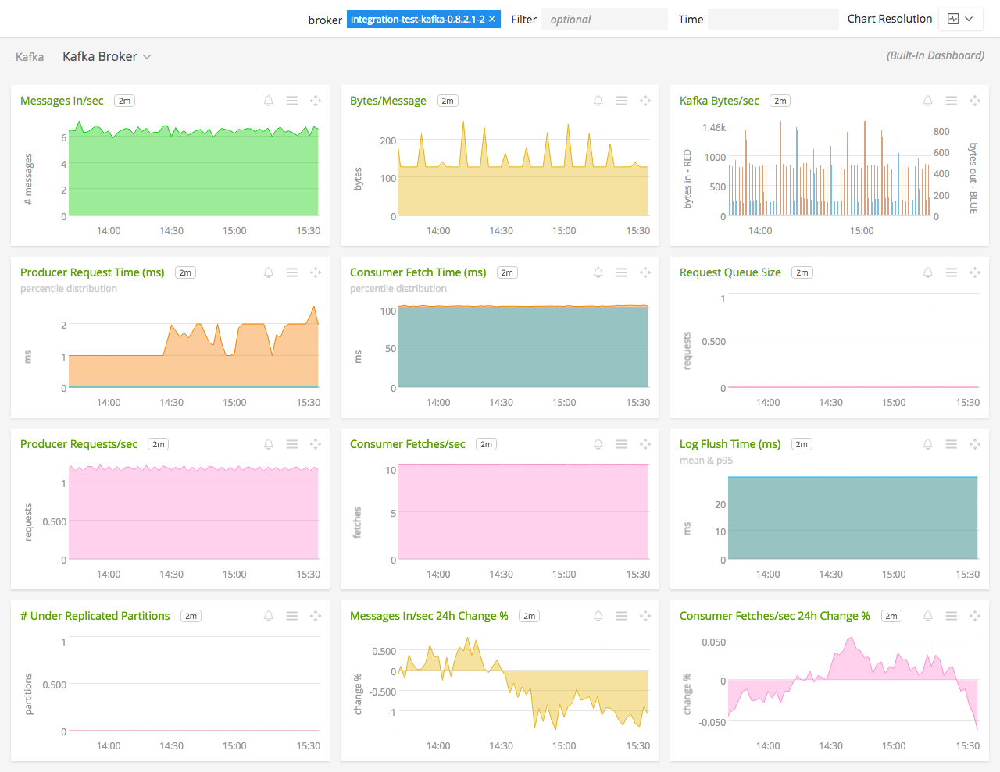

#  Kafka

_This directory consolidates all the metadata associated with SignalFx's integration with Kafka. The relevant code for the plugin can be found [here](https://github.com/signalfx/collectd/blob/master/src/java.c)_

- [Description](#description)
- [Requirements and Dependencies](#requirements-and-dependencies)
- [Installation](#installation)
- [Configuration](#configuration)
- [Usage](#usage)
- [Metrics](#metrics)
- [License](#license)

### DESCRIPTION

This is the Kafka plugin for collectd. It will send data about Kafka to SignalFx, enabling built-in Kafka monitoring dashboards.

#### FEATURES

##### Built-in dashboards

- **Kafka**: Overview of data from all Kafka brokers.

  

- **Kafka Broker**: Focus on a single Kafka broker.

  

### REQUIREMENTS AND DEPENDENCIES

#### Version information

| Software          | Version        |
|-------------------|----------------|
| collectd          | 4.9 or later   |

### INSTALLATION

1. RHEL/CentOS and Amazon Linux users: Install the [Java plugin for collectd](https://github.com/signalfx/integrations/tree/master/collectd-java) if it is not already installed. 

1. Download SignalFx's example Kafka configuration file to `/etc/collectd/managed_config`:  [20-kafka.conf](https://github.com/signalfx/integrations/blob/master/collectd-kafka/20-kafka.conf)

  *Note: If you're using Kafka v0.8.2, download this sample Kafka configuration file instead:*
[20-kafka_82.conf](https://github.com/signalfx/integrations/blob/master/collectd-kafka/20-kafka_82.conf)

1. Modify `20-kafka.conf` to provide values that make sense for your environment, as described in [Configuration](#configuration), below.

1. Restart collectd.

### CONFIGURATION

Using the example configuration file [20-kafka.conf](././20-kafka.conf) as a guide, provide values for the configuration options listed below that make sense for your environment and allow you to connect to the Kafka instance to be monitored.

| Value | Description |
|-------|-------------|
| ServiceURL | URL of your JMX application. |
| Host | The name of your host. Appears as dimension `host` in SignalFx.  
 Note: (Please leave the identifier `[hostHasService=kafka]`) in the host name. |

### USAGE

Sample of pre-built dashboard in SignalFx:

### METRICS

Common metrics to monitor:

| Description | Mbean name | Normal value |
|-------------|------------|--------------|
| Message in rate | `kafka.server:type=BrokerTopicMetrics,name=MessagesInPerSec` |  |
| Byte in rate | `kafka.server:type=BrokerTopicMetrics,name=BytesInPerSec` |  |
| Request rate | <code>kafka.network:type=RequestMetrics,name=RequestsPerSec,request={Produce&#124;FetchConsumer&#124;FetchFollower}</code> |  |
| Byte out rate | `kafka.server:type=BrokerTopicMetrics,name=BytesOutPerSec` |  |
| Log flush rate and time | `kafka.log:type=LogFlushStats,name=LogFlushRateAndTimeMs` |  |
| # of under replicated partitions <code> &#124; ISR &#124; < &#124; all replicas &#124; </code> | `kafka.server:type=ReplicaManager,name=UnderReplicatedPartitions` | 0 |
| Is controller active on broker | `kafka.controller:type=KafkaController,name=ActiveControllerCount` | only one broker in the broker should have 1 |
| Leader election rate | `kafka.controller:type=ControllerStats,name=LeaderElectionRateAndTimeMs` | non-zero when there are broker failures |
| Unclean leader election rate | `kafka.controller:type=ControllerStats,name=UncleanLeaderElectionsPerSec` | 0 |
| Partition counts | `kafka.server:type=ReplicaManager,name=PartitionCount` | mostly even across brokers |
| Leader replica counts | `kafka.server:type=ReplicaManager,name=LeaderCount` | mostly even across brokers |
| ISR shrink rate | `kafka.server:type=ReplicaManager,name=IsrShrinksPerSec` | If a broker goes down, ISR for some of the partitions will shrink. When that broker is up again, ISR will be expanded once the replicas are fully caught up. Other than that, the expected value for both ISR shrink rate and expansion rate is 0. |
| ISR expansion rate | `kafka.server:type=ReplicaManager,name=IsrExpandsPerSec` | See above |
| Max lag in messages btw follower and leader replicas | `kafka.server:type=ReplicaFetcherManager,name=MaxLag,clientId=Replica` | lag should be proportional to the maximum batch size of a produce request. |
| Lag in messages per follower replica | `kafka.server:type=FetcherLagMetrics,name=ConsumerLag,clientId=([-.\w]+),topic=([-.\w]+),partition=([0-9]+)` | lag should be proportional to the maximum batch size of a produce request. |
| Requests waiting in the producer purgatory | `kafka.server:type=ProducerRequestPurgatory,name=PurgatorySize` | non-zero if ack=-1 is used |
| Requests waiting in the fetch purgatory | `kafka.server:type=FetchRequestPurgatory,name=PurgatorySize` | size depends on fetch.wait.max.ms in the consumer |
| Request total time | <code>kafka.network:type=RequestMetrics,name=TotalTimeMs,request={Produce&#124;FetchConsumer&#124;FetchFollower}</code> | broken into queue, local, remote and response send time |
| Time the request waiting in the request queue | <code>kafka.network:type=RequestMetrics,name=QueueTimeMs,request={Produce&#124;FetchConsumer&#124;FetchFollower}</code> |  |
| Time the request being processed at the leader | <code>kafka.network:type=RequestMetrics,name=LocalTimeMs,request={Produce&#124;FetchConsumer&#124;FetchFollower}</code> |  |
| Time the request waits for the follower | <code>kafka.network:type=RequestMetrics,name=RemoteTimeMs,request={Produce&#124;FetchConsumer&#124;FetchFollower}</code> | non-zero for produce requests when ack=-1 |
| Time to send the response | <code>kafka.network:type=RequestMetrics,name=ResponseSendTimeMs,request={Produce&#124;FetchConsumer&#124;FetchFollower}</code> |  |
| Number of messages the consumer lags behind the producer by | `kafka.consumer:type=ConsumerFetcherManager,name=MaxLag,clientId=([-.\w]+)` |  |
| The average fraction of time the network processors are idle | `kafka.network:type=SocketServer,name=NetworkProcessorAvgIdlePercent` | between 0 and 1, ideally > 0.3 |
| The average fraction of time the request handler threads are idle | `kafka.server:type=KafkaRequestHandlerPool,name=RequestHandlerAvgIdlePercent` | between 0 and 1, ideally > 0.3 |
| Quota metrics per client-id | <code>kafka.server:type={Produce&#124;Fetch},client-id==([-.\w]+)</code> | Two attributes. throttle-time indicates the amount of time in ms the client-id was throttled. Ideally = 0. byte-rate indicates the data produce/consume rate of the client in bytes/sec. |

The following metrics are available on new producer instances:

| Metric/Attribute name | Description | Mbean name |
|------------------|---------------------|---------------------------|
| waiting-threads | The number of user threads blocked waiting for buffer memory to enqueue their records | kafka.producer:type=producer-metrics,client-id=([-.\w]+) |
| buffer-total-bytes | The maximum amount of buffer memory the client can use (whether or not it is currently used). | kafka.producer:type=producer-metrics,client-id=([-.\w]+) |
| buffer-available-bytes | The total amount of buffer memory that is not being used (either unallocated or in the free list). | kafka.producer:type=producer-metrics,client-id=([-.\w]+) |
| bufferpool-wait-time | The fraction of time an appender waits for space allocation. | kafka.producer:type=producer-metrics,client-id=([-.\w]+) |
| batch-size-avg | The average number of bytes sent per partition per-request. | kafka.producer:type=producer-metrics,client-id=([-.\w]+) |
| batch-size-max | The max number of bytes sent per partition per-request. | kafka.producer:type=producer-metrics,client-id=([-.\w]+) |
| compression-rate-avg | The average compression rate of record batches. | kafka.producer:type=producer-metrics,client-id=([-.\w]+) |
| record-queue-time-avg | The average time in ms record batches spent in the record accumulator. | kafka.producer:type=producer-metrics,client-id=([-.\w]+) |
| record-queue-time-max | The maximum time in ms record batches spent in the record accumulator | kafka.producer:type=producer-metrics,client-id=([-.\w]+) |
| request-latency-avg | The average request latency in ms | kafka.producer:type=producer-metrics,client-id=([-.\w]+) |
| request-latency-max | The maximum request latency in ms | kafka.producer:type=producer-metrics,client-id=([-.\w]+) |
| record-send-rate | The average number of records sent per second. | kafka.producer:type=producer-metrics,client-id=([-.\w]+) |
| records-per-request-avg | The average number of records per request. | kafka.producer:type=producer-metrics,client-id=([-.\w]+) |
| record-retry-rate | The average per-second number of retried record sends | kafka.producer:type=producer-metrics,client-id=([-.\w]+) |
| record-error-rate | The average per-second number of record sends that resulted in errors | kafka.producer:type=producer-metrics,client-id=([-.\w]+) |
| record-size-max | The maximum record size | kafka.producer:type=producer-metrics,client-id=([-.\w]+) |
| record-size-avg | The average record size | kafka.producer:type=producer-metrics,client-id=([-.\w]+) |
| requests-in-flight | The current number of in-flight requests awaiting a response. | kafka.producer:type=producer-metrics,client-id=([-.\w]+) |
| metadata-age | The age in seconds of the current producer metadata being used. | kafka.producer:type=producer-metrics,client-id=([-.\w]+) |
| connection-close-rate | Connections closed per second in the window. | kafka.producer:type=producer-metrics,client-id=([-.\w]+) |
| connection-creation-rate | New connections established per second in the window. | kafka.producer:type=producer-metrics,client-id=([-.\w]+) |
| network-io-rate | The average number of network operations (reads or writes) on all connections per second. | kafka.producer:type=producer-metrics,client-id=([-.\w]+) |
| outgoing-byte-rate | The average number of outgoing bytes sent per second to all servers. | kafka.producer:type=producer-metrics,client-id=([-.\w]+) |
| request-rate | The average number of requests sent per second. | kafka.producer:type=producer-metrics,client-id=([-.\w]+) |
| request-size-avg | The average size of all requests in the window. | kafka.producer:type=producer-metrics,client-id=([-.\w]+) |
| request-size-max | The maximum size of any request sent in the window. | kafka.producer:type=producer-metrics,client-id=([-.\w]+) |
| incoming-byte-rate | Bytes/second read off all sockets | kafka.producer:type=producer-metrics,client-id=([-.\w]+) |
| response-rate | Responses received sent per second. | kafka.producer:type=producer-metrics,client-id=([-.\w]+) |
| select-rate | Number of times the I/O layer checked for new I/O to perform per second | kafka.producer:type=producer-metrics,client-id=([-.\w]+) |
| io-wait-time-ns-avg | The average length of time the I/O thread spent waiting for a socket ready for reads or writes in nanoseconds. | kafka.producer:type=producer-metrics,client-id=([-.\w]+) |
| io-wait-ratio | The fraction of time the I/O thread spent waiting. | kafka.producer:type=producer-metrics,client-id=([-.\w]+) |
| io-time-ns-avg | The average length of time for I/O per select call in nanoseconds. | kafka.producer:type=producer-metrics,client-id=([-.\w]+) |
| io-ratio | The fraction of time the I/O thread spent doing I/O | kafka.producer:type=producer-metrics,client-id=([-.\w]+) |
| connection-count | The current number of active connections. | kafka.producer:type=producer-metrics,client-id=([-.\w]+) |
| outgoing-byte-rate | The average number of outgoing bytes sent per second for a node. | kafka.producer:type=producer-node-metrics,client-id=([-.\w]+),node-id=([0-9]+) |
| request-rate | The average number of requests sent per second for a node. | kafka.producer:type=producer-node-metrics,client-id=([-.\w]+),node-id=([0-9]+) |
| request-size-avg | The average size of all requests in the window for a node. | kafka.producer:type=producer-node-metrics,client-id=([-.\w]+),node-id=([0-9]+) |
| request-size-max | The maximum size of any request sent in the window for a node. | kafka.producer:type=producer-node-metrics,client-id=([-.\w]+),node-id=([0-9]+) |
| incoming-byte-rate | The average number of responses received per second for a node. | kafka.producer:type=producer-node-metrics,client-id=([-.\w]+),node-id=([0-9]+) |
| request-latency-avg | The average request latency in ms for a node. | kafka.producer:type=producer-node-metrics,client-id=([-.\w]+),node-id=([0-9]+) |
| request-latency-max | The maximum request latency in ms for a node. | kafka.producer:type=producer-node-metrics,client-id=([-.\w]+),node-id=([0-9]+) |
| response-rate | Responses received sent per second for a node. | kafka.producer:type=producer-node-metrics,client-id=([-.\w]+),node-id=([0-9]+) |
| record-send-rate | The average number of records sent per second for a topic. | kafka.producer:type=producer-topic-metrics,client-id=([-.\w]+),topic=([-.\w]+) |
| byte-rate | The average number of bytes sent per second for a topic. | kafka.producer:type=producer-topic-metrics,client-id=([-.\w]+),topic=([-.\w]+) |
| compression-rate | The average compression rate of record batches for a topic. | kafka.producer:type=producer-topic-metrics,client-id=([-.\w]+),topic=([-.\w]+) |
| record-retry-rate | The average per-second number of retried record sends for a topic | kafka.producer:type=producer-topic-metrics,client-id=([-.\w]+),topic=([-.\w]+) |
| record-error-rate | The average per-second number of record sends that resulted in errors for a topic. | kafka.producer:type=producer-topic-metrics,client-id=([-.\w]+),topic=([-.\w]+) |
| produce-throttle-time-max | The maximum time in ms a request was throttled by a broker. | kafka.producer:type=producer-topic-metrics,client-id=([-.\w]+) |
| produce-throttle-time-avg | The average time in ms a request was throttled by a broker. | kafka.producer:type=producer-topic-metrics,client-id=([-.\w]+) |

Documentation of the metrics and dimensions emitted by this plugin, segmented by metric [click here](././docs).

### LICENSE

This integration is released under the Apache 2.0 license. See [LICENSE](./LICENSE) for more details.
