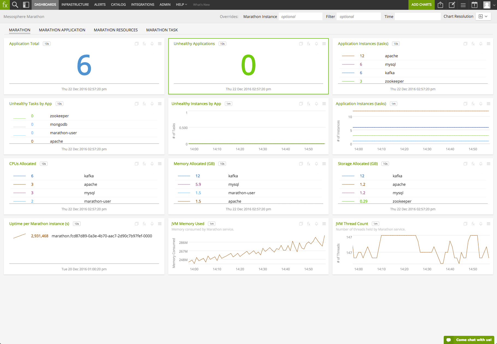
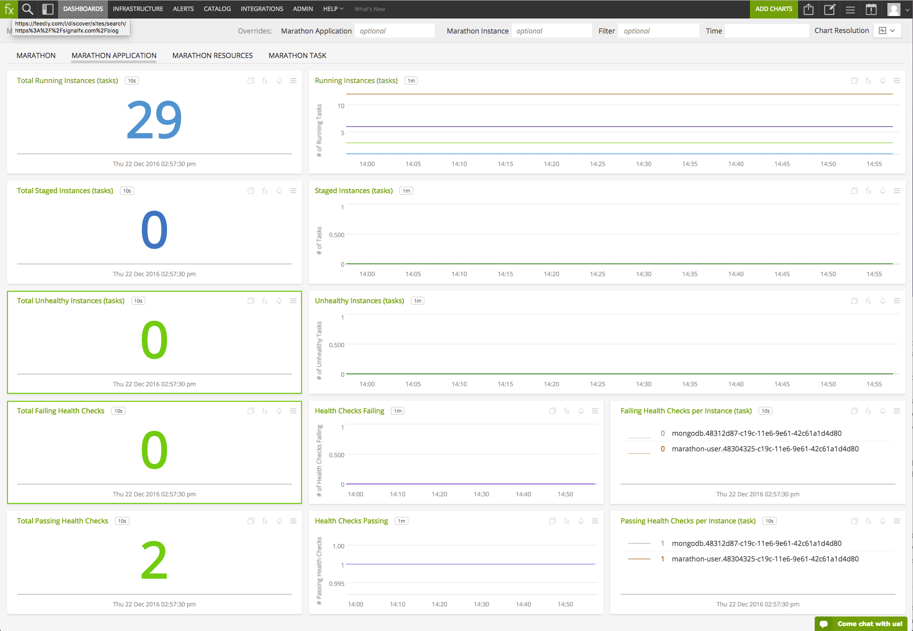
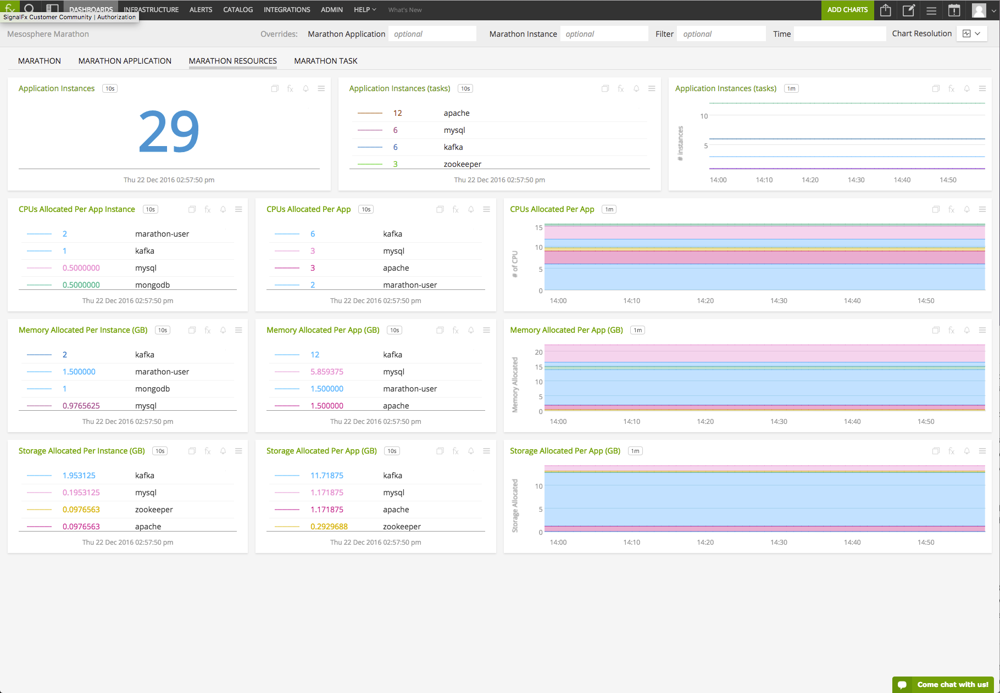
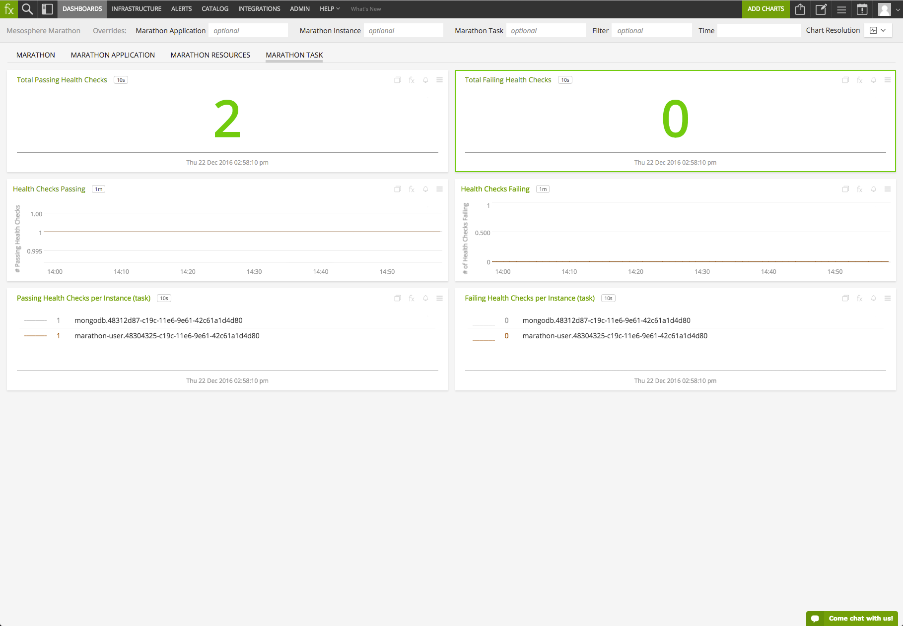

#  Marathon

Metadata associated with the Marathon plugin for collectd can be found <a target="_blank" href="https://github.com/signalfx/integrations/tree/release/collectd-marathon">here</a>.  The relevant code for the plugin can be found <a target="_blank" href="https://github.com/signalfx/collectd-marathon">here</a>.

- [Description](#description)
- [Requirements and Dependencies](#requirements-and-dependencies)
- [Installation](#installation)
- [Configuration](#configuration)
- [Usage](#usage)
- [Metrics](#metrics)
- [License](#license)

### DESCRIPTION

The <a target="_blank" href="https://github.com/signalfx/collectd-marathon">collectd-marathon</a> plugin collects metrics about Marathon applications and tasks.

#### Features
##### Built-in dashboards

- **Marathon**: Overview of Marathon environment.

  [](./img/dashboard_marathon_overview.png)

- **Marathon Application**: Focus on Marathon Applications.

  [](./img/dashboard_marathon_application.png)

- **Marathon Resources**: Focus on a Marathon Resource Allocation.

  [](./img/dashboard_marathon_resources.png)

- **Marathon Task**: Focus on a Marathon Task.

  [](./img/dashboard_marathon_task.png)

### REQUIREMENTS AND DEPENDENCIES

#### Version information

| Software | Version      |
|----------|--------------|
| collectd | 5.0 or later |
| Python   | 2.6 or later |
| Marathon | 1.1.1 or later |
| Python plugin for collectd | (included with [SignalFx collectd agent](https://github.com/signalfx/integrations/tree/master/collectd)[](sfx_link:sfxcollectd)) |

### INSTALLATION

**If you are using the new Smart Agent, see the docs for [the collectd/marathon
monitor](https://github.com/signalfx/signalfx-agent/tree/master/docs/monitors/collectd-marathon.md)
for more information.  The configuration documentation below may be helpful as
well, but consult the Smart Agent repo's docs for the exact schema.**


1.  Download the <a target="_blank" href="https://github.com/signalfx/collectd-marathon">collectd-marathon</a> Python module onto a host that has access to the Marathon API.

2.  Run the following command to install the module’s dependencies using `pip`, replacing the example path with the download location of the `collectd-marathon` module:

        sudo pip install -r /path/to/collectd-marathon/requirements.txt

3.  Download SignalFx’s <a target="_blank" href="https://github.com/signalfx/integrations/blob/master/collectd-marathon/20-collectd-marathon.conf">sample configuration file</a> for this plugin to `/etc/collectd/managed_config`.

4.  Modify the configuration file to provide values that make sense for your environment, as described in [Configuration](#configuration) below.

5.  Restart collectd.

### CONFIGURATION
Using the sample configuration file <a target="_blank" href="https://github.com/signalfx/integrations/blob/master/collectd-marathon/20-collectd-marathon.conf">20-collectd-marathon.conf</a> as a guide, provide values for the configuration options listed below that make sense for your environment.

| configuration option | definition | default value |
| ---------------------|------------|---------------|
| ModulePath | Path on disk where collectd can find this module. | `"/usr/share/collectd/collectd-marathon"` |
| Import | Path to the name of the python module with out the .py extension | `marathon` |
| LogTraces | Logs traces from the plugin's execution | `true` |
| verbose | Turns on verbose log statements | `False` |
| host | A python list of `["<scheme>", "<host>", "<port>", "username", "password", "<dcos_auth_url>"]`. `scheme` is either "http" or "https". The `username` and `password` are only required for Basic Authentication with the Marathon API. `dcos_auth_url` is a string that takes the dcos authentication URL which the plugin uses to get authentication tokens from. Set `scheme` to "https" if operating DC/OS in strict mode and `dcos_auth_url` to "https://leader.mesos/acs/api/v1/auth/login" (which is the default DNS entry provided by DC/OS) |  no default |

**Note**: Metrics from the `/metrics` endpoint are not available while operating in DC/OS strict mode.

An example configuration would look like the following:

```
<LoadPlugin "python">
  Globals true
</LoadPlugin>

<Plugin "python">
  ModulePath "/usr/share/collectd/collectd-marathon"
  Import "marathon"
  LogTraces true
  <Module "marathon">
    # Note that the last config option can also be set to the base URL of the
    # DC/OS UI and /acs/api/v1/auth/login is the authentication endpoint the plugin
    # uses to obtain token for subsequent requests.
    host  ["https", "localhost", "8443", "username", "password", "https://leader.mesos/acs/api/v1/auth/login"]
    verbose False
  </Module>
</Plugin>
```

### USAGE
All metrics reported by the Marathon collectd plugin will contain the following dimensions:

- `host` will contain the hostname (as known by collectd) of the machine reporting the metrics.
- `plugin` is always set to `marathon`.
- `plugin_instance` will always be `marathon` concated with `.` and the Mesos agent id. Ex. `marathon.<mesos agent id>`.

Sample of built-in dashboard in SignalFx:


### METRICS

For documentation of the metrics and dimensions emitted by this plugin, [click here](./docs).

### LICENSE

See [LICENSE](./LICENSE)
