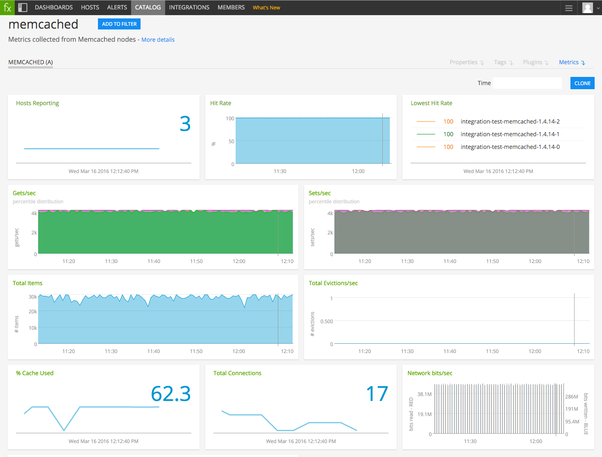

#  Memcached

Metadata associated with the Memcached plugin for collectd can be found <a target="_blank" href="https://github.com/signalfx/integrations/tree/release/collectd-memcached">here</a>. The relevant code for the plugin can be found <a target="_blank" href="https://github.com/signalfx/collectd/blob/master/src/memcached.c">here</a>.

- [Description](#description)
- [Requirements and Dependencies](#requirements-and-dependencies)
- [Installation](#installation)
- [Configuration](#configuration)
- [Usage](#usage)
- [Metrics](#metrics)
- [License](#license)

### DESCRIPTION

Use the Memcached plugin for collectd to monitor the following types of information from a Memcached node:

* request information (including hits, misses & evictions)
* current connections
* net input/output bytes
* number of items cached

Documentation for Memcached can be found here: <a target="_blank" href="https://github.com/memcached/memcached/wiki">https://github.com/memcached/memcached/wiki</a>

#### FEATURES

##### Built-in dashboards

- **Memcached (a)**: Overview of data from all Memcached hosts.

  

- **Memcached**: Focus on a single Memcached host.

  

### REQUIREMENTS AND DEPENDENCIES

#### Version information

| Software  | Version        |
|-----------|----------------|
| collectd  |  4.2 or later  |
| memcached |  1.1 or later  |

### INSTALLATION

**If you are using the new Smart Agent, see the docs for [the collectd/memcached
monitor](https://github.com/signalfx/signalfx-agent/tree/master/docs/monitors/collectd-memcached.md)
for more information.  The configuration documentation below may be helpful as
well, but consult the Smart Agent repo's docs for the exact schema.**

1. Download SignalFx's <a target="_blank" href="https://github.com/signalfx/integrations/blob/master/collectd-memcached/10-memcached.conf">sample memcached configuration file</a> to `/etc/collectd/managed_config`.

2. Modify the sample configuration file to provide values that make sense for your environment, as described in [Configuration](#configuration), below.

3. Restart collectd.

### CONFIGURATION

Using the example configuration file <a target="_blank" href="https://github.com/signalfx/integrations/tree/master/collectd-memcached/10-memcached.conf">10-memcached.conf</a> as a guide, provide values for the configuration options listed below that make sense for your environment and allow you to connect to the Memcached instance to be monitored.

| configuration option | definition | example value |
| ---------------------|------------|---------------|
| Host | Hostname at which collectd can connect to Memcached. | 127.0.0.1 |
| Port | Port at which collectd can connect to Memcached. | 11211 |

### USAGE

Sample of built-in dashboard in SignalFx:

### METRICS

For documentation of the metrics and dimensions emitted by this plugin, [click here](./docs).

### LICENSE

This integration is released under the Apache 2.0 license. See [LICENSE](./LICENSE) for more details.
