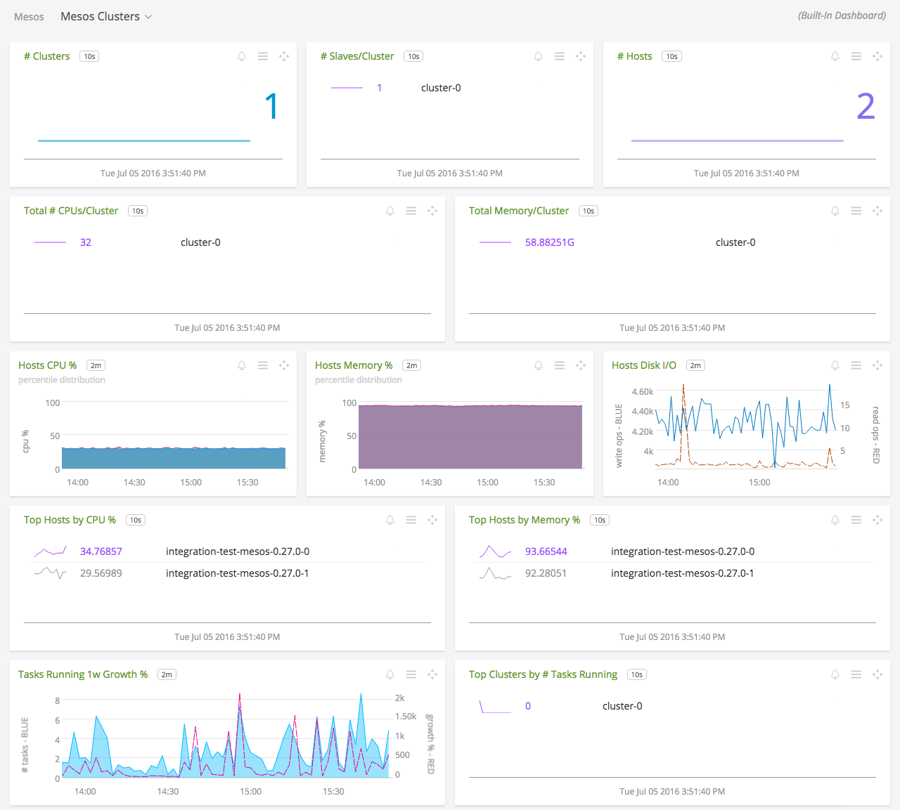
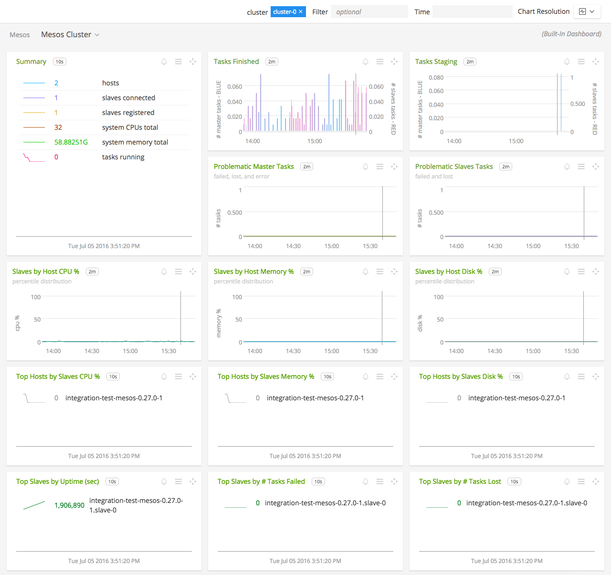
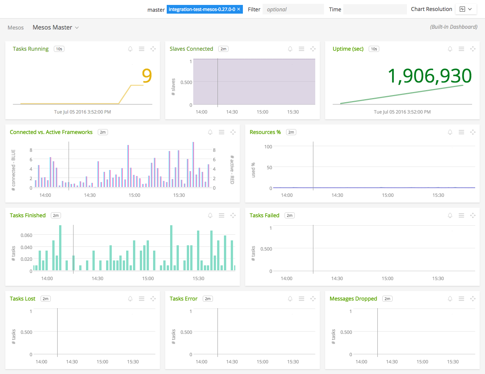
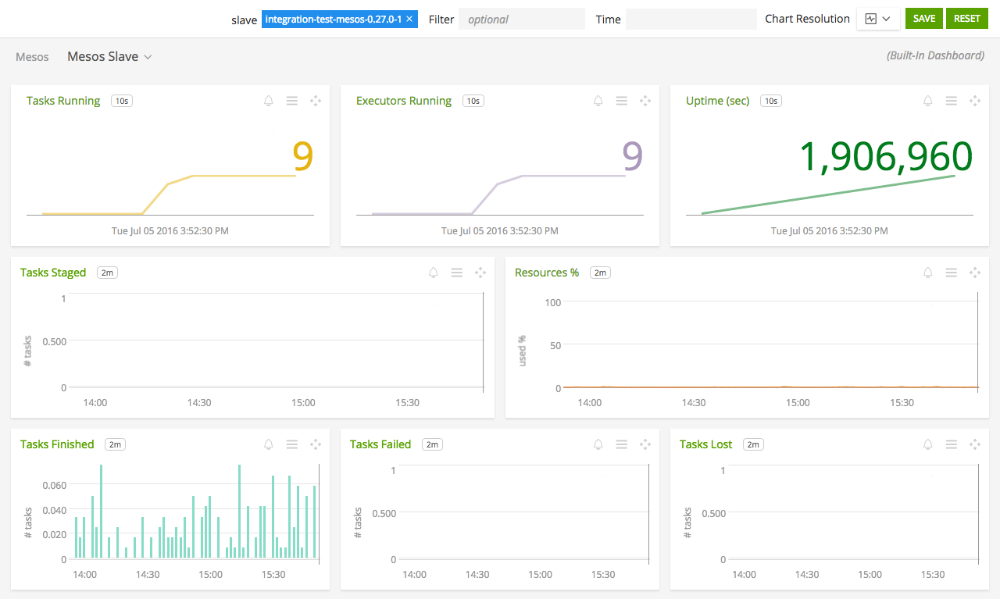
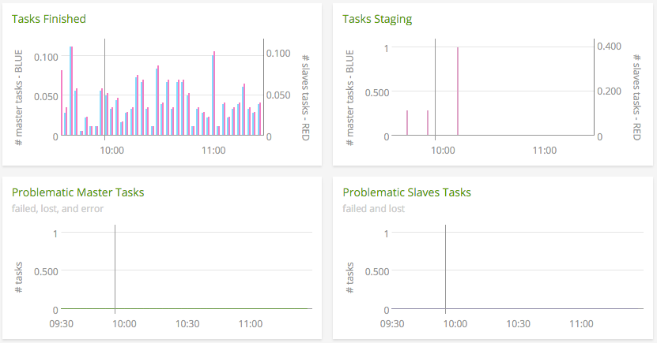
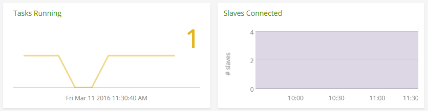
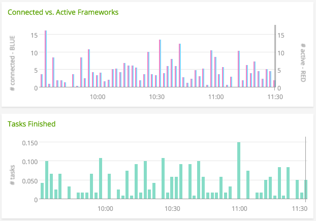

#  Mesos

- [Description](#description)
- [Requirements and Dependencies](#requirements-and-dependencies)
- [Installation](#installation)
- [Configuration](#configuration)
- [Usage](#usage)
- [Metrics](#metrics)
- [License](#license)

### DESCRIPTION

Use the Mesos plugin for collectd to monitor the following information about Mesos:

- Cluster status: number of activated slaves, schedulers and tasks
- CPU, disk and memory usage for Mesos
- Tasks finished, lost, and failed

#### FEATURES

##### Built-in dashboards

- **Mesos Clusters**: Overview of data from all Mesos clusters.

  [](./img/dashboard_mesos_clusters.png)

- **Mesos Cluster**: Focus on a single Mesos cluster.

  [](./img/dashboard_mesos_cluster.png)

- **Mesos Master**: Focus further on a single Mesos master.

  [](./img/dashboard_mesos_master.png)

- **Mesos Slave**: Focus further on a single Mesos slave.

  [](./img/dashboard_mesos_slave.png)

### REQUIREMENTS AND DEPENDENCIES

This plugin requires:

- collectd 4.9+
- Python plugin for collectd (included with [SignalFx collectd agent](https://github.com/signalfx/integrations/tree/master/collectd)[](sfx_link:sfxcollectd))
- Python 2.3+ (2.7.5+ for DC/OS strict mode)
- Mesos 0.19.0 or greater

### INSTALLATION

1. Download the three Python modules for Mesos from the following URL:
  <a target="_blank" href="https://github.com/signalfx/collectd-mesos">https://github.com/signalfx/collectd-mesos</a>. Place them in a convenient spot (e.g. in `/usr/share/collectd/mesos-collectd-plugin`)

2. Download SignalFx's sample configuration files for a <a target="_blank" href="https://github.com/signalfx/integrations/tree/master/collectd-mesos/10-mesos-master.conf">Mesos master</a> or a <a target="_blank" href="https://github.com/signalfx/integrations/tree/master/collectd-mesos/10-mesos-slave.conf">Mesos slave</a> to `/etc/collectd/managed_config`.

3. Modify the configuration file to contain values that make sense for your environment, as described [below](#configuration).

4. Restart collectd.

5. **OPTIONAL**: This step needs to be followed when the Mesos cluster being monitored is running under a DC/OS cluster operating in **strict** mode.
    * Make a new user on DC/OS.
    * Give the new user the following permission strings:
        * `dcos:mesos:agent:endpoint:path:/metrics/snapshot	read`
        * `dcos:mesos:master:endpoint:path:/metrics/snapshot read`
    * Configure the plugin with the required options. See below.

**Note**: The `/system/health/v1` endpoint on port `1050` for DC/OS is not available if operating in strict mode.

### CONFIGURATION

Using the example configuration files [10-mesos-master.conf](././10-mesos-master.conf) or [10-mesos-slave.conf](././10-mesos-slave.conf) as a guide, provide values for the configuration options listed below that make sense for your environment and allow you to connect to the Mesos instance to be monitored.

| configuration option | definition | default value |
| ---------------------|------------|---------------|
| ModulePath | Path on disk where collectd can find the Mesos python modules. | "/usr/share/collectd/mesos-collectd-plugin" |
| Cluster | The name of the cluster to which the Mesos instance belongs. Appears in the dimension `cluster`. | "cluster-0" |
| Instance | The name of this Mesos master/slave instance. Appears in the dimension `plugin_instance`. | "master-0" / "slave-0" |
| Path | The location of the mesos-master/mesos-slave binary. | "/usr/sbin" |
| scheme | Scheme the plugin needs to use to fetch metrics. It is either "http" or "https". | "http" |
| Host  | The hostname or IP address of the Mesos instance to be monitored. | "%%%MASTER\_IP%%%" |
| Port | The port on which the Mesos instance is listening for connections. | %%%MASTER\_PORT%%% |
| Verbose | Enable verbose logging from this plugin to collectd's log file | false |
| IncludeSystemHealth | Enable the sending of DC/OS System Service Health Metrics (this option is only applicable for a DC/OS master) | false |
| ca\_file\_path |  Path to CA file required for server verification. If not provided, verification is skipped (this option is only applicable if ssl is enabled) | "path/to/file" |
| dcos\_sfx\_username | New DC/OS username created for the plugin (this option is only applicable for DC/OS in strict mode) | sfx-collectd |
| dcos\_sfx\_password | Password of the above username (this option is only applicable for DC/OS in strict mode) | signalfx |
| dcos\_url | The DC/OS authentication endpoint (this is an optional config and is only applicable for DC/OS in strict mode) | "https://leader.mesos/acs/api/v1/auth/login" |

**Note**: (Applicable if operating DC/OS in strict mode) The default `dcos_url` makes use of the `leader.mesos` hostname provided by DC/OS. If the hostname does not exist, `dcos_url` can be set by the user. See below example.

Below is an example configuration:

```
<LoadPlugin "python">
  Globals true
</LoadPlugin>

<Plugin "python">
  ModulePath "/opt/collectd-mesos"

  Import "mesos-master"

  <Module "mesos-master">
    Cluster "cluster-0"
    Instance "master-0"
    Path "/usr/sbin"
    scheme "https"
    Host "10.0.142.190"
    Port 5050
    Verbose false
    IncludeSystemHealth false
    dcos_sfx_username "test-collectd"
    dcos_sfx_password "1234"
    # Note that https://sfx-dco-elasticl-qyuyl8k0dc99-1879689557.us-west-2.elb.amazonaws.com is
    # base URL of the DC/OS UI and /acs/api/v1/auth/login is the authentication endpoint the plugin
    # uses to obtain token for subsequent requests. By default dcos_url takes -
    # https://leader.mesos/acs/api/v1/auth/login
    dcos_url "https://sfx-dco-elasticl-qyuyl8k0dc99-1879689557.us-west-2.elb.amazonaws.com/acs/api/v1/auth/login"
  </Module>
</Plugin>
```

### USAGE

Below are screen captures of dashboards created for this plugin by SignalFx, illustrating the metrics emitted by this plugin.

#### Monitoring Mesos clusters



It’s important to keep track of the status of tasks in the cluster. An increase in failed tasks for a master or slave can indicate a problem with a framework.


It can be important to analyze performance per Mesos host. An increase in failed tasks for many masters and slaves on a single host may indicate a hardware problem.


Track week-over-week growth of tasks in your cluster to be informed of changing workloads.

#### Monitoring Mesos masters and slaves



An unexpectedly low number of connected slaves on a Mesos master can indicate a network problem preventing them from connecting. To verify this, check to see if there’s an unexpectedly high number of dropped messages in [counter.master_dropped_messages](./docs/counter.master_dropped_messages.md).



On the Mesos master dashboard, you can view in detail the number of tasks that are finished, failed, lost or errored out. Monitoring connected and active frameworks can help you determine the health of your Mesos scheduler.

For additional information on how to monitor Mesos, check out Apache's guide <a target="_blank" href="http://mesos.apache.org/documentation/latest/monitoring/">here</a>.


### METRICS

For documentation of the metrics and dimensions emitted by this plugin, [click here](./docs).

### LICENSE

This integration is released under the Apache 2.0 license. See [LICENSE](./LICENSE) for more details.
